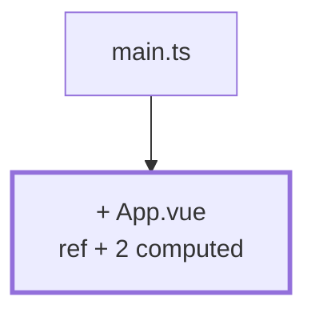

# Kapitel 01 — Erste Noten auf dem Bildschirm

> **Zeit:** ca. 1–1,5 h
> **Konzepte:** [Vue-Reaktivität](../konzepte/04-vue-reactivity.md)

## Wo du stehst

Du hast [Setup](../konzepte/00-setup.md) durch: der DevContainer läuft, `npm run dev` liefert die
Vite-Startseite. In `src/` liegt noch das Gerüst aus `npm create vue@latest`.

## Was dazukommt

Eine Liste hartcodierter Noten in `App.vue`, dazu Durchschnitt und Verteilung als `computed` —
mehr nicht.



## Der Weg

1. **Das Repo anlegen.** [Setup](../konzepte/00-setup.md) hat das Projekt erzeugt, aber noch
   keine Historie. Hol das jetzt nach — ab dem Ende dieses Kapitels schließt jedes Kapitel mit
   einem Commit ab:

   ```bash
   git init
   git add -A && git commit -m "chore: Vue-Projekt mit Vite und TypeScript"
   ```

   `npm create vue@latest` legt eine `.gitignore` mit `node_modules` und `dist` an. Wirf einen
   Blick hinein, bevor du das erste Mal committest — was einmal in der Historie steht, bekommst
   du nur mühsam wieder heraus.

2. **Aufräumen.** Alles aus `src/components/` löschen, was das Gerüst mitgebracht hat
   (`HelloWorld.vue`, `TheWelcome.vue`, `icons/`). Ebenso `src/assets/logo.svg` und die
   Beispiel-Styles. Du willst eine leere Fläche.

3. **`App.vue` ersetzen.** Das hier ist der komplette Stand dieses Kapitels:

   ```vue
   <script setup lang="ts">
   import { computed, ref } from 'vue'

   // Hartcodiert. Woher die Zahlen wirklich kommen, ist Kapitel 04.
   const grades = ref([1, 3, 2, 5, 2, 4, 3, 2])

   const average = computed(() => {
     if (grades.value.length === 0) return null
     const sum = grades.value.reduce((a, b) => a + b, 0)
     return sum / grades.value.length
   })

   const distribution = computed(() => {
     const counts: Record<number, number> = { 1: 0, 2: 0, 3: 0, 4: 0, 5: 0 }
     for (const grade of grades.value) counts[grade] += 1
     return counts
   })
   </script>

   <template>
     <main>
       <h1>Galactic Gradebook</h1>

       <p>
         Durchschnitt:
         {{ average === null ? '–' : average.toFixed(1).replace('.', ',') }}
         ({{ grades.length }} Noten)
       </p>

       <ul>
         <li v-for="(grade, index) in grades" :key="index">Note {{ grade }}</li>
       </ul>

       <p v-for="(count, grade) in distribution" :key="grade">{{ grade }}: {{ count }}×</p>
     </main>
   </template>
   ```

   Der Code ist durchgehend englisch, die Texte für Menschen sind deutsch — dabei bleibt es bis
   zum Schluss.

4. **`.value` üben.** Häng einen Button dran, der `grades.value.push(3)` aufruft, und schau, dass
   Durchschnitt und Verteilung ohne dein Zutun mitwandern. Genau dafür ist `computed` da.

5. **Einen `watch` einbauen**, der bei jeder Änderung die Anzahl auf die Konsole schreibt.
   Nicht, weil die App ihn braucht — sondern damit du einmal gesehen hast, wann er feuert und
   wann nicht.

## Was noch vereinfacht ist

| Vereinfachung | Warum das reicht | Aufgeräumt in |
| --- | --- | --- |
| Zahlen stehen im Quelltext | es gibt noch kein Datenmodell | [Kapitel 04](04-seed-und-typen.md) |
| `number` statt `Grade` | eine 7 wäre hier erlaubt | [Kapitel 04](04-seed-und-typen.md) |
| Durchschnitt wird im Template formatiert | die Funktion `formatAverage` existiert noch nicht | [Kapitel 04](04-seed-und-typen.md) |
| `:key="index"` | die Liste hat noch keine IDs, und das rächt sich gleich | [Kapitel 03](03-eingabe-roh.md) |
| Alles in einer Datei | es gibt noch nichts zu trennen | [Kapitel 02](02-erste-komponente.md) |
| Deutsche Texte im Template | eine Sprache reicht vorerst | [Kapitel 21](21-i18n.md) |

## Review

- [ ] `npm run dev` zeigt Überschrift, Durchschnitt, Notenliste und Verteilung
- [ ] Der Button ändert alle drei Werte gleichzeitig
- [ ] Leerst du das Array im Quelltext, steht `–` da und **nicht** `NaN`
- [ ] Der Browser aktualisiert ohne Reload (sonst siehe [Setup](../konzepte/00-setup.md), `usePolling`)
- [ ] `npm run type-check` ist grün

## Commit

Der Stand läuft — leg das Repo an und sichere ihn.

```bash
git add -A && git commit -m "feat: Notenliste mit Durchschnitt und Verteilung"
```

## Zum Nachlesen

- [Konzepte: Vue-Reaktivität](../konzepte/04-vue-reactivity.md) — `ref`, `computed`, `watch`, Template-Syntax
- Die Regel, an der hier alles hängt: *ist ein Wert ableitbar, dann leite ihn ab.*
