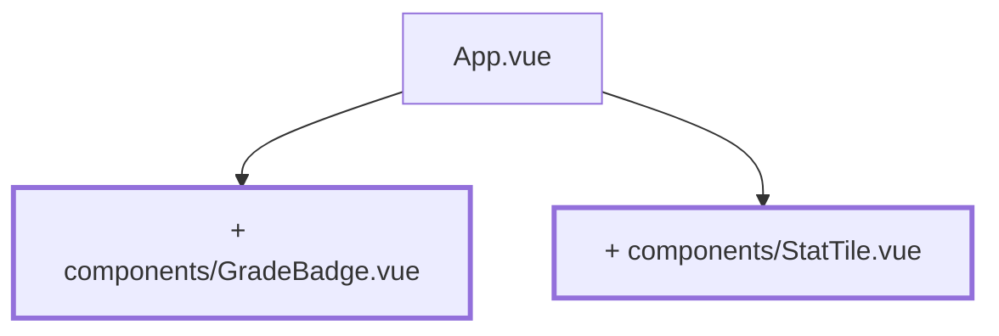

# Kapitel 02 — Die erste eigene Komponente

> **Zeit:** ca. 0,5–1 h
> **Konzepte:** [Komponenten](../konzepte/05-komponenten.md)

## Wo du stehst

`App.vue` zeigt eine Notenliste mit Durchschnitt und Verteilung. Alles steht in einer Datei.

## Was dazukommt

Zwei Komponenten mit Props: `GradeBadge` zeigt eine einzelne Note, `StatTile` eine Kennzahl.
Beide bleiben bis zum Schluss im Projekt.



## Der Weg

1. **`src/components/GradeBadge.vue`** — nimmt eine Note entgegen und stellt sie dar:

   ```vue
   <script setup lang="ts">
   defineProps<{
     grade: number | null
   }>()
   </script>

   <template>
     <span class="badge">{{ grade === null ? '–' : grade }}</span>
   </template>

   <style scoped>
   .badge {
     display: inline-flex;
     min-width: 2rem;
     justify-content: center;
     border-radius: 0.5rem;
     padding: 0.25rem 0.5rem;
     background: #eee;
   }
   </style>
   ```

   Der Prop heißt `grade` und nicht `note`: der Code des Projekts ist durchgehend englisch,
   nur die Texte für Menschen sind deutsch.

2. **`src/components/StatTile.vue`** — `label`, `value` und ein optionales `hint`. Die
   Props-Deklaration steht in `defineProps<{ … }>()`, optionale mit `?`.

3. **Beides in `App.vue` benutzen.** Die `v-for`-Liste rendert jetzt `<GradeBadge :grade="note" />`,
   und über der Liste stehen drei `<StatTile>`: Anzahl, Durchschnitt, häufigste Note.

4. **Props sind Einbahnstraße.** Versuch einmal bewusst, in der Komponente `grade = 4` zu
   schreiben. Vue warnt in der Konsole. Wenn Daten zurückfließen sollen, braucht es ein Emit —
   das kommt in [Kapitel 03](03-eingabe-roh.md).

## Was noch vereinfacht ist

| Vereinfachung | Warum das reicht | Aufgeräumt in |
| --- | --- | --- |
| `grade: number \| null` statt `Grade \| null` | den Typ `Grade` gibt es noch nicht | [Kapitel 04](04-seed-und-typen.md) |
| Farbe pro Note fehlt | ohne Design-Tokens wäre sie zweimal Arbeit | [Kapitel 17](17-tailwind-layout.md) |
| `<style scoped>` statt Tailwind | für zwei Komponenten reicht das | [Kapitel 17](17-tailwind-layout.md) |
| Kein `title`, kein `aria-label` | kommt mit den Bezeichnungen aus der Akademie | [Kapitel 15](15-vier-akademien.md) |

## Review

- [ ] Die Notenliste besteht aus `GradeBadge`-Komponenten
- [ ] Drei Kennzahlen stehen als `StatTile` über der Liste
- [ ] `<GradeBadge :grade="null" />` zeigt `–`
- [ ] Ein fehlender Pflicht-Prop ist ein Fehler in `npm run type-check`, nicht erst im Browser

## Commit

Der Stand läuft — sichere ihn, bevor du weitermachst.

```bash
git add -A && git commit -m "refactor: GradeBadge und StatTile als eigene Komponenten"
```

## Zum Nachlesen

- [Konzepte: Komponenten](../konzepte/05-komponenten.md) — Props, Emits, Slots
- `reference/src/components/StatTile.vue` — die Endfassung ist fast identisch, nur mit
  Tailwind-Klassen statt `scoped`
