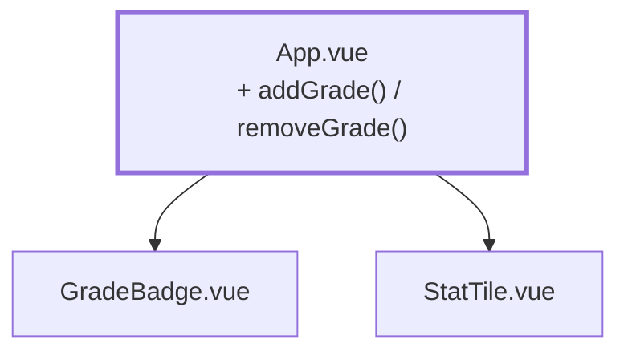

# Kapitel 03 — Noten eingeben, erst mal roh

> **Zeit:** ca. 0,5–1 h
> **Konzepte:** [Vue-Reaktivität](../konzepte/04-vue-reactivity.md),
> [Komponenten](../konzepte/05-komponenten.md)

## Wo du stehst

Eine Notenliste aus `GradeBadge`-Komponenten, drei Kennzahlen darüber. Die Zahlen kommen aus
einem hartcodierten Array.

## Was dazukommt

Ein Eingabefeld und zwei Buttons: Note hinzufügen, Note entfernen. Ohne Validierung — eine 9
darf hier noch durchrutschen.



## Der Weg

1. **IDs statt Indizes.** Bevor du etwas entfernen kannst, brauchen die Einträge eine stabile
   Identität. Aus `ref([1, 3, 2])` wird:

   ```ts
   type Entry = { id: number; grade: number }

   let nextId = 1
   const entries = ref<Entry[]>([
     { id: nextId++, grade: 1 },
     { id: nextId++, grade: 3 },
     { id: nextId++, grade: 2 },
   ])
   ```

   Und im Template `:key="entry.id"`. Warum das kein Detail ist, steht in
   [Vue-Reaktivität](../konzepte/04-vue-reactivity.md#listen): mit `:key="index"` behält beim Löschen die
   falsche Zeile ihren Zustand.

2. **Eingabe mit `v-model`:**

   ```vue
   <script setup lang="ts">
   const input = ref('')

   function addGrade() {
     const value = Number(input.value)
     // Absichtlich ungeprüft - Kapitel 11 macht daraus etwas Belastbares.
     entries.value.push({ id: nextId++, grade: value })
     input.value = ''
   }

   function removeGrade(id: number) {
     entries.value = entries.value.filter((entry) => entry.id !== id)
   }
   </script>

   <template>
     <form @submit.prevent="addGrade">
       <input v-model="input" type="number" min="1" max="5" />
       <button type="submit">Hinzufügen</button>
     </form>
   </template>
   ```

   `@submit.prevent` auf einem echten `<form>` statt `@click` auf dem Button: nur so
   funktioniert die Eingabetaste im Feld.

3. **Entfernen über ein Emit.** Gib `GradeBadge` einen Button und lass es `remove` emitten,
   statt den Button danebenzusetzen. Das ist die kleinste sinnvolle Übung für
   `defineEmits<{ remove: [] }>()`.

4. **Die Lücke ausprobieren.** Tipp eine `9` ein und drück Hinzufügen. Die Verteilung bekommt
   einen Eintrag, den es gar nicht geben dürfte, und der Durchschnitt ist Unsinn. Merk dir, wie
   das aussieht — [Kapitel 11](11-grade-input.md) räumt genau das auf.

## Was noch vereinfacht ist

| Vereinfachung | Warum das reicht | Aufgeräumt in |
| --- | --- | --- |
| Jede Zahl wird akzeptiert | Validierung braucht den Typ `Grade` und `parseGrade` | [Kapitel 11](11-grade-input.md) |
| Die Eingabe ist ein nacktes `<input>` | eine eigene Komponente lohnt erst bei zehn Feldern | [Kapitel 11](11-grade-input.md) |
| Noten hängen an nichts — kein Fach, keine Person | dafür fehlt das Datenmodell | [Kapitel 04](04-seed-und-typen.md) |
| Die Hinzufügen/Entfernen-Oberfläche selbst ist ein Wegwerfstand | sie übt `v-model` und Emits; ab Kapitel 04 gehört jede Note zu einer Person, und eingegeben wird zeilenweise | [Kapitel 04](04-seed-und-typen.md), [Kapitel 10](10-grades-store-und-draft.md) |
| `let nextId` als Zähler im Modul | echte IDs kommen aus dem Seed | [Kapitel 04](04-seed-und-typen.md) |
| Beim Reload ist alles weg | Persistenz hat ihr eigenes Kapitel | [Kapitel 12](12-localstorage-composable.md) |

## Review

- [ ] Hinzufügen ergänzt die Liste, leert das Feld und aktualisiert alle Kennzahlen
- [ ] Entfernen trifft **die** Zeile, auf die du geklickt hast — auch die mittlere
- [ ] Die Eingabetaste im Feld löst Hinzufügen aus
- [ ] Eine `9` rutscht durch (das ist hier der erwartete Stand, kein Fehler)
- [ ] `npm run type-check` und `npm run lint` sind grün

## Commit

Der Stand läuft — sichere ihn, bevor du weitermachst.

```bash
git add -A && git commit -m "feat: Noten hinzufügen und entfernen"
```

## Zum Nachlesen

- [Konzepte: Vue-Reaktivität](../konzepte/04-vue-reactivity.md) — `v-for`, `:key`, Event-Modifikatoren
- [Konzepte: Komponenten](../konzepte/05-komponenten.md) — Emits
