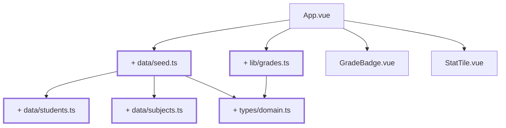

# Kapitel 04 — Die Daten raus aus der View

> **Zeit:** ca. 1,5–2,5 h
> **Konzepte:** [TypeScript](../konzepte/03-typescript.md),
> [Domänenmodell](../konzepte/06-domaenenmodell.md)

## Wo du stehst

Du kannst Noten anzeigen, hinzufügen und entfernen. Sie hängen an nichts: kein Fach, keine
Person, kein Typ, der eine 9 verbieten würde.

## Was dazukommt

Ein Datenmodell in `src/types/`, Stammdaten in `src/data/`, Rechenfunktionen in `src/lib/` —
und **eine** Akademie: den Jedi-Tempel mit zehn Lernenden und sechs Fächern.



## Der Weg

1. **`src/types/domain.ts`** — der Kern. Noch **ohne** Akademie:

   ```ts
   export type Grade = 1 | 2 | 3 | 4 | 5

   /** Dieselben Werte zur Laufzeit - für Schleifen und Diagramme. */
   export const GRADES = [1, 2, 3, 4, 5] as const satisfies readonly Grade[]

   export interface Identifiable {
     readonly id: string
   }

   export interface Student extends Identifiable {
     readonly firstName: string
     readonly lastName: string
     readonly matriculationNumber: string
   }

   export interface Subject extends Identifiable {
     readonly name: string
     readonly shortName: string
     readonly semester: number
     readonly ects: number
   }

   export type SubjectId = string
   export type StudentId = string

   /** Fach -> Lernende:r -> Note. `null` heißt „noch nicht benotet". */
   export type GradeBook = Record<SubjectId, Record<StudentId, Grade | null>>
   ```

   Ab hier ist `const g: Grade = 7` ein Compile-Fehler. Das ist der eigentliche Gewinn dieses
   Kapitels — nicht die Daten, sondern die Tatsache, dass falsche Werte gar nicht mehr entstehen
   können.

   Zu `null` statt `undefined` oder `0`: `undefined` wäre von „Schlüssel fehlt" nicht zu
   unterscheiden, und mit `0` könnte man versehentlich rechnen. [Domänenmodell](../konzepte/06-domaenenmodell.md)
   begründet das ausführlich.

2. **`src/data/students.ts`** — zehn Lernende. Nimm ruhig die Namen aus der Referenz
   (`reference/src/data/students.ts`, die ersten zehn); es geht hier nicht ums Erfinden.

   ```ts
   import type { Student } from '@/types/domain'

   export const STUDENTS = [
     { id: 's01', firstName: 'Ahsoka', lastName: 'Tano', matriculationNumber: '2400001' },
     { id: 's02', firstName: 'Kanan', lastName: 'Jarrus', matriculationNumber: '2400002' },
     // … acht weitere
   ] as const satisfies readonly Student[]
   ```

   `satisfies` statt `:` — der Compiler prüft die Struktur, behält aber die engen Literaltypen.
   Warum das ein Unterschied ist, steht in [TypeScript](../konzepte/03-typescript.md).

3. **`src/data/subjects.ts`** — sechs Fächer über vier Semester, mit `name`, `shortName`,
   `semester`, `ects`.

4. **`src/data/seed.ts`** — der Einstiegspunkt für alles Datenhafte:

   ```ts
   import type { Grade, GradeBook } from '@/types/domain'
   import { STUDENTS } from './students'
   import { SUBJECTS } from './subjects'

   export const students = [...STUDENTS].sort((a, b) => a.lastName.localeCompare(b.lastName))
   export const subjects = [...SUBJECTS].sort((a, b) => a.semester - b.semester)

   /** Zwei Fächer sind fertig benotet, vier noch leer - sonst sieht man nichts. */
   const PREFILLED: Partial<Record<string, readonly Grade[]>> = {
     f01: [2, 3, 1, 2, 4, 2, 3, 1, 3, 2],
     f04: [3, 2, 2, 4, 3, 1, 2, 3, 5, 3],
   }

   /**
    * Funktion, nicht Konstante: jeder Aufruf liefert ein frisches Objekt.
    * Sonst teilten sich später Store und Tests dieselbe Referenz.
    */
   export function createGradeBook(): GradeBook {
     const book: GradeBook = {}
     for (const subject of subjects) {
       const prefilled = PREFILLED[subject.id]
       const row: Record<string, Grade | null> = {}
       students.forEach((student, index) => {
         row[student.id] = prefilled?.[index] ?? null
       })
       book[subject.id] = row
     }
     return book
   }
   ```

5. **`src/lib/grades.ts`** — die Fachlogik, **ohne jeden Vue-Import**. Genau diese Funktionen
   brauchst du bis zum Schluss:

   | Funktion | Rückgabe |
   | --- | --- |
   | `isGrade(value: unknown): value is Grade` | Type Guard von Laufzeitdaten in den engen Typ |
   | `average(grades: readonly (Grade \| null)[])` | `number \| null` — `null`-Einträge zählen nicht mit |
   | `distribution(grades)` | `Record<Grade, number>`, Noten ohne Vorkommen stehen mit `0` drin |
   | `gradedCount(grades)` | wie viele tatsächlich vergeben sind |
   | `formatGrade(grade)` | `'–'` bei `null` |
   | `formatAverage(value)` | `'2,3'` — eine Nachkommastelle, deutsches Komma |

   Warum hier kein Vue vorkommen darf, steht in [Domänenmodell](../konzepte/06-domaenenmodell.md#warum-vue-hier-nichts-zu-suchen-hat).
   Kurzfassung: was rein ist, lässt sich ohne Framework testen — das zahlt sich in
   [Kapitel 19](19-tests-vitest.md) aus.

6. **`App.vue` umstellen.** Das hartcodierte Array fliegt raus — und mit ihm die
   Hinzufügen/Entfernen-Oberfläche aus [Kapitel 03](03-eingabe-roh.md). Sie hat ihren Zweck
   erfüllt: eine Note gehört ab jetzt zu einer Person, und eingegeben wird zeilenweise
   ([Kapitel 10](10-grades-store-und-draft.md)). Stattdessen: ein Fach fest
   auswählen (`const subjectId = 'f01'`), dessen Notenzeile aus `createGradeBook()` holen und
   die Lernenden dazu anzeigen — Name links, `GradeBadge` rechts. Die Kennzahlen kommen jetzt
   aus `average`, `distribution` und `gradedCount`.

7. **`GradeBadge` und `StatTile` nachziehen:** aus `number | null` wird `Grade | null`.

## Was noch vereinfacht ist

| Vereinfachung | Warum das reicht | Aufgeräumt in |
| --- | --- | --- |
| Nur eine Akademie, kein `academyId` | zwei neue Konzepte auf einmal sind eins zu viel | [Kapitel 15](15-vier-akademien.md) |
| `subject.name` steht in den Stammdaten | es gibt nur eine Sprache | [Kapitel 21](21-i18n.md) |
| Plain Arrays mit `.filter()` / `.sort()` | eine generische `Collection<T>` lohnt erst beim Filtern nach Akademie | [Kapitel 15](15-vier-akademien.md) |
| Das Fach ist im Quelltext fest gewählt | Auswahl braucht entweder State oder Routing | [Kapitel 05](05-fachliste.md), [Kapitel 06](06-router-zwei-views.md) |
| Die Notenmatrix lebt nur in einer lokalen Variablen | Store kommt später | [Kapitel 10](10-grades-store-und-draft.md) |
| Eingabe schreibt noch nichts in die Matrix | dafür fehlt der Draft | [Kapitel 10](10-grades-store-und-draft.md) |

## Review

- [ ] `App.vue` enthält **keine** Notenzahl mehr im Quelltext
- [ ] Zehn Namen mit Note stehen auf dem Bildschirm, zwei Fächer sind vorbelegt
- [ ] `const g: Grade = 6` in irgendeiner Datei ist ein Fehler in `npm run type-check`
- [ ] `average([])` liefert `null`, nicht `NaN`
- [ ] `formatAverage(2.3333)` liefert `2,3`
- [ ] In `src/lib/` und `src/data/` steht **kein** `import … from 'vue'`

## Commit

Der Stand läuft — sichere ihn, bevor du weitermachst.

```bash
git add -A && git commit -m "refactor: Domänenmodell, Seed und Notenlogik in eigene Module"
```

## Zum Nachlesen

- [Konzepte: Domänenmodell](../konzepte/06-domaenenmodell.md) — Typen, Fixtures, Vue-freie Fachlogik
- [Konzepte: TypeScript](../konzepte/03-typescript.md) — Unions, `satisfies`, Type Guards, `noUncheckedIndexedAccess`
- `reference/src/lib/grades.ts` — deine Endfassung; nur `gradeLabel` und `passRate` fehlen dir
  noch, die brauchst du erst in [Kapitel 14](14-klassenspiegel-chart.md)
