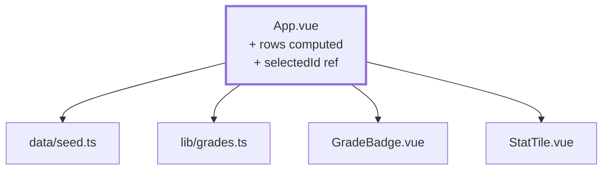

# Kapitel 05 — Die Fächerliste

> **Zeit:** ca. 1–1,5 h
> **Konzepte:** [Domänenmodell](../konzepte/06-domaenenmodell.md)

## Wo du stehst

Sechs Fächer und zehn Lernende liegen im Seed, `lib/grades.ts` rechnet. Angezeigt wird aber
immer nur das eine Fach, das im Quelltext steht.

## Was dazukommt

Eine Tabelle **aller** Fächer mit Fortschritt und Durchschnitt, und ein Klick wechselt das
angezeigte Fach. Noch ohne Router — die Auswahl ist ein `ref`.



## Der Weg

1. **Die angereicherte Zeile.** Eine Tabellenzeile ist mehr als ein Fach — sie trägt gleich den
   Fortschritt und den Durchschnitt mit. Diese Anreicherung gehört in ein `computed` und nicht
   ins Template, wo sie bei jedem Rendern erneut liefe:

   ```ts
   const rows = computed(() =>
     subjects.map((subject) => {
       const grades = students.map((student) => book.value[subject.id]?.[student.id] ?? null)
       const graded = gradedCount(grades)

       return {
         subject,
         graded,
         isComplete: graded === students.length,
         average: average(grades),
       }
     }),
   )
   ```

2. **Die Tabelle** mit Fach, Semester, `graded / gesamt`, Ø und einem Button „Bewerten".
   `:key="row.subject.id"`.

3. **Die Auswahl** als `const selectedId = ref<SubjectId | null>(null)`. Ist sie `null`, zeigt
   die Seite die Liste; sonst die Notenzeilen des gewählten Fachs plus einen Zurück-Button.

4. **Die Kennzahlen oben:** Anzahl Fächer, noch offene Fächer, Gesamtdurchschnitt über alle
   Fächer. Für den letzten ist `flatMap` das richtige Werkzeug — eine Liste aller Noten über
   alle Fächer, dann `average` darauf.

5. **Sortieren nach zwei Kriterien.** Die Fächer sollen nach Semester und darin nach Nummer
   stehen. Statt einer zweistufigen Vergleichsfunktion reicht ein Sortierschlüssel:

   ```ts
   subjects.sort((a, b) => key(a) - key(b))
   const key = (s: Subject) => s.semester * 1000 + Number(s.id.slice(1))
   ```

   Das erste Kriterium dominiert, weil sein Beitrag immer größer ist als alles, was das zweite
   beisteuern kann.

6. **Kosmetik-Pause.** Ein paar Tailwind-Klassen für Abstände und eine lesbare Tabelle sind
   jetzt in Ordnung. Fang aber nicht mit Farben und Tokens an — das lohnt erst, wenn feststeht,
   welche Komponenten es überhaupt gibt ([Kapitel 17](17-tailwind-layout.md)).

## Was noch vereinfacht ist

| Vereinfachung | Warum das reicht | Aufgeräumt in |
| --- | --- | --- |
| Fachwechsel über ein `ref` statt über die URL | du siehst gleich selbst, warum das nicht reicht | [Kapitel 06](06-router-zwei-views.md) |
| Liste und Formular in einer Datei | zwei Views brauchen erst einen Router | [Kapitel 06](06-router-zwei-views.md) |
| `book` ist ein lokaler `ref` in `App.vue` | Store kommt später | [Kapitel 10](10-grades-store-und-draft.md) |
| Jede:r sieht jedes Fach | es gibt noch keine Anmeldung | [Kapitel 08](08-auth-store.md), [Kapitel 15](15-vier-akademien.md) |
| Tabelle als rohes `<table>` | `BaseTable` lohnt erst bei mehreren Tabellen | [Kapitel 16](16-base-components.md) |

## Review

- [ ] Sechs Fächer stehen nach Semester sortiert in der Tabelle
- [ ] Zwei Fächer zeigen `10 / 10`, vier zeigen `0 / 10`
- [ ] Der Gesamtdurchschnitt ist plausibel und wird `–`, wenn du `PREFILLED` leerst
- [ ] Ein Klick auf „Bewerten" zeigt die zehn Lernenden dieses Fachs
- [ ] **Der wunde Punkt:** F5 auf der Detailansicht landet wieder in der Liste, und du kannst
      niemandem einen Link auf ein Fach schicken. Merk dir das — das ist die Begründung für
      [Kapitel 06](06-router-zwei-views.md).

## Commit

Der Stand läuft — sichere ihn, bevor du weitermachst.

```bash
git add -A && git commit -m "feat: Fächerliste mit Fortschritt und Durchschnitt"
```

## Zum Nachlesen

- [Konzepte: Domänenmodell](../konzepte/06-domaenenmodell.md) — Fixtures, Sortierschlüssel, Rechnen mit Noten
- `reference/src/views/lecturer/SubjectListView.vue` — dieselbe `rows`-Idee, nur mit Store und
  Akademie
