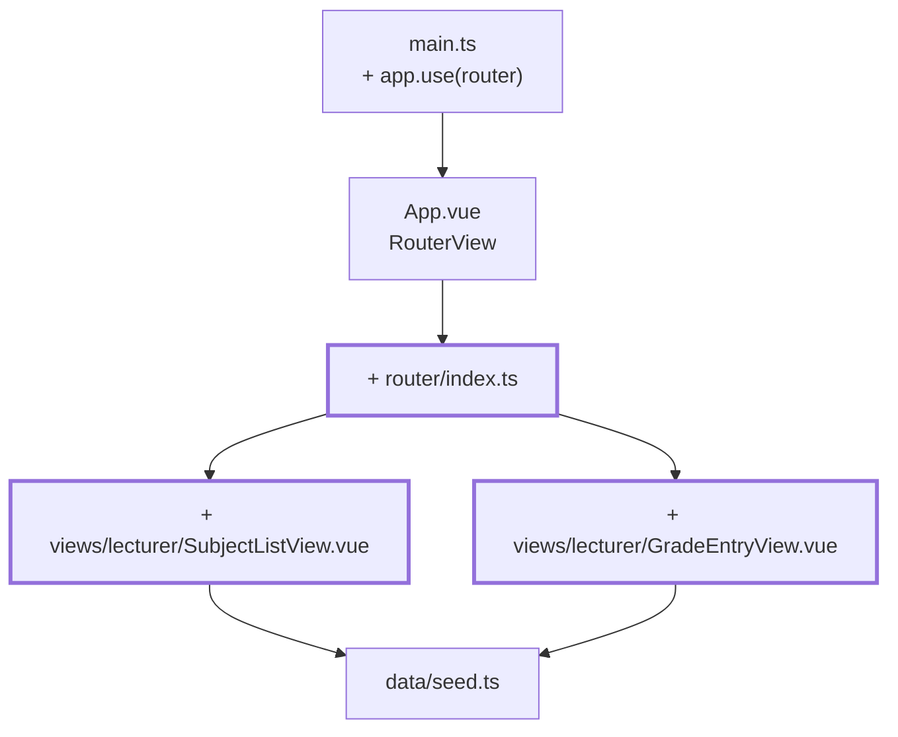
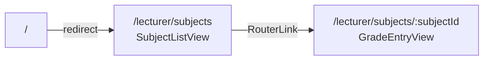

# Kapitel 06 — Zwei Views unter eigenen URLs

> **Zeit:** ca. 1–1,5 h
> **Konzepte:** [Vue Router](../konzepte/07-router.md)

## Wo du stehst

Fächerliste und Notenformular liegen beide in `App.vue`, umgeschaltet durch ein `ref`. Ein
Reload wirft dich zurück auf die Liste, und ein Link auf ein einzelnes Fach existiert nicht.

## Was dazukommt

vue-router mit zwei Routen. `App.vue` wird zum Rahmen, die beiden Ansichten ziehen nach
`src/views/`. Noch ohne Login.



**Die Route-Map dieses Kapitels:**



## Der Weg

1. **Installieren und einhängen:** `npm install vue-router`, dann in `main.ts`
   `app.use(router)`. In `App.vue` bleibt nur noch das Gerüst mit `<RouterView />`.

2. **`src/router/index.ts`** mit `createWebHistory` und den beiden Routen. Für die zweite:

   ```ts
   {
     path: '/lecturer/subjects/:subjectId',
     name: 'lecturer-grade-entry',
     props: true,
     component: () => import('@/views/lecturer/GradeEntryView.vue'),
   }
   ```

   `props: true` reicht den Route-Parameter als Prop hinein. Die View ruft dann kein `useRoute()`
   auf und ist damit isoliert testbar — das zahlt sich in [Kapitel 19](19-tests-vitest.md) aus.
   `() => import(...)` lädt die View erst beim ersten Aufruf; in [Kapitel 20](20-build-deployment.md)
   siehst du im Build-Output, dass daraus wirklich getrennte Dateien werden.

3. **Die beiden Views anlegen** und den Inhalt aus `App.vue` dorthin verschieben. Die Liste
   verlinkt mit `<RouterLink :to="{ name: 'lecturer-grade-entry', params: { subjectId: row.subject.id } }">`
   statt mit einem Button — benannte Routen mit Parametern, keine zusammengebauten Strings.

4. **`GradeEntryView`** nimmt `defineProps<{ subjectId: string }>()` und sucht sich das Fach
   selbst aus dem Seed.

5. **Unbekanntes Fach abfangen.** Ruf `/lecturer/subjects/f99` auf. Wenn die View abstürzt, ist
   das der Normalfall beim ersten Versuch: eine ID aus der URL ist frei wählbar. Zeig
   stattdessen eine freundliche Meldung mit Link zurück zur Liste.

6. **Der Watcher, den du gleich brauchen wirst.** Wechsel über die Liste von `f02` zu `f03`.
   Wenn die View lokalen State hätte, bliebe der stehen — Vue verwendet die Komponente wieder,
   weil dieselbe Route gilt. Noch merkst du nichts davon; in [Kapitel 10](10-grades-store-und-draft.md)
   ist genau das der Fehler, der dich Noten ins falsche Fach eintragen lässt.

## Was noch vereinfacht ist

| Vereinfachung | Warum das reicht | Aufgeräumt in |
| --- | --- | --- |
| Jede URL ist für alle offen | ohne Anmeldung gibt es nichts zu schützen | [Kapitel 09](09-router-guards.md) |
| Keine 404-Route | eine Route mehr, wenn der Rest steht | [Kapitel 09](09-router-guards.md) |
| Nur die Dozent:innen-Seite | die Lernenden-Sicht braucht erst einen Login | [Kapitel 13](13-student-dashboard.md) |
| Formular zeigt Noten nur an | Eingabe braucht den Draft | [Kapitel 10](10-grades-store-und-draft.md) |

## Review

- [ ] `/lecturer/subjects` zeigt die Liste, ein Klick führt auf `/lecturer/subjects/f01`
- [ ] F5 auf `/lecturer/subjects/f01` zeigt weiterhin dasselbe Fach
- [ ] Der Zurück-Button des Browsers funktioniert
- [ ] `/` leitet auf die Liste um
- [ ] `/lecturer/subjects/f99` zeigt eine Meldung statt eines Absturzes
- [ ] Im Netzwerk-Tab siehst du beim ersten Klick einen eigenen JS-Chunk nachladen

## Commit

Der Stand läuft — sichere ihn, bevor du weitermachst.

```bash
git add -A && git commit -m "feat: Router mit Fächerliste und Bewertungsformular"
```

## Zum Nachlesen

- [Konzepte: Vue Router](../konzepte/07-router.md) — Routen, Parameter, `props: true`, Lazy Loading
- `reference/src/router/index.ts` — dieselben zwei Routen, plus die vier, die noch fehlen
