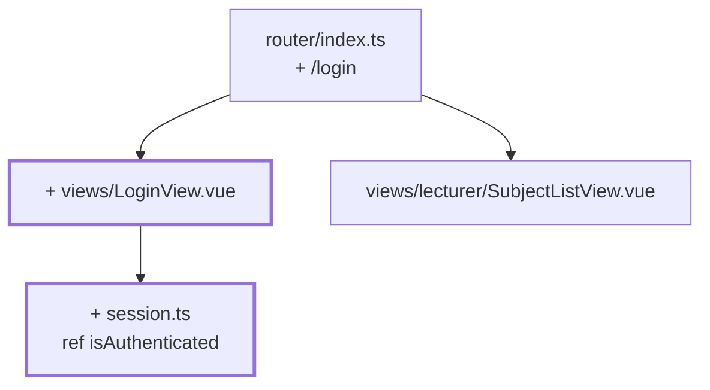

# Kapitel 07 — Der Login, der noch nichts prüft

> **Zeit:** ca. 0,5–1 h
> **Konzepte:** [Vue Router](../konzepte/07-router.md)

## Wo du stehst

Zwei Routen, beide offen. Wer die App aufruft, landet direkt in der Fächerliste.

## Was dazukommt

Ein Login-Bildschirm mit zwei Feldern und einem Button. Der Button prüft **nichts** — er setzt
ein Flag und navigiert weiter. Das ist der ganze Punkt dieses Kapitels: erst der Ablauf, dann die
Logik.



## Der Weg

1. **`src/session.ts`** — ein einziger `ref`, absichtlich außerhalb jeder Komponente:

   ```ts
   import { ref } from 'vue'

   /**
    * Modul-State: existiert genau EINMAL für die ganze App, weil der `ref`
    * außerhalb einer Funktion steht. Ein Provisorium bis Kapitel 08.
    */
   export const isAuthenticated = ref(false)
   ```

   Dass ein `ref` auf Modulebene anders funktioniert als einer in einer Funktion, ist kein
   Zufallsdetail — dieselbe Unterscheidung brauchst du in
   [Kapitel 18](18-academy-themes.md) wieder.

2. **`src/views/LoginView.vue`** mit einem echten `<form>`, zwei `<input>` und einem
   Submit-Button:

   ```vue
   <script setup lang="ts">
   import { ref } from 'vue'
   import { useRouter } from 'vue-router'
   import { isAuthenticated } from '@/session'

   const router = useRouter()
   const username = ref('')
   const password = ref('')

   function handleSubmit() {
     // Kapitel 08 prüft hier wirklich etwas. Vorerst: Tür auf.
     isAuthenticated.value = true
     router.push({ name: 'lecturer-subjects' })
   }
   </script>

   <template>
     <form @submit.prevent="handleSubmit">
       <label>Benutzername <input v-model="username" autocomplete="username" /></label>
       <label>Passwort <input v-model="password" type="password" autocomplete="current-password" /></label>
       <button type="submit">Anmelden</button>
     </form>
   </template>
   ```

3. **Route `/login`** ergänzen und `/` dorthin umleiten statt auf die Fächerliste.

4. **Einen Logout-Button** irgendwo oben hinsetzen: `isAuthenticated.value = false` und
   `router.push({ name: 'login' })`.

5. **Den Ablauf durchklicken**, bis er sich richtig anfühlt: Login → Liste → Fach → zurück →
   Logout → Login. Erst wenn das sitzt, kommt in [Kapitel 08](08-auth-store.md) die Prüfung dazu.

## Was noch vereinfacht ist

| Vereinfachung | Warum das reicht | Aufgeräumt in |
| --- | --- | --- |
| Jede Eingabe wird akzeptiert, auch eine leere | der Ablauf steht vor der Regel | [Kapitel 08](08-auth-store.md) |
| `isAuthenticated` ist ein loser Modul-`ref` | ein Store lohnt erst mit mehr als einem Feld | [Kapitel 08](08-auth-store.md) |
| Es gibt keine Rolle und keine Person | dafür braucht es die Stammdaten | [Kapitel 08](08-auth-store.md) |
| Die geschützten URLs sind weiter direkt erreichbar | Guards sind ein eigenes Kapitel | [Kapitel 09](09-router-guards.md) |
| Beim Reload bist du abgemeldet | Persistenz kommt später | [Kapitel 12](12-localstorage-composable.md) |
| Kein Fehlertext im Formular | es gibt noch keinen Fehlerfall | [Kapitel 08](08-auth-store.md) |

## Review

- [ ] `/` landet auf `/login`
- [ ] Der Button führt in die Fächerliste — mit leeren Feldern genauso
- [ ] Die Eingabetaste im Passwortfeld löst das Absenden aus
- [ ] Logout führt zurück auf `/login`
- [ ] `/lecturer/subjects` ist direkt aufrufbar, ohne angemeldet zu sein (erwartet — das ist
      [Kapitel 09](09-router-guards.md))

## Commit

Der Stand läuft — sichere ihn, bevor du weitermachst.

```bash
git add -A && git commit -m "feat: Login-Bildschirm ohne Prüfung"
```

## Zum Nachlesen

- [Konzepte: Vue Router](../konzepte/07-router.md) — programmatische Navigation, benannte Routen
- [Konzepte: Komponenten](../konzepte/05-komponenten.md) — warum ein echtes `<form>` und nicht `@click`
