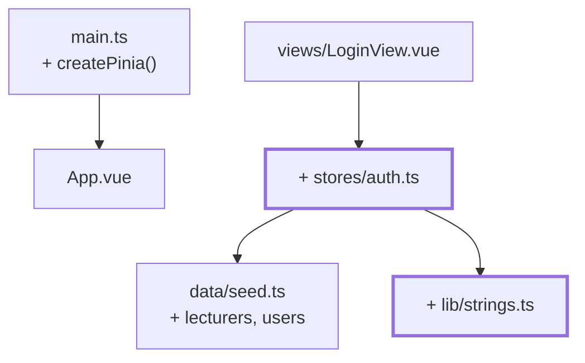

# Kapitel 08 — Der echte Login

> **Zeit:** ca. 1–1,5 h
> **Konzepte:** [Pinia](../konzepte/08-pinia.md)

## Wo du stehst

Der Login-Bildschirm funktioniert als Ablauf, prüft aber nichts. Der Zustand ist ein loser
`ref` in `src/session.ts`.

## Was dazukommt

Pinia, ein `auth`-Store und eine Prüfung gegen die Stammdaten. Dazu die zweite Rolle: bisher
gab es nur Lehrende, jetzt gibt es auch Lernende.



## Der Weg

1. **Stammdaten ergänzen.** `src/data/lecturers.ts` mit **einer** lehrenden Person, und in
   `types/domain.ts` die Rolle:

   ```ts
   export type Role = 'lecturer' | 'student'

   export interface Student extends Person { readonly role: 'student'; … }
   export interface Lecturer extends Person { readonly role: 'lecturer'; readonly academicTitle: string }

   /** Discriminated Union - das Feld `role` erlaubt Narrowing. */
   export type User = Student | Lecturer
   ```

   Dazu die beiden Type Guards `isStudent(user)` und `isLecturer(user)`. In `seed.ts` kommt
   `users = [...LECTURERS, ...STUDENTS]` dazu — der Login sucht in **einer** Sammlung.

2. **`src/lib/strings.ts`** mit `toUsername(lastName)`: kleinschreiben, `ä→ae`, `ß→ss`, dann
   Akzente über `normalize('NFD')` wegwerfen. `Sabé` wird zu `sabe`. Und `fullName(person)`,
   das `Yoda Yoda` zu `Yoda` zusammenzieht — Mononyme gibt es real genauso.

3. **`npm install pinia`**, `app.use(createPinia())` in `main.ts`, **vor** `app.use(router)`.

4. **`src/stores/auth.ts`** als Setup-Store — die Funktion ist aufgebaut wie ein
   `<script setup>`: `ref` sind State, `computed` sind Getter, normale Funktionen sind Actions.

   ```ts
   export const useAuthStore = defineStore('auth', () => {
     /** Nur die ID, nicht das ganze User-Objekt. */
     const currentUserId = ref<string | null>(null)
     const error = ref<string | null>(null)

     /** Frisch aus den Stammdaten gelesen - eine Quelle der Wahrheit. */
     const currentUser = computed<User | null>(() =>
       currentUserId.value === null
         ? null
         : (users.find((u) => u.id === currentUserId.value) ?? null),
     )

     const isAuthenticated = computed(() => currentUser.value !== null)
     const role = computed(() => currentUser.value?.role ?? null)

     function login(username: string, password: string): boolean {
       const normalized = toUsername(username)
       const match = users.find((user) => toUsername(user.lastName) === normalized)

       // Dieselbe Meldung in beiden Fällen: verrate nicht, welcher Teil falsch war.
       if (match === undefined || toUsername(password) !== normalized) {
         error.value = 'Benutzername oder Passwort ist falsch.'
         return false
       }

       currentUserId.value = match.id
       error.value = null
       return true
     }

     function logout(): void { … }

     return { currentUserId, currentUser, error, isAuthenticated, role, login, logout }
   })
   ```

   > **Das ist keine echte Authentifizierung.** Benutzername und Passwort sind beide der
   > Nachname, geprüft wird im Browser. Eine Lernübung — echte Anmeldung passiert serverseitig
   > gegen gehashte Passwörter. Schreib den Hinweis als Kommentar in die Datei, damit die
   > Einschränkung nicht irgendwann als Feature durchgeht.

   Warum nur die ID im State steht und `currentUser` abgeleitet wird: würdest du das ganze
   Objekt speichern, hättest du eine zweite Quelle der Wahrheit, die nach jeder Datenänderung
   veraltet ist.

   Und warum `login` `false` zurückgibt statt zu werfen: ein falsches Passwort ist ein normaler
   Ablauf, keine Ausnahmesituation.

5. **`LoginView` umbauen:** `auth.login(username, password)`, bei `false` das Passwortfeld
   leeren und `error` anzeigen, bei `true` weiternavigieren. `src/session.ts` löschen.

6. **Eine Zugangsliste anbieten.** Niemand rät zehn Nachnamen. Bau eine aufklappbare Liste
   aller Zugänge, deren Klick beide Felder füllt. In `seed.ts` gehört dafür eine Funktion, die
   **Rohdaten** liefert (`{ id, name, login, isLecturer }`) und keinen fertigen Anzeigetext —
   der hängt an der Sprache und gehört in die View.

7. **`storeToRefs` benutzen**, wenn du State aus dem Store destrukturierst:
   `const { error } = storeToRefs(auth)`. Ohne das ist die Reaktivität weg. Actions dagegen
   destrukturierst du normal.

## Was noch vereinfacht ist

| Vereinfachung | Warum das reicht | Aufgeräumt in |
| --- | --- | --- |
| Klartext-Passwort im Browser geprüft | Lernprojekt ohne Backend — bleibt so, aber kommentiert | — |
| Die Rolle ändert noch nichts an der Ansicht | die Lernenden-Sicht gibt es noch nicht | [Kapitel 13](13-student-dashboard.md) |
| Geschützte URLs sind weiter offen | Guards sind das nächste Kapitel | [Kapitel 09](09-router-guards.md) |
| Reload meldet dich ab | `useLocalStorage` kommt später | [Kapitel 12](12-localstorage-composable.md) |
| Alle Nutzer:innen in einem Topf | ohne Akademien gibt es nichts zu trennen | [Kapitel 15](15-vier-akademien.md) |
| `users.find(...)` von Hand | eine `Collection<T>` lohnt erst mit Filtern | [Kapitel 15](15-vier-akademien.md) |

## Review

- [ ] `tano` / `tano` meldet an, `tano` / `falsch` nicht
- [ ] Bei Fehlschlag steht eine Meldung am Feld und das Passwort ist geleert
- [ ] Die Meldung ist bei unbekanntem Namen **dieselbe** wie bei falschem Passwort
- [ ] Ein Klick in der Zugangsliste füllt beide Felder
- [ ] `sabe` funktioniert als Login für `Sabé`
- [ ] In den Vue-Devtools siehst du den `auth`-Store mit `currentUserId`
- [ ] `npm run type-check` ist grün — die Union `User` zwingt dich an ein, zwei Stellen zu
      unterscheiden, und das ist beabsichtigt

## Commit

Der Stand läuft — sichere ihn, bevor du weitermachst.

```bash
git add -A && git commit -m "feat: Login gegen die Stammdaten mit Pinia"
```

## Zum Nachlesen

- [Konzepte: Pinia](../konzepte/08-pinia.md) — Setup-Stores, `storeToRefs`
- [Konzepte: Domänenmodell](../konzepte/06-domaenenmodell.md#der-login-name) — `toUsername` im Detail
- `reference/src/stores/auth.ts`, `reference/src/lib/strings.ts` — bis auf `academy` und
  `useLocalStorage` dein jetziger Stand
