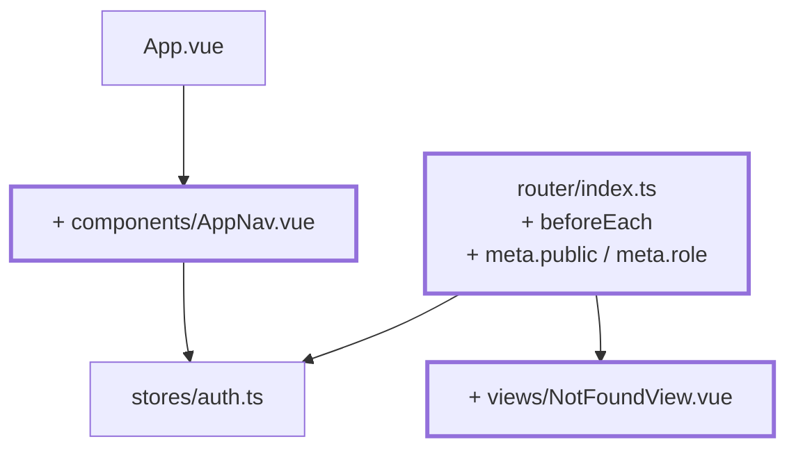
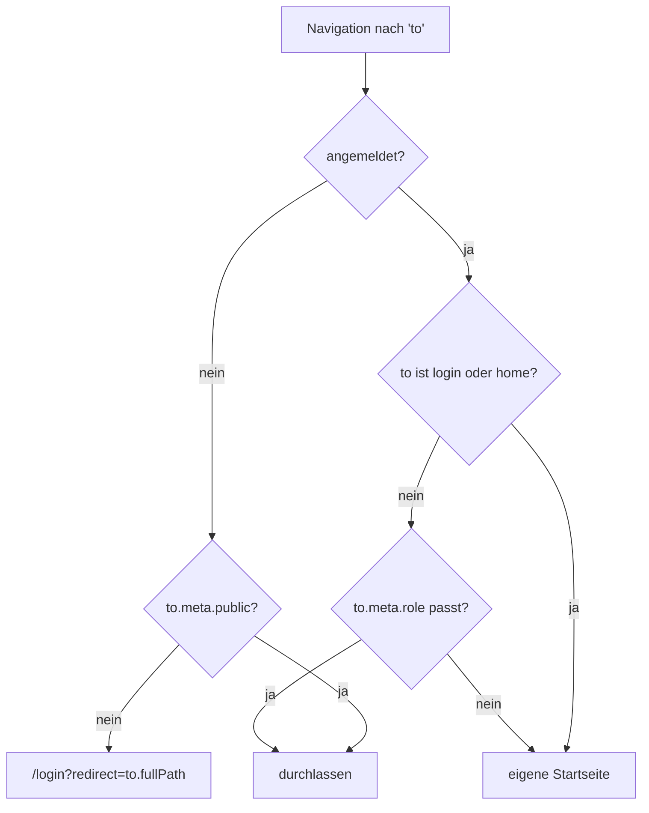

# Kapitel 09 — Routen schützen

> **Zeit:** ca. 1–1,5 h
> **Konzepte:** [Vue Router](../konzepte/07-router.md), [Pinia](../konzepte/08-pinia.md)

## Wo du stehst

Der Login prüft gegen die Stammdaten, der `auth`-Store kennt Person und Rolle. Nur: `/lecturer/subjects`
ist weiterhin ohne Anmeldung erreichbar.

## Was dazukommt

Ein globaler Guard, Rollen an den Routen, eine 404-Seite und eine Navigationsleiste mit Logout.



**Was der Guard entscheidet:**



## Der Weg

1. **`meta` typsicher machen.** TypeScript erlaubt, ein Interface aus einem fremden Modul zu
   erweitern — damit ist `meta: { rolle: 'x' }` ein Compile-Fehler statt eines stillen Bugs:

   ```ts
   declare module 'vue-router' {
     interface RouteMeta {
       public?: boolean
       role?: Role
     }
   }
   ```

2. **`meta` an den Routen setzen:** `/login` bekommt `public: true`, die Dozent:innen-Routen
   `role: 'lecturer'`.

3. **Ein globaler `beforeEach` statt `beforeEnter` je Route.** Die Regel gilt für alles;
   wiederholst du sie pro Route, ist die eine Route, die du zu ergänzen vergisst, ungeschützt.

   ```ts
   router.beforeEach((to) => {
     // Der Store darf erst *hier drin* geholt werden - beim Import dieses
     // Moduls existiert die Pinia-Instanz noch nicht.
     const auth = useAuthStore()

     if (!auth.isAuthenticated) {
       if (to.meta.public) return true
       return { name: 'login', query: { redirect: to.fullPath } }
     }
     …
   })
   ```

   Rückgabe: `true` oder nichts = durchlassen, ein Route-Objekt = umleiten.

4. **`homeRouteFor(role)`** als exportierte Funktion — sie beantwortet an genau einer Stelle,
   wo eine Rolle nach dem Login landet. Der Guard braucht sie, `LoginView` auch.

5. **Das `redirect` einlösen.** Nach erfolgreichem Login schickt `LoginView` die Person an das
   ursprüngliche Ziel. **Wichtig:** `redirect` ist ein Query-Parameter und damit frei
   beeinflussbar — akzeptiere nur Werte, die mit `/` beginnen, sonst hast du eine offene
   Weiterleitung gebaut.

6. **Falsche Rolle → eigene Startseite**, nicht Fehlerseite. Wer als Lernende:r auf einer
   Dozent:innen-URL landet, hat sich vertan; eine Fehlermeldung hilft da niemandem.

7. **404-Route** mit `path: '/:pathMatch(.*)*'` und `meta: { public: true }`.

8. **`components/AppNav.vue`** mit dem Namen der angemeldeten Person und einem Logout-Button.
   In `App.vue` über den `<RouterView />`.

## Was noch vereinfacht ist

| Vereinfachung | Warum das reicht | Aufgeräumt in |
| --- | --- | --- |
| Es gibt nur Routen für `role: 'lecturer'` | die Lernenden-Sicht fehlt noch | [Kapitel 13](13-student-dashboard.md) |
| Reload meldet ab, der Guard schickt zum Login | Session-Persistenz kommt gleich | [Kapitel 12](12-localstorage-composable.md) |
| Der Guard prüft die Rolle, nicht die Akademie | es gibt nur eine | [Kapitel 15](15-vier-akademien.md) |
| `AppNav` ist eine schlichte Leiste | Layout und Banner später | [Kapitel 17](17-tailwind-layout.md) |

## Review

- [ ] `/lecturer/subjects` ohne Anmeldung → `/login?redirect=/lecturer/subjects`
- [ ] Nach dem Login landest du **auf dem ursprünglichen Ziel**, nicht auf der Startseite
- [ ] `?redirect=https://example.com` führt **nicht** dorthin
- [ ] Angemeldet auf `/login` → sofort weiter auf die eigene Startseite
- [ ] `/gibtsnicht` zeigt die 404-Seite, auch ohne Anmeldung
- [ ] Logout und dann Zurück-Button führt nicht zurück in die geschützte Ansicht

## Commit

Der Stand läuft — sichere ihn, bevor du weitermachst.

```bash
git add -A && git commit -m "feat: Routen über einen globalen Guard schützen"
```

## Zum Nachlesen

- [Konzepte: Vue Router](../konzepte/07-router.md) — Guards, `meta`, Declaration Merging
- `reference/src/router/index.ts` — der vollständige Guard, inklusive der Routen für Lernende
