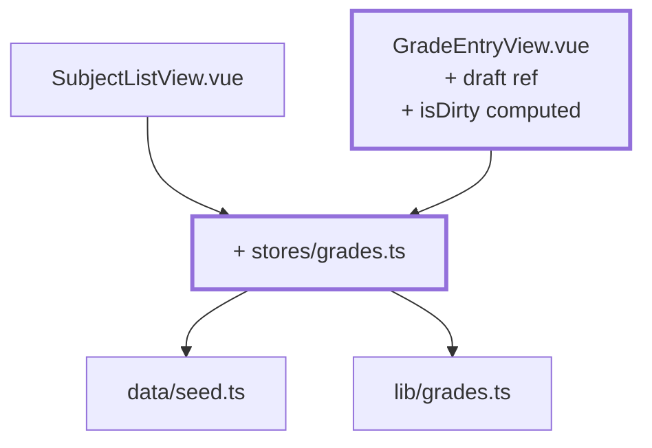
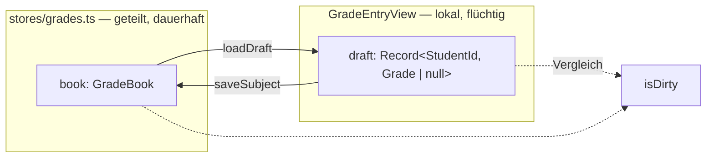

# Kapitel 10 — Noten eintragen und speichern

> **Zeit:** ca. 1,5–2 h
> **Konzepte:** [Pinia](../konzepte/08-pinia.md),
> [Ansicht der Lehrenden](../konzepte/10-dozenten-view.md)

## Wo du stehst

Angemeldet, geschützte Routen, Fächerliste und Formular. Die Notenmatrix ist ein lokaler `ref`
in einer View — jede Navigation setzt sie zurück, und die Liste weiß nichts von dem, was im
Formular passiert.

## Was dazukommt

Ein `grades`-Store als gemeinsame Quelle, und im Formular ein **Draft**: eine lokale Kopie, die
erst beim Speichern in den Store wandert.



**Wem gehört welcher Zustand:**



## Der Weg

1. **`src/stores/grades.ts`** mit `book = ref(createGradeBook())` und den Zugriffsfunktionen:

   | Funktion | Zweck |
   | --- | --- |
   | `gradesForSubject(subjectId)` | die Noten eines Fachs, in Reihenfolge der Lernenden |
   | `gradeMapForSubject(subjectId)` | dieselben Daten als Objekt — **flache Kopie** für den Draft |
   | `gradeOf(subjectId, studentId)` | eine einzelne Note |
   | `saveSubject(subjectId, draft)` | übernimmt einen kompletten Draft |
   | `gradedCountBySubject` | `computed`: Fach-ID → Anzahl vergebener Noten |

   `gradeMapForSubject` gibt bewusst eine Kopie zurück. Gäbe es die nicht, würde jeder
   Tastendruck im Formular direkt den Store mutieren — und „Verwerfen" wäre unmöglich.

   `saveSubject` ist **ein** Aufruf statt vieler Einzel-Setter. Ein Schreibvorgang heißt später
   auch genau ein `localStorage`-Write ([Kapitel 12](12-localstorage-composable.md)).

2. **Der Draft in `GradeEntryView`:**

   ```ts
   const draft = ref<Record<string, Grade | null>>({})
   const savedAt = ref<Date | null>(null)

   function loadDraft() {
     draft.value = gradesStore.gradeMapForSubject(props.subjectId)
     savedAt.value = null
   }
   ```

3. **Der Watcher, ohne den die View kaputt ist:**

   ```ts
   watch(() => props.subjectId, loadDraft, { immediate: true })
   ```

   Wechselst du von `/lecturer/subjects/f02` auf `/f03`, wird die Komponente **wiederverwendet** —
   `<script setup>` läuft nicht erneut, und der alte Draft bleibt stehen. Du trägst Noten ins
   falsche Fach ein. Das ist der Fehler, der in [Kapitel 06](06-router-zwei-views.md) angekündigt
   war.

   Zwei Fallstricke auf einmal: `watch(props.subjectId, …)` funktioniert **nicht** (du übergibst
   den Wert, nicht die Quelle), und ohne `immediate: true` ist beim ersten Rendern alles leer.

4. **`isDirty` ableiten statt mitpflegen:**

   ```ts
   const isDirty = computed(() =>
     students.some((s) => draft.value[s.id] !== gradesStore.gradeOf(props.subjectId, s.id)),
   )
   ```

   Nach dem Speichern ist `isDirty` von selbst `false` — es vergleicht ja gegen den Store. Du
   musst nichts zurücksetzen. Das ist der Gewinn aus der Regel in
   [Vue-Reaktivität](../konzepte/04-vue-reactivity.md): ableiten statt mitpflegen.

5. **Vier Buttons:** *Speichern*, *Verwerfen* (beide nur aktiv bei `isDirty`), *Leeren*, und
   ein Hinweis „Ungespeicherte Änderungen" bzw. „Gespeichert um HH:MM:SS".

6. **Die Eingabefelder** bleiben vorerst nackte `<input type="number">`, ein Feld pro Zeile,
   gebunden über den Index-Zugriff. Hier stolperst du über `noUncheckedIndexedAccess` aus
   [TypeScript](../konzepte/03-typescript.md): `draft[student.id]` ist `Grade | null | undefined`. Löse
   `v-model` in seine beiden Hälften auf:

   ```vue
   :model-value="draft[student.id] ?? null"
   @update:model-value="(value) => (draft[student.id] = value)"
   ```

7. **Die Liste zieht mit.** `SubjectListView` liest jetzt aus dem Store — speicherst du im
   Formular, ändert sich beim Zurückgehen der Fortschritt, ohne dass du irgendetwas
   synchronisierst.

## Was noch vereinfacht ist

| Vereinfachung | Warum das reicht | Aufgeräumt in |
| --- | --- | --- |
| Eine `9` im Feld verdirbt den Draft | robuste Eingabe ist das nächste Kapitel | [Kapitel 11](11-grade-input.md) |
| Kein „Zufällig ausfüllen" | erst muss der Draft stehen | [Kapitel 11](11-grade-input.md) |
| Wegnavigieren verwirft ungespeicherte Änderungen wortlos | `onBeforeRouteLeave` kommt gleich | [Kapitel 11](11-grade-input.md) |
| Reload setzt alle Noten auf den Seed zurück | Persistenz hat ihr eigenes Kapitel | [Kapitel 12](12-localstorage-composable.md) |
| Der Store kennt jedes Fach für jede Person | ohne Akademien gibt es keine Trennlinie | [Kapitel 15](15-vier-akademien.md) |
| Kennzahlen von Hand zusammengerechnet | `useGradeStats` bündelt das | [Kapitel 14](14-klassenspiegel-chart.md) |

## Review

- [ ] Ein leeres Fach öffnen, Noten eintragen → „ungespeichert" erscheint
- [ ] Der Store ist noch **unverändert** (in den Vue-Devtools nachsehen)
- [ ] *Verwerfen* stellt den alten Stand wieder her
- [ ] *Speichern* → Hinweis wechselt, und die Fächerliste zeigt den neuen Fortschritt
- [ ] Fachwechsel über die Liste zeigt die **richtigen** Noten, nicht die vorherigen
- [ ] Direktaufruf von `/lecturer/subjects/f03` zeigt sofort die Noten, nicht leere Felder

## Commit

Der Stand läuft — sichere ihn, bevor du weitermachst.

```bash
git add -A && git commit -m "feat: Noten im Store speichern, Draft im Formular"
```

## Zum Nachlesen

- [Konzepte: Ansicht der Lehrenden](../konzepte/10-dozenten-view.md) — Draft vs. gespeicherter Stand, der Watcher im Detail
- [Konzepte: Pinia](../konzepte/08-pinia.md) — Setup-Stores
- `reference/src/stores/grades.ts` — dieselben Funktionen, plus `rosterFor` für die Akademien
