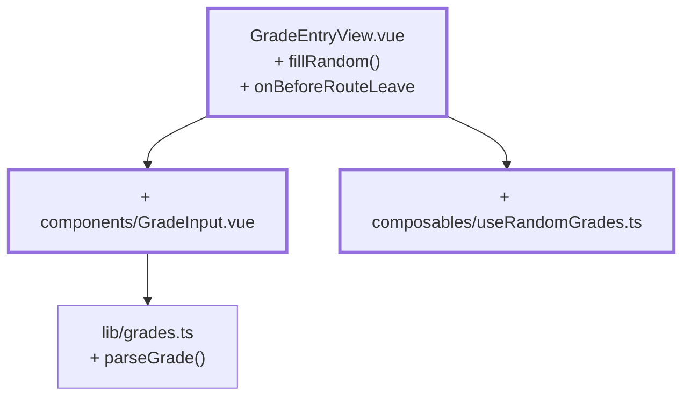

# Kapitel 11 — Eine Eingabe, die man nicht kaputtmachen kann

> **Zeit:** ca. 1,5–2 h
> **Konzepte:** [Ansicht der Lehrenden](../konzepte/10-dozenten-view.md)

## Wo du stehst

Der Draft funktioniert, Speichern und Verwerfen auch. Aber eine `9` im Feld landet im Draft, und
wer mit ungespeicherten Änderungen wegnavigiert, verliert sie kommentarlos.

## Was dazukommt

`GradeInput` als eigene Komponente mit einer klaren Zusage: **ungültige Eingaben werden
angezeigt, aber nicht nach oben gemeldet.** Dazu „Zufällig ausfüllen" und die Rückfrage beim
Verlassen.



## Der Weg

1. **`parseGrade` in `lib/grades.ts`** — drei Rückgabefälle, und die Unterscheidung ist der
   ganze Trick:

   ```ts
   /** '' -> null (nicht benotet) · '3' -> 3 · '9' -> undefined (Fehler) */
   export function parseGrade(input: string): Grade | null | undefined
   ```

   „Feld geleert" ist eine gültige Aktion, „Feld enthält 9" ist ein Fehler, den die Oberfläche
   melden muss. Achte auf `Number('')`, das `0` ergibt — die Leerprüfung muss davor stehen.

2. **`components/GradeInput.vue`.** Ein `<input>` liefert immer einen String, das Modell will
   `Grade | null`. Die Komponente hält deshalb einen eigenen Text-`ref` und übersetzt in beide
   Richtungen:

   ```ts
   const model = defineModel<Grade | null>({ required: true })
   const text = ref(model.value === null ? '' : String(model.value))
   const invalid = ref(false)

   // von außen nach innen: Zufallswerte, Fachwechsel
   watch(model, (value) => {
     const next = value === null ? '' : String(value)
     if (next !== text.value) {          // ohne diesen Vergleich: Endlosschleife
       text.value = next
       invalid.value = false
     }
   })

   // von innen nach außen: Tippen
   watch(text, (value) => {
     const parsed = parseGrade(value)
     if (parsed === undefined) {
       invalid.value = true              // anzeigen, aber NICHT melden
       return
     }
     invalid.value = false
     model.value = parsed
   })
   ```

   Das Modell ist damit zu **jedem** Zeitpunkt gültig. Tippt jemand eine 9, steht „nur 1–5" am
   Feld und die vorherige Note bleibt unangetastet.

3. **Zugänglichkeit, die keine Extraarbeit ist.** Zehn Felder ohne sichtbares Label brauchen
   ein `aria-label` (`Bewertung für Ahsoka Tano`), sonst hört ein Screenreader zehnmal
   „Textfeld". Und die Fehlermeldung braucht eine eindeutige ID aus `useId()` — zehn Felder mit
   derselben festen ID würden alle auf dieselbe Meldung zeigen.

4. **`composables/useRandomGrades.ts`.** Gewichtete Verteilung statt `Math.random() * 5`: eine
   echte Klausur produziert selten gleich viele Einsen wie Fünfen. Das Verfahren
   („roulette wheel") steht in der Referenz.

   ```ts
   function fillRandom() {
     draft.value = randomGradesFor(students.map((s) => s.id))
   }
   ```

   **Ein neues Objekt statt zehn Einzelzuweisungen:** eine Zuweisung, ein Rendern. Und es
   schreibt in den *Draft*, nicht in den Store — der Generator füllt die Felder, du siehst das
   Ergebnis und bestätigst.

5. **`onBeforeRouteLeave`** mit Rückfrage, wenn `isDirty`.

## Was noch vereinfacht ist

| Vereinfachung | Warum das reicht | Aufgeräumt in |
| --- | --- | --- |
| Fehlertext steht deutsch in der Komponente | eine Sprache | [Kapitel 21](21-i18n.md) |
| `GradeInput` bringt sein eigenes Markup mit | `BaseInput` gibt es noch nicht | [Kapitel 16](16-base-components.md) |
| Die Rückfrage ist ein `window.confirm` | bleibt so — auch in der Referenz | — |
| Kein Test für die zentrale Zusage | Tests haben ein eigenes Kapitel | [Kapitel 19](19-tests-vitest.md) |

## Review

- [ ] *Zufällig ausfüllen* in einem leeren Fach füllt **zehn** Felder, „ungespeichert" erscheint
- [ ] Der Store ist danach immer noch unverändert
- [ ] Eine `9` eintippen → Hinweis am Feld, **vorheriger Wert bleibt erhalten**
- [ ] Feld leeren → wird als „nicht benotet" übernommen, ohne Fehlermeldung
- [ ] Fachwechsel setzt die Felder um, ohne dass ein Feld hängen bleibt
- [ ] Mit ungespeicherten Änderungen wegnavigieren → Rückfrage
- [ ] Ein Screenreader (oder die Accessibility-Ansicht der Devtools) liest je Feld den Namen vor

## Commit

Der Stand läuft — sichere ihn, bevor du weitermachst.

```bash
git add -A && git commit -m "feat: GradeInput mit Validierung und Zufallswerten"
```

## Zum Nachlesen

- [Konzepte: Ansicht der Lehrenden](../konzepte/10-dozenten-view.md) — `GradeInput` Zeile für Zeile
- `reference/src/components/GradeInput.vue` — deine Endfassung
- `reference/src/composables/useRandomGrades.ts` — die gewichtete Ziehung
