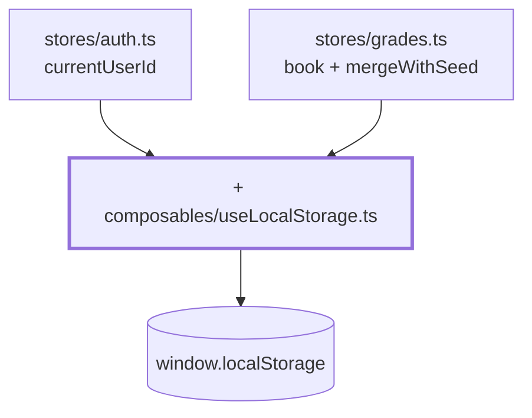

# Kapitel 12 — Alles überlebt den Reload

> **Zeit:** ca. 1–1,5 h
> **Konzepte:** [Composables](../konzepte/09-composables.md)

## Wo du stehst

Noten eintragen und speichern funktioniert. F5 macht alles zunichte: Session weg, Noten zurück
auf den Seed.

## Was dazukommt

Ein generisches `useLocalStorage<T>` — **ein** Composable, das beide Stores bedient.



## Der Weg

1. **Die Signatur zuerst.** Der Typparameter macht das Composable universell — der Rückgabetyp
   richtet sich nach dem Fallback:

   ```ts
   export function useLocalStorage<T>(
     key: string,
     fallback: T,
     parse: (raw: unknown, fallback: T) => T = (raw) => raw as T,
   ): Ref<T>
   ```

   ```ts
   const id   = useLocalStorage<string | null>('gradebook.session', null)  // Ref<string | null>
   const book = useLocalStorage('gradebook.grades', createGradeBook())      // Ref<GradeBook>
   ```

2. **Lesen mit `try`/`catch`.** Nicht optional: ein halb geschriebener oder von Hand geänderter
   Eintrag lässt `JSON.parse` werfen und würde die App beim Start abschießen. `undefined` heißt
   „nichts Brauchbares gespeichert".

3. **Schreiben über einen `watch` mit `deep: true`.** Ohne `deep` würde bei der verschachtelten
   Notenmatrix nur der Austausch der ganzen Referenz melden, nicht die Änderung eines Eintrags.
   Auch das Schreiben braucht ein `catch`: privater Modus oder volles Quota sind kein Grund,
   die App anzuhalten — Persistenz ist hier Komfort, kein Muss.

4. **In den `auth`-Store einsetzen.** `currentUserId` wird zum `useLocalStorage`. Beachte, dass
   weiterhin **nur die ID** persistiert wird und `currentUser` abgeleitet bleibt — sonst hättest
   du veraltete Personendaten im Speicher.

5. **Der `parse`-Parameter zeigt jetzt seinen Sinn.** Dein Datenmodell ändert sich über die
   Zeit, `localStorage` ist persistent. Kommt in `subjects.ts` ein Fach dazu, fehlt es in alten
   Ständen — ohne Merge wäre `book.value['f07']` dann `undefined` und die View liefe auf einen
   Fehler.

   ```ts
   const book = useLocalStorage('gradebook.grades', createGradeBook(), mergeWithSeed)
   ```

   `mergeWithSeed` lässt den Seed die **Struktur** vorgeben und den gespeicherten Stand die
   **Werte** — und übernimmt nur Werte, die `isGrade` passieren. Ein Detail, das man leicht
   falsch macht: „Schlüssel fehlt" und „Wert ist `null`" sind zwei verschiedene Dinge. Fehlt der
   Schlüssel, ist die Person neu → Seed-Wert. Steht dort `null`, wurde die Note bewusst geleert
   → `null` bleibt.

6. **Ein Zurücksetzen anbieten.** `resetAll()` im Store, ein unauffälliger Link auf dem
   Login-Bildschirm mit `window.confirm`. Ohne das kommst du beim Entwickeln nicht mehr an einen
   frischen Stand.

## Was noch vereinfacht ist

| Vereinfachung | Warum das reicht | Aufgeräumt in |
| --- | --- | --- |
| Der `localStorage`-Key ist ein String im Modul | eine Konstante je Store reicht | — |
| Kein Ablauf der Session | Lernprojekt ohne Backend | — |
| Bei zwei Tabs gewinnt der zuletzt schreibende | `storage`-Events wären eine eigene Übung | — |
| Der Merge kennt nur die Notenmatrix | mehr gibt es nicht zu migrieren | — |

## Review

- [ ] Anmelden, F5 → du bist immer noch angemeldet und auf derselben Seite
- [ ] Noten speichern, F5 → die Noten sind noch da
- [ ] In den Devtools unter Application → Local Storage stehen zwei Einträge
- [ ] Den Wert von Hand zu Unsinn machen (`{{{`) und neu laden → die App startet trotzdem
- [ ] Ein Fach in `subjects.ts` ergänzen, neu laden → es erscheint leer, der Rest bleibt
- [ ] Eine Note von Hand auf `9` setzen und neu laden → daraus wird `null`, kein Absturz
- [ ] „Daten zurücksetzen" führt auf den Auslieferungszustand

## Commit

Der Stand läuft — sichere ihn, bevor du weitermachst.

```bash
git add -A && git commit -m "feat: Session und Noten im localStorage sichern"
```

## Zum Nachlesen

- [Konzepte: Composables](../konzepte/09-composables.md) — Composables, generisches `useLocalStorage<T>`
- `reference/src/composables/useLocalStorage.ts` — deine Endfassung
- `reference/src/stores/grades.ts` — `mergeWithSeed` ganz unten
