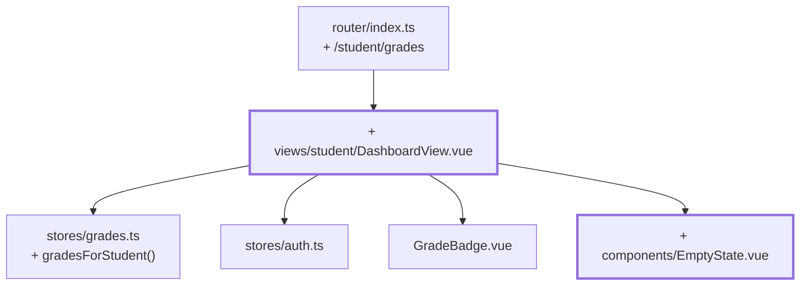

# Kapitel 13 — Die Sicht der Lernenden

> **Zeit:** ca. 1–1,5 h
> **Konzepte:** [Ansicht der Lernenden](../konzepte/11-studierenden-view.md)

## Wo du stehst

Die Dozent:innen-Seite ist fertig und überlebt den Reload. Meldet sich eine lernende Person an,
landet sie trotzdem in der Fächerliste der Lehrenden — die zweite Rolle hat noch keine eigene
Ansicht.

## Was dazukommt

Ein Dashboard mit den **eigenen** Noten über alle Fächer, und die Rolle entscheidet endlich,
wo man nach dem Login landet.



## Der Weg

1. **`gradesForStudent(studentId)` im Store** — alle Fächer mit der jeweiligen eigenen Note:

   ```ts
   export interface StudentGradeRow {
     subject: Subject
     grade: Grade | null
   }
   ```

   Ein eigener Typ statt eines anonymen Objekts, weil die View ihn im `v-for` braucht und du ihn
   in [Kapitel 19](19-tests-vitest.md) testen willst.

2. **`views/student/DashboardView.vue`** mit Route `/student/grades` und `meta: { role: 'student' }`.
   `homeRouteFor` aus [Kapitel 09](09-router-guards.md) liefert jetzt für beide Rollen etwas
   Sinnvolles.

3. **Die Person kommt aus dem Store, nicht aus der URL.** Das ist die wichtige Entscheidung
   dieses Kapitels:

   ```ts
   const rows = computed(() => {
     const user = currentUser.value
     if (user === null) return []
     return gradesStore.gradesForStudent(user.id)
   })
   ```

   Gäbe es stattdessen `/student/grades/:studentId`, könnte man mit einer fremden ID in der
   Adresszeile fremde Noten lesen. Was nie aus der URL kommt, kann auch nicht manipuliert
   werden.

   `currentUser` kann theoretisch `null` sein — der Guard schließt das praktisch aus, der
   Compiler weiß das aber nicht. Behandle den Fall sauber, statt ihn mit `!` wegzudrücken.

4. **Kennzahlen oben:** Anzahl benoteter Fächer, eigener Durchschnitt, offene Fächer.

5. **`EmptyState`** für den Fall, dass noch gar nichts benotet ist. Eine leere Tabelle sieht aus
   wie ein Fehler.

6. **`AppNav` rollenabhängig.** Lehrende sehen den Link zur Fächerliste, Lernende den zum
   Dashboard. Der Type Guard `isStudent(user)` aus [Kapitel 08](08-auth-store.md) macht das
   typsicher.

## Was noch vereinfacht ist

| Vereinfachung | Warum das reicht | Aufgeräumt in |
| --- | --- | --- |
| Kein Vergleich mit dem Jahrgang | der Klassenspiegel ist das nächste Kapitel | [Kapitel 14](14-klassenspiegel-chart.md) |
| Kennzahlen von Hand zusammengerechnet | `useGradeStats` kommt gleich | [Kapitel 14](14-klassenspiegel-chart.md) |
| Jede lernende Person sieht alle sechs Fächer | es gibt nur eine Akademie | [Kapitel 15](15-vier-akademien.md) |
| Die Notenbezeichnung („gut") fehlt | hängt an der Akademie | [Kapitel 15](15-vier-akademien.md) |

## Review

- [ ] `tano` / `tano` landet nach dem Login auf `/student/grades`
- [ ] `yoda` / `yoda` landet weiterhin auf `/lecturer/subjects`
- [ ] Das Dashboard zeigt sechs Fächer, zwei davon mit Note
- [ ] Als lernende Person `/lecturer/subjects` aufrufen → zurück auf das eigene Dashboard
- [ ] Noten als Lehrende:r speichern, abmelden, als Lernende:r anmelden → die Note ist da
- [ ] Alle Noten leeren → `EmptyState` statt leerer Tabelle

## Commit

Der Stand läuft — sichere ihn, bevor du weitermachst.

```bash
git add -A && git commit -m "feat: Dashboard mit den eigenen Noten"
```

## Zum Nachlesen

- [Konzepte: Ansicht der Lernenden](../konzepte/11-studierenden-view.md) — die Ansicht der Lernenden
- `reference/src/views/student/DashboardView.vue`
