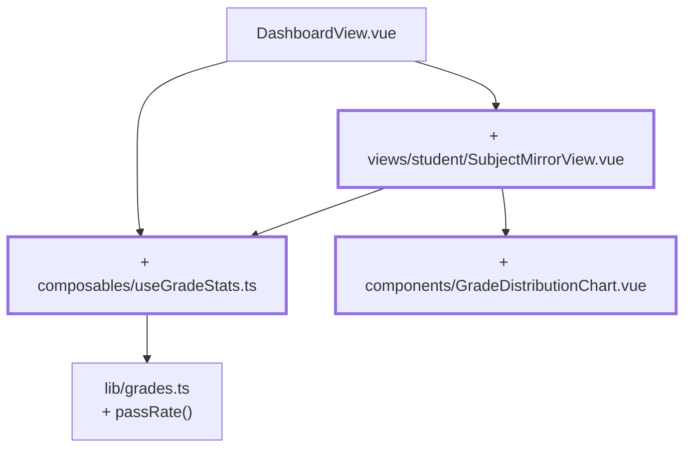

# Kapitel 14 — Klassenspiegel und Balkendiagramm

> **Zeit:** ca. 1,5–2 h
> **Konzepte:** [Composables](../konzepte/09-composables.md),
> [Ansicht der Lernenden](../konzepte/11-studierenden-view.md)

## Wo du stehst

Lernende sehen ihre eigenen Noten. Die Frage, die als Nächstes kommt — „und wie stehen die
anderen?" — beantwortet die App noch nicht.

## Was dazukommt

Eine Detailseite je Fach mit anonymem Vergleich und einem Balkendiagramm, und `useGradeStats`
als Bündel aller Kennzahlen.



## Der Weg

1. **`composables/useGradeStats.ts`** — die Kennzahlen als `computed`-Bündel: `count`, `total`,
   `average`, `distribution`, `passRate`, `peak`, `isEmpty`, `isComplete`.

   Die Signatur ist das eigentlich Lehrreiche:

   ```ts
   export function useGradeStats(source: MaybeRefOrGetter<readonly (Grade | null)[]>) {
     const grades = computed(() => toValue(source))
     …
   }
   ```

   `MaybeRefOrGetter<T>` ist die übliche Form für Composable-Eingaben: Wert, `ref` oder
   Funktion sind alle erlaubt, `toValue()` packt aus. Nähmst du stattdessen `(grades: Grade[])`,
   wäre der Wert beim Aufruf eingefroren und die Statistik aktualisierte sich nie.

2. **`useGradeStats` überall einsetzen**, wo du bisher von Hand gerechnet hast: Dashboard,
   Fächerliste und im Bewertungsformular. Dort mit den **Draft**-Werten als Quelle — die
   Kennzahlen sollen sich live beim Tippen ändern, nicht erst beim Speichern.

3. **`views/student/SubjectMirrorView.vue`** unter `/student/grades/:subjectId` mit `props: true`.

4. **Anonym heißt: die View bekommt die Namen gar nicht.**

   ```ts
   const classGrades = computed(() => gradesStore.gradesForSubject(props.subjectId))
   ```

   Eine Liste von Noten, keine Zuordnung. Was die View nie erhält, kann sie auch nicht
   versehentlich anzeigen — das ist der Unterschied zwischen „wir zeigen die Namen nicht an" und
   „wir haben sie nicht".

5. **`components/GradeDistributionChart.vue`** — fünf Balken, bewusst ohne Chart-Bibliothek.
   Die Höhe ist ein Prozentwert, skaliert am höchsten Balken; das ist reines CSS. Eine
   Bibliothek dafür wären rund 100 kB, die niemand braucht.

   Hier ist ein Inline-`:style` richtig, weil der Wert berechnet ist — für alles andere:
   Klassen.

   ```vue
   <div :style="{ height: `${(anzahl / peak) * 100}%` }" />
   ```

   Und: ein Diagramm ist für Screenreader nutzlos. Gib jedem Balken ein `aria-label` mit Note
   und Anzahl, oder stell eine Tabelle daneben.

6. **Die eigene Note hervorheben** — `GradeBadge` bekommt dafür den `highlight`-Prop, den es
   seit [Kapitel 02](02-erste-komponente.md) noch nicht hatte.

## Was noch vereinfacht ist

| Vereinfachung | Warum das reicht | Aufgeräumt in |
| --- | --- | --- |
| Der Vergleich umfasst alle Lernenden, die es gibt | es gibt nur eine Akademie — später ist es der eigene Jahrgang | [Kapitel 15](15-vier-akademien.md) |
| `/student/grades/f99` prüft nur auf „gibt es das Fach" | die Frage „darf diese Person das?" kommt mit den Akademien | [Kapitel 15](15-vier-akademien.md) |
| Notenbezeichnungen sind neutral („gut") | akademiespezifische Labels später | [Kapitel 15](15-vier-akademien.md), [Kapitel 21](21-i18n.md) |
| Die Balkenfarben sind fest | Design-Tokens später | [Kapitel 17](17-tailwind-layout.md) |

## Review

- [ ] Ein Klick im Dashboard führt auf `/student/grades/f01`
- [ ] Der Klassenspiegel zeigt zehn Noten, aber **keinen einzigen Namen**
- [ ] Die eigene Note ist hervorgehoben
- [ ] Fünf Balken, der höchste füllt die Fläche, leere Noten haben Höhe 0
- [ ] Ein Fach ohne Noten zeigt einen `EmptyState` statt fünf Nullen
- [ ] Im Bewertungsformular ändern sich die Kennzahlen **beim Tippen**, nicht erst beim Speichern
- [ ] Im DOM des Diagramms steht kein Name und keine Matrikelnummer

## Commit

Der Stand läuft — sichere ihn, bevor du weitermachst.

```bash
git add -A && git commit -m "feat: Klassenspiegel mit Notenverteilung"
```

## Zum Nachlesen

- [Konzepte: Composables](../konzepte/09-composables.md) — `MaybeRefOrGetter`, `toValue`
- [Konzepte: Ansicht der Lernenden](../konzepte/11-studierenden-view.md) — Klassenspiegel und Diagramm
- `reference/src/composables/useGradeStats.ts`, `reference/src/components/GradeDistributionChart.vue`
