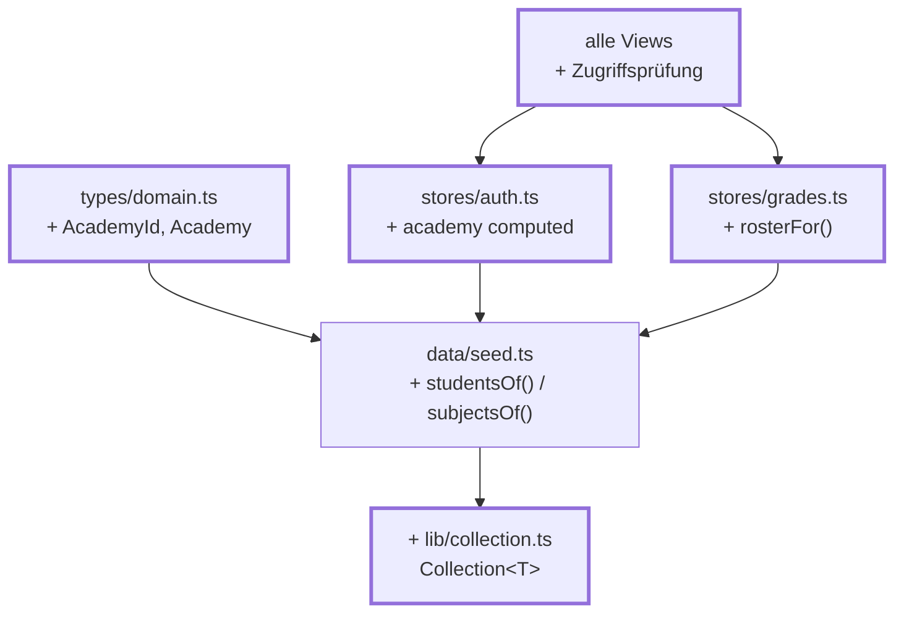
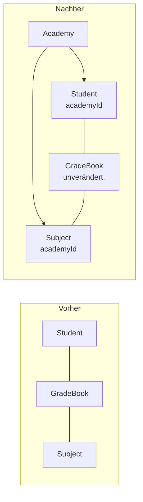

# Kapitel 15 — Aus einer Akademie werden vier

> **Zeit:** ca. 2–3 h
> **Konzepte:** [Domänenmodell](../konzepte/06-domaenenmodell.md)

## Wo du stehst

Die App ist funktional fertig: Login, Rollen, Noten eintragen, Klassenspiegel, alles überlebt
den Reload. Und alles kennt genau **eine** Akademie — die steht nirgends im Code, weil es
nichts zu unterscheiden gab.

## Was dazukommt

Die Akademie als **Dimension im Datenmodell**. Das ist das anspruchsvollste Kapitel, und zwar
nicht wegen der Menge, sondern weil eine nachträglich eingezogene Dimension an überraschend
vielen Stellen auftaucht.



**Was sich am Modell ändert:**



## Der Weg

1. **`AcademyId` als Union, nicht als `string`:**

   ```ts
   export type AcademyId = 'jedi' | 'sith' | 'empire' | 'rebels'
   export interface Academy extends Identifiable { readonly id: AcademyId }
   ```

   Damit muss jede Zuordnung — Farbpalette, Wappen, Bezeichnungen — vollständig sein, sonst
   meckert der Compiler. Ein Tippfehler fällt beim Übersetzen auf, nicht im Betrieb.

2. **`academyId` an `Person` und `Subject`.** Ab hier zeigt dir `npm run type-check` selbst,
   wo überall etwas fehlt. Arbeite die Liste ab — das ist der Kern dieses Kapitels.

3. **Die Notenmatrix bleibt unverändert.** Zweistufig, ohne Akademie-Ebene: das Fach legt die
   Akademie bereits fest, und eine Person gehört zu genau einer. Eine dritte Verschachtelung
   wäre redundant und müsste bei jeder Änderung konsistent gehalten werden. Wenn dich das
   überrascht, lies [Domänenmodell](../konzepte/06-domaenenmodell.md#warum-die-notenmatrix-unverändert-bleibt).

4. **Die zentrale Trennlinie** — zwei Funktionen in `seed.ts`, durch die alles geht:

   ```ts
   export function studentsOf(academyId: AcademyId): readonly Student[]
   export function subjectsOf(academyId: AcademyId): readonly Subject[]
   ```

   Sobald irgendwo „alle Lernenden" gebraucht werden, ist ab jetzt fast immer `studentsOf`
   gemeint.

5. **`createGradeBook` anpassen:** für ein Fach werden **nur die Lernenden der eigenen
   Akademie** eingetragen. Ein Padawan taucht damit gar nicht erst in einem imperialen Fach
   auf — die Trennung wird eine Eigenschaft der Datenstruktur statt eine Frage der Sorgfalt in
   den Views.

6. **`lib/collection.ts` — jetzt lohnt sich die generische Sammlung.** Bisher hast du überall
   `.filter().sort()` von Hand geschrieben. Mit vier Akademien wird daraus ein Muster:

   ```ts
   students.filter((s) => s.academyId === id).sortBy((s) => s.lastName).all()
   ```

   Eine generische Klasse mit `byId`, `find`, `filter`, `sortBy`, `map` und `[Symbol.iterator]`.
   Wie man sie baut, steht in [TypeScript](../konzepte/03-typescript.md) und
   [Domänenmodell](../konzepte/06-domaenenmodell.md#die-generische-sammlung). Zieh sie **nach** den ersten
   fünf Schritten ein, nicht davor — dann weißt du genau, welche Methoden du brauchst.

7. **`academy` im `auth`-Store**, abgeleitet und nicht gespeichert:

   ```ts
   const academy = computed(() => {
     const user = currentUser.value
     return user === null ? null : (academies.byId(user.academyId) ?? null)
   })
   ```

   Das ist der Dreh- und Angelpunkt der App: welche Fächer sichtbar sind, wer im Klassenspiegel
   auftaucht, wie später das Design aussieht — alles folgt daraus.

8. **`rosterFor(subjectId)` im `grades`-Store:** genau ein Ort, an dem steht, welche Lernenden
   zu einem Fach gehören. Alle Zugriffsfunktionen gehen hier durch. Ein unbekanntes Fach ergibt
   eine leere Liste statt eines Absturzes.

9. **Die Zugriffsprüfung — der wichtigste Punkt dieses Kapitels.** In beiden Detail-Views:

   ```ts
   const subject = computed(() => {
     const found = subjects.byId(props.subjectId)
     if (found === undefined || academy.value === null) return undefined
     // Fremdes Fach == nicht vorhandenes Fach.
     return found.academyId === academy.value.id ? found : undefined
   })
   ```

   > **Das ist kein hypothetischer Fall.** Beim Bauen der Referenz war genau diese Prüfung
   > zunächst vergessen: `byId` findet *jedes* Fach, und die ID kommt aus der URL. Ein Rekrut
   > konnte über die Adresszeile den Sith-Klassenspiegel einsehen. Immer wenn ein Bezeichner aus
   > der URL kommt, gehört dazu die Frage: *Darf diese Person das überhaupt?*

10. **Die Stammdaten auffüllen:** vier Akademien, je eine lehrende Person, je zehn Lernende, je
    sechs Fächer. Die Nachnamen müssen **akademieübergreifend eindeutig** sein — der Login sucht
    in einer einzigen Sammlung. Das ist die Stunde stumpfes Tippen aus
    [Domänenmodell](../konzepte/06-domaenenmodell.md); nimm die Daten aus `reference/src/data/`.

11. **Die Akademie auf dem Login-Bildschirm wählbar machen.** Vier echte Radio-Buttons
    (`<input type="radio">` in einem `<fieldset>` mit `<legend>`), nicht vier `<button>`:
    Gruppierung, Pfeiltastennavigation und Fokusverhalten kommen so vom Browser. Die Auswahl
    filtert die Zugangsliste — und in [Kapitel 18](18-academy-themes.md) schaltet sie das Design um.

## Was noch vereinfacht ist

| Vereinfachung | Warum das reicht | Aufgeräumt in |
| --- | --- | --- |
| Alle vier Akademien sehen gleich aus | Theming ist ein eigenes Kapitel | [Kapitel 18](18-academy-themes.md) |
| Namen und Mottos stehen in `academies.ts` | eine Sprache — sie wandern später in die Locale-Dateien | [Kapitel 21](21-i18n.md) |
| Bezeichnungen („Padawan", „Rekrut") noch neutral | dito | [Kapitel 21](21-i18n.md) |
| Kein Test sichert die Trennung ab | Tests haben ein eigenes Kapitel | [Kapitel 19](19-tests-vitest.md) |

## Review

- [ ] Vier Akademien auf dem Login, die Zugangsliste zeigt nur die passenden Zugänge
- [ ] Als Jedi-Lehrende:r siehst du **sechs** Fächer, nicht 24
- [ ] *Zufällig ausfüllen* füllt **zehn** Felder, nicht 40
- [ ] Der Klassenspiegel zeigt zehn Noten — den eigenen Jahrgang
- [ ] `/lecturer/subjects/f07` (ein Sith-Fach) als Jedi → dieselbe Meldung wie bei `f99`
- [ ] `/student/grades/f07` als Jedi ebenfalls
- [ ] `npm run type-check` ist grün, und du hast nirgends `as` benutzt, um es grün zu bekommen

## Commit

Der Stand läuft — sichere ihn, bevor du weitermachst.

```bash
git add -A && git commit -m "feat: vier Akademien als Dimension im Datenmodell"
```

## Zum Nachlesen

- [Konzepte: Domänenmodell](../konzepte/06-domaenenmodell.md) — die Akademie als Dimension, `Collection<T>`
- `reference/src/data/seed.ts` — `studentsOf`, `subjectsOf`, `createGradeBook`
- `reference/src/lib/collection.ts`
- `reference/src/views/student/SubjectMirrorView.vue` — die Zugriffsprüfung im Zusammenhang
