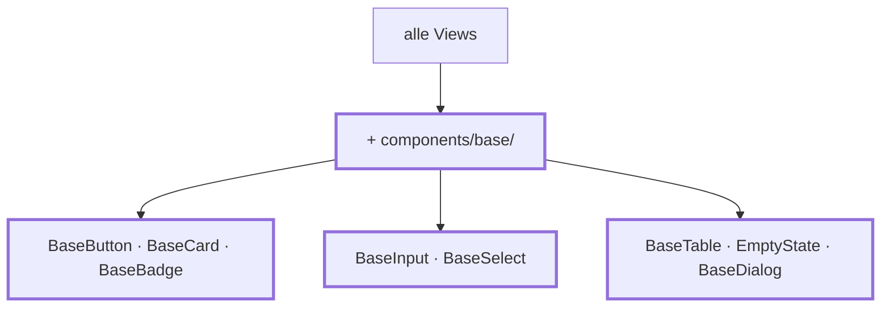

# Kapitel 16 — Basiskomponenten

> **Zeit:** ca. 2–3 h
> **Konzepte:** [Komponenten](../konzepte/05-komponenten.md)

## Wo du stehst

Vier Akademien, alle Funktionen da. Und in jeder View steht ein eigenes `<table>`, ein eigener
`<button class="…">`, ein eigenes `<input>` mit `<label>`. Fünf Mal fast dasselbe.

## Was dazukommt

Ein Ordner `components/base/` mit den Bausteinen, aus denen ab jetzt jede View besteht. Das ist
der Moment, in dem sich Slots und `defineModel` auszahlen — vorher wäre es eine Abstraktion auf
Verdacht gewesen.



## Der Weg

1. **Zuerst inventarisieren, dann bauen.** Geh durch deine Views und schreib auf, was mehr als
   zweimal vorkommt. Was nur einmal vorkommt, wird **keine** Basiskomponente — genau daran
   scheitern die meisten Komponentenbibliotheken.

2. **`BaseButton`** mit `variant` (`primary` / `secondary` / `ghost`), `block` und `type`.
   Alles, was nicht als Prop deklariert ist, fällt automatisch auf das Wurzelelement durch —
   `disabled`, `aria-*` und `@click` musst du nicht durchreichen.

3. **`BaseCard`** mit `title`, `subtitle` und einem Default-Slot. Der Unterschied zu Props:
   Markup hinein statt nur Text.

4. **`BaseInput`** mit `label`, `error` und `defineModel<string>()`. Hier gehört das `<label>`
   mit `for`/`id` hin, damit du es nie wieder von Hand schreibst — und `aria-describedby` auf
   die Fehlermeldung, mit einer ID aus `useId()`.

5. **`BaseTable` generisch.** Eine Komponente kann Typparameter haben:

   ```vue
   <script setup lang="ts" generic="T">
   defineProps<{ rows: readonly T[] }>()
   </script>
   ```

   Ob du so weit gehst oder bei einer Komponente mit `#head`-Slot und freiem Default-Slot
   bleibst, ist Geschmackssache; die Referenz macht Letzteres.

6. **`BaseDialog` auf dem nativen `<dialog>`.** Kein Modal aus einer Bibliothek: Fokusfalle,
   Escape-Taste, Backdrop und `inert` für den Hintergrund bringt das Element mit.
   `showModal()` / `close()` musst du an ein `defineModel<boolean>()` koppeln — den Weg zeigt
   [Komponenten](../konzepte/05-komponenten.md#ein-modal-ohne-bibliothek-das-native-dialog).

7. **`BaseBadge`** (`tone`: `success` / `warning` / `neutral`), und **`EmptyState`** zieht aus
   [Kapitel 13](13-student-dashboard.md) von `components/` nach `components/base/` um — dorthin
   gehört es, seit es mehr als eine Verwendung hat.

8. **Umbauen, eine View nach der anderen.** Nach jeder View einmal durchklicken. Wenn eine View
   sich nicht sauber umbauen lässt, ist meistens die Basiskomponente zu eng geschnitten — nicht
   die View falsch.

## Was noch vereinfacht ist

| Vereinfachung | Warum das reicht | Aufgeräumt in |
| --- | --- | --- |
| Farben und Abstände sind noch Einzelwerte | Design-Tokens sind das nächste Kapitel | [Kapitel 17](17-tailwind-layout.md) |
| Keine Tests für `BaseDialog` | Tests haben ein eigenes Kapitel | [Kapitel 19](19-tests-vitest.md) |
| Beschriftungen deutsch in den Komponenten | eine Sprache | [Kapitel 21](21-i18n.md) |

## Review

- [ ] `components/base/` enthält nur Komponenten, die **mindestens zweimal** benutzt werden
- [ ] Kein rohes `<table>` und kein rohes `<button class="…">` mehr in den Views
- [ ] `<BaseButton disabled>` ist wirklich deaktiviert, ohne dass du `disabled` als Prop
      deklariert hast
- [ ] Der Dialog schließt mit Escape, der Fokus bleibt darin gefangen und kehrt danach zum
      auslösenden Element zurück
- [ ] Jedes `BaseInput` hat ein verknüpftes `<label>` — in der Accessibility-Ansicht prüfbar
- [ ] `npm run type-check` und `npm run lint` sind grün

## Commit

Der Stand läuft — sichere ihn, bevor du weitermachst.

```bash
git add -A && git commit -m "refactor: wiederkehrendes Markup in Base-Components"
```

## Zum Nachlesen

- [Konzepte: Komponenten](../konzepte/05-komponenten.md) — Slots, Fallthrough-Attribute, generische Komponenten
- `reference/src/components/base/` — alle acht Komponenten
