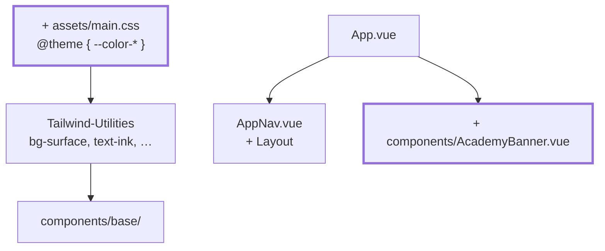

# Kapitel 17 — Design-Tokens und Layout

> **Zeit:** ca. 1,5–2,5 h
> **Konzepte:** [Styling mit Tailwind](../konzepte/12-styling-tailwind.md)

## Wo du stehst

Die App kann alles und sieht aus wie ein Formular von 1998. Die Basiskomponenten stehen — jetzt
lohnt es sich, ihnen ein Aussehen zu geben, das an **einer** Stelle definiert ist.

## Was dazukommt

Tailwind-4-Konfiguration in CSS, semantische Tokens statt Farbnamen, und ein Layout, das auf
dem Telefon nicht zerfällt.



## Der Weg

1. **Tailwind 4 wird CSS-first konfiguriert** — kein `tailwind.config.js` mehr. Alles, was du
   im Netz an Tutorials findest, beschreibt Version 3. Lies
   [Styling mit Tailwind](../konzepte/12-styling-tailwind.md#tailwind-4-ist-anders-als-alle-tutorials-die-du-findest),
   bevor du anfängst, sonst suchst du eine Stunde lang eine Datei, die es nicht geben soll.

2. **`@theme` in `assets/main.css`.** Was dort steht, wird zu CSS-Custom-Properties **und** zu
   Utility-Klassen: `--color-grade-1` erzeugt `bg-grade-1`, `text-grade-1` und so weiter.

3. **Semantische Tokens statt Farbnamen.** `--color-surface`, `--color-ink`, `--color-line`,
   `--color-link` — nicht `--color-gray-100`. Der Unterschied entscheidet über
   [Kapitel 18](18-academy-themes.md): eine Fläche, die `bg-surface` heißt, kann je Akademie
   anders sein; eine, die `bg-gray-100` heißt, nicht.

   Ein Token, das man leicht zusammenlegt und dann bereut: `--color-link` muss getrennt von
   `--color-brand-600` sein. Brand-600 muss weiße Schrift tragen können (Buttons) **und** als
   Textfarbe auf heller Fläche lesbar sein. Das geht nicht mit einem Wert.

4. **Notenfarben** `--color-grade-1` bis `-5`. In `GradeBadge` und im Diagramm gehört dazu eine
   ausgeschriebene Zuordnung:

   ```ts
   const GRADE_CLASSES: Record<Grade, string> = { 1: 'bg-grade-1', … }
   ```

   Klassennamen dürfen **nicht** zusammengebaut werden. `bg-grade-${grade}` steht im fertigen
   CSS schlicht nicht drin, weil Tailwind den Quelltext nur nach vollständigen Klassennamen
   durchsucht.

5. **Layout mit den drei Werkzeugen, die reichen:** ein zentrierter Container
   (`mx-auto max-w-5xl px-4`), `grid` für Kachelreihen, `flex` für Zeilen. Mobil zuerst, dann
   `sm:` und `md:`.

6. **`AcademyBanner`** mit Name und Motto der eigenen Akademie, und `AppNav` als richtige
   Navigationsleiste.

7. **Zugänglichkeit im Vorbeigehen:** sichtbarer Fokusring (nicht `outline: none`), Kontrast
   mindestens 4,5:1, und Zustände nie nur über Farbe unterscheiden — der Fortschritts-Badge
   trägt deshalb Text und nicht nur Grün oder Gelb.

## Was noch vereinfacht ist

| Vereinfachung | Warum das reicht | Aufgeräumt in |
| --- | --- | --- |
| Es gibt genau eine Palette | die vier Akademien sind das nächste Kapitel | [Kapitel 18](18-academy-themes.md) |
| Kein Dark Mode | die dunklen Akademien übernehmen die Rolle | [Kapitel 18](18-academy-themes.md) |
| Die Wappen fehlen | gehören zum Theme | [Kapitel 18](18-academy-themes.md) |

## Review

- [ ] `assets/main.css` enthält einen `@theme`-Block, und es gibt **kein** `tailwind.config.js`
- [ ] Ändern von `--color-surface` färbt die ganze App um
- [ ] Kein `bg-gray-…` mehr in den Komponenten, nur semantische Tokens
- [ ] Bei 375 px Breite scrollt nichts seitwärts
- [ ] Mit der Tabulatortaste ist der Fokus jederzeit sichtbar
- [ ] Suche nach `` `bg-grade-${ `` findet nichts

## Commit

Der Stand läuft — sichere ihn, bevor du weitermachst.

```bash
git add -A && git commit -m "style: Design-Tokens und Layout mit Tailwind"
```

## Zum Nachlesen

- [Konzepte: Styling mit Tailwind](../konzepte/12-styling-tailwind.md) — Tokens, Utilities, Layout, Zugänglichkeit
- `reference/src/assets/main.css` — der `@theme`-Block ganz oben
