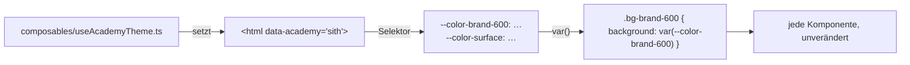

# Kapitel 18 — Vier Erscheinungsbilder an einem Attribut

> **Zeit:** ca. 1,5–2 h
> **Konzepte:** [Styling mit Tailwind](../konzepte/12-styling-tailwind.md)

## Wo du stehst

Eine Palette, semantische Tokens, ordentliches Layout. Jedi und Sith sehen identisch aus.

## Was dazukommt

Vier Themes. Umgeschaltet wird über **ein** Attribut am `<html>`-Element — keine Komponente muss
wissen, in welcher Akademie sie gerade rendert.



## Die Beobachtung, auf der alles beruht

Tailwind gibt seine Utilities als **Verweis** aus, nicht als eingesetzten Wert:

```css
.bg-brand-600 { background-color: var(--color-brand-600) }
```

Deshalb genügt es, die Custom Property unter einem anderen Selektor neu zu belegen, um jede
Verwendung auf der Seite umzufärben.

## Der Weg

1. **Vier Blöcke in `main.css`:** `[data-academy='jedi'] { --color-brand-600: …; … }` und so
   weiter. Alle vier belegen **dieselben** Properties.

2. **Auf mehreren Ebenen unterscheiden.** Farbe allein reicht nicht, um Imperium und Sith
   auseinanderzuhalten — beide sind dunkel. Nimm zusätzlich Radius (`--radius-card`), Schrift
   (`--font-display`) und Laufweite (`--tracking-display`) dazu. Ein Design ist mehr als eine
   Farbe.

3. **`color-scheme` nicht vergessen.** Auf den dunklen Akademien gehört
   `color-scheme: dark` in den Block, sonst bleiben Scrollbalken und native Formularelemente
   hell.

4. **`composables/useAcademyTheme.ts`.** Hier steckt eine Feinheit, die man einmal gesehen
   haben muss:

   ```ts
   // AUSSERHALB der Funktion: existiert genau EINMAL für die ganze App,
   // alle Aufrufer teilen sich denselben Wert.
   const previewAcademyId = ref<AcademyId>('jedi')

   export function useAcademyPreview() {
     return { previewAcademyId }
   }
   ```

   Ein `ref` **innerhalb** einer Composable-Funktion (wie in `useGradeStats`) erzeugt bei jedem
   Aufruf einen eigenen. Beides ist richtig — du musst nur wissen, welches du gerade schreibst.
   Dieselbe Unterscheidung wie beim Modul-`ref` aus [Kapitel 07](07-login-mock.md).

5. **Das Attribut setzen:**

   ```ts
   watchEffect(() => {
     document.documentElement.dataset.academy = academy.value?.id ?? previewAcademyId.value
   })
   ```

   `watchEffect` statt `watch`, weil die Abhängigkeiten beim ersten Lauf selbst erkannt werden
   und dieser erste Lauf sofort passiert. Aufgerufen wird das einmal in `App.vue` — damit gilt
   es für die ganze App.

6. **Die Vorschau auf dem Login.** Die Akademie-Auswahl aus [Kapitel 15](15-vier-akademien.md) ist
   dasselbe `previewAcademyId` — deshalb reicht dort ein `v-model`, und das Umfärben passiert
   von selbst.

   Dazu ein Detail, das man erst beim Ausprobieren merkt: nach dem Anmelden muss die echte
   Akademie als Vorschau gemerkt werden. Sonst ist das Abmelden ein optischer Sprung — wer sich
   als Sith abmeldet, landete sonst wieder im hellen Jedi-Design.

7. **Das Aufblitzen beim Laden.** Zwischen erstem Paint und dem ersten Vue-Tick steht die Seite
   kurz in der Standardpalette. Ein winziges Inline-Skript in `index.html`, das
   `data-academy` aus dem `localStorage` liest, bevor das Bundle lädt, löst das —
   [Styling mit Tailwind](../konzepte/12-styling-tailwind.md#das-aufblitzen-beim-laden) zeigt es.

8. **Die Wappen als Inline-SVG** je Akademie, mit `fill="currentColor"`. Dann übernehmen sie die
   Textfarbe und passen automatisch ins Theme — eine Icon-Bibliothek brauchst du für vier
   Symbole nicht.

## Was noch vereinfacht ist

| Vereinfachung | Warum das reicht | Aufgeräumt in |
| --- | --- | --- |
| Namen und Mottos stehen noch in den Stammdaten | sie sind sprachabhängig | [Kapitel 21](21-i18n.md) |
| Kein Test dafür, dass alle vier Paletten vollständig sind | Tests sind das nächste Kapitel | [Kapitel 19](19-tests-vitest.md) |
| Die Themes reagieren nicht auf `prefers-color-scheme` | die Akademie gewinnt bewusst | — |

## Review

- [ ] Auf dem Login wechselt das **ganze** Erscheinungsbild beim Umschalten der Akademie
- [ ] Nach dem Anmelden gilt die Akademie der angemeldeten Person
- [ ] Abmelden führt nicht zu einem Farbsprung
- [ ] Imperium und Sith sind ohne Beschriftung auseinanderzuhalten
- [ ] Auf den dunklen Themes sind Scrollbalken und Datumsfelder dunkel
- [ ] Reload zeigt kein Aufblitzen der hellen Palette
- [ ] In den Komponenten steht **keine** Abfrage auf die Akademie, um Farben zu wählen

## Commit

Der Stand läuft — sichere ihn, bevor du weitermachst.

```bash
git add -A && git commit -m "feat: vier Akademie-Themes über data-academy"
```

## Zum Nachlesen

- [Konzepte: Styling mit Tailwind](../konzepte/12-styling-tailwind.md) — die vier Themes im Detail
- `reference/src/assets/main.css`, `reference/src/composables/useAcademyTheme.ts`
- `reference/src/components/emblems/` — die vier Wappen
