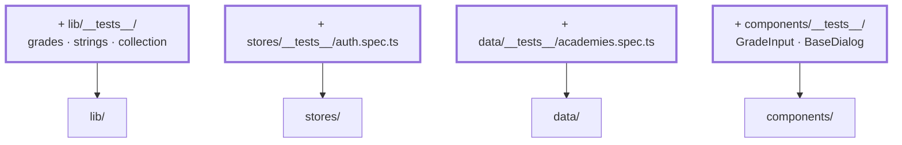

# Kapitel 19 — Tests

> **Zeit:** ca. 2–3 h
> **Konzepte:** [Tests mit Vitest](../konzepte/13-tests-vitest.md)

## Wo du stehst

Die App ist fertig und sieht gut aus. Abgesichert ist nichts — jede Änderung an `seed.ts` oder
am Store prüfst du von Hand durch Klicken.

## Was dazukommt

Vitest, und Tests in der Reihenfolge, in der sie am meisten bringen: erst die reinen
Funktionen, dann die Stores, zuletzt Komponenten.



## Der Weg

1. **Einrichten:** `vitest`, `@vue/test-utils`, `jsdom`, dazu `vitest.config.ts` und ein
   `tsconfig.vitest.json`. `npm run test:unit`.

2. **Zuerst `lib/`.** Reine Funktionen, keine Vorbereitung, sofort grün. Die Fälle, die zählen,
   sind die Ränder:

   - `average([])` → `null`, nicht `NaN`
   - `average([1, null, 3])` → `2` — `null` zählt nicht mit
   - `parseGrade('')` → `null`, `parseGrade('9')` → `undefined`, `parseGrade('2,0')` → `2`
   - `toUsername('Sabé')` → `sabe`, `toUsername('Groß')` → `gross`
   - `fullName({ firstName: 'Yoda', lastName: 'Yoda' })` → `Yoda`

3. **Dann die Stores.** Pinia braucht je Test eine frische Instanz:

   ```ts
   beforeEach(() => setActivePinia(createPinia()))
   ```

   Und `localStorage` muss zwischen den Tests leer sein, sonst schleppt ein Test den Zustand des
   vorherigen mit. Genau dafür war es wichtig, dass `createGradeBook()` eine **Funktion** ist
   und keine exportierte Konstante ([Kapitel 04](04-seed-und-typen.md)).

   Testenswert: erfolgreicher Login, falsches Passwort (`error` gesetzt, nicht angemeldet),
   unbekannter Benutzername (**dieselbe** Meldung), Logout.

4. **Ein Test, der die fachliche Zusage absichert.** Der wertvollste Test des ganzen Projekts
   ist nicht der auf `average`, sondern der auf die Trennung der Akademien: `studentsOf('jedi')`
   enthält niemanden aus einer anderen Akademie, und `createGradeBook()` trägt für ein
   Jedi-Fach keine Sith-Lernenden ein. Das ist die Regel, die man beim Refactoring am ehesten
   versehentlich bricht.

5. **Zuletzt Komponenten**, und nur die, bei denen Verhalten drinsteckt:

   - `GradeInput` — prüft die zentrale Zusage: eine `9` erzeugt **kein** `update:modelValue`,
     eine leere Eingabe erzeugt eines mit `null`.
   - `BaseDialog` — öffnet und schließt, Escape funktioniert.

   Teste, was die Nutzerin sieht und tut, nicht die interne Struktur. `findByText` und
   `trigger('click')` statt Zugriff auf `vm.internerZaehler`.

6. **In CI einhängen** — spätestens in [Kapitel 20](20-build-deployment.md).

## Was noch vereinfacht ist

| Vereinfachung | Warum das reicht | Aufgeräumt in |
| --- | --- | --- |
| Keine End-to-End-Tests | Playwright wäre ein eigenes Tutorial | — |
| Keine Coverage-Schwelle | eine Zahl ersetzt kein Urteil | — |
| Views sind ungetestet | dort steckt fast nur Darstellung | — |

## Review

- [ ] `npm run test:unit` ist grün und läuft in wenigen Sekunden
- [ ] Ändere `average` so, dass leere Listen `0` liefern → ein Test wird rot
- [ ] Verschiebe eine lernende Person in `students.ts` in eine andere Akademie → der
      Trennungs-Test wird rot
- [ ] Die Tests laufen in beliebiger Reihenfolge und einzeln (`-t`) genauso grün
- [ ] Kein Test greift auf `localStorage` zu, ohne ihn vorher zu leeren

## Commit

Der Stand läuft — sichere ihn, bevor du weitermachst.

```bash
git add -A && git commit -m "test: Vitest für lib, Stores und Komponenten"
```

## Zum Nachlesen

- [Konzepte: Tests mit Vitest](../konzepte/13-tests-vitest.md) — Vitest, Store-Tests, Komponententests
- `reference/src/lib/__tests__/`, `reference/src/stores/__tests__/auth.spec.ts`
- `reference/src/components/__tests__/GradeInput.spec.ts`
