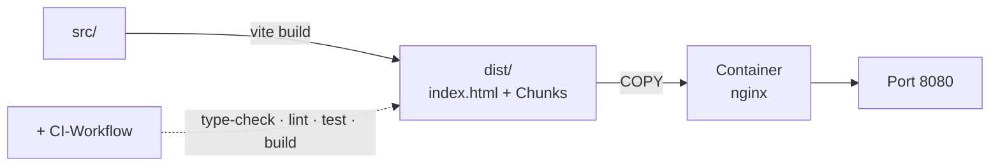

# Kapitel 20 — Bauen und ausliefern

> **Zeit:** ca. 1–1,5 h
> **Konzepte:** [Build und Deployment](../konzepte/14-build-deployment.md)

## Wo du stehst

Die App läuft im Dev-Server und ist getestet. Ausgeliefert hast du noch nie etwas — und der
Dev-Server ist kein Webserver.

## Was dazukommt

Ein Produktions-Build, ein Container mit nginx und eine CI, die beides prüft.



## Der Weg

1. **`npm run build` und den Output ansehen.** `run-p type-check build-only` heißt: der Build
   scheitert, wenn die Typen nicht stimmen. Schau in `dist/assets/` — dort siehst du die
   eigenen Chunks für die Views, die aus dem `() => import(...)` in
   [Kapitel 06](06-router-zwei-views.md) entstanden sind.

2. **`npm run preview`** — das ist der Stand, den echte Nutzer:innen bekommen. Klick ihn
   einmal komplett durch. Erfahrungsgemäß fällt hier auf, was im Dev-Modus funktioniert hat:
   fehlende Assets, absolute Pfade, ein `console.log`, das nicht dort sein sollte.

3. **Der Containerfile in zwei Stufen.** Erst Node zum Bauen, dann ein schlankes Image, in das
   nur `dist/` kopiert wird. Ohne diese Trennung schleppst du `node_modules` in die Produktion.

4. **Die nginx-Regel, ohne die eine SPA kaputt ist:**

   ```nginx
   location / {
     try_files $uri $uri/ /index.html;
   }
   ```

   Ohne sie liefert ein direkter Aufruf von `/lecturer/subjects/f01` einen 404 — die Datei gibt es
   ja nicht. Der Router muss den Pfad bekommen, nicht der Dateisystem-Lookup.

5. **Caching richtig setzen:** die Dateien in `assets/` tragen einen Hash im Namen und dürfen
   lange gecacht werden; `index.html` darf es **nicht**, sonst bekommen wiederkehrende Besucher
   ewig die alte App.

6. **CI:** `type-check`, `lint`, `test:unit`, `build` — in dieser Reihenfolge, weil das
   Schnellste zuerst scheitern soll.

7. **Einmal wirklich starten:** Image bauen, Container laufen lassen, im Browser aufrufen.
   Direktaufruf einer tiefen URL nicht vergessen.

## Was noch vereinfacht ist

| Vereinfachung | Warum das reicht | Aufgeräumt in |
| --- | --- | --- |
| Kein Backend, alles im Browser | das ist der Zuschnitt des Projekts | — |
| Keine Umgebungsvariablen | es gibt nichts zu konfigurieren | — |
| Kein Deployment-Ziel | Container starten reicht als Nachweis | — |

## Review

- [ ] `npm run build` läuft durch und bricht bei einem Typfehler ab
- [ ] In `dist/assets/` liegen mehrere JS-Dateien, nicht eine große
- [ ] `npm run preview` verhält sich wie der Dev-Server
- [ ] Im Container: `/lecturer/subjects/f01` direkt aufrufen liefert die App, keinen 404
- [ ] F5 auf einer tiefen URL funktioniert
- [ ] `index.html` wird laut Response-Header **nicht** lange gecacht
- [ ] Die CI wird rot, wenn du einen Test brichst

## Commit

Der Stand läuft — sichere ihn, bevor du weitermachst.

```bash
git add -A && git commit -m "build: Produktions-Build und Container mit nginx"
```

## Zum Nachlesen

- [Konzepte: Build und Deployment](../konzepte/14-build-deployment.md) — Build, Containerfile, nginx, CI
- `reference/Containerfile`, `reference/nginx.conf`
