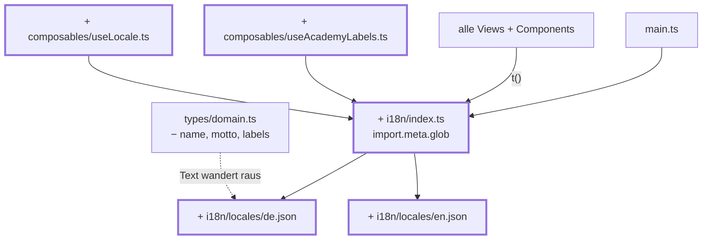

# Kapitel 21 — Zwei Sprachen

> **Zeit:** ca. 2–3 h
> **Konzepte:** [Mehrsprachigkeit](../konzepte/15-mehrsprachigkeit.md)

## Wo du stehst

Die App ist fertig, getestet und ausgeliefert. Und jeder Text steht dort, wo er gerade gebraucht
wurde: in Templates, in Komponenten, in `academies.ts`, in `subjects.ts`.

## Was dazukommt

vue-i18n, zwei Sprachdateien — und dabei die Erkenntnis, dass Mehrsprachigkeit vor allem eine
Umbau-Aufgabe ist: du musst erst finden, was überall an Text herumliegt.



## Der Weg

1. **Erst die Frage, dann die Bibliothek.** Für zwei Sprachen könnte man das selbst bauen. Was
   man dabei unterschätzt, sind Plurale und Interpolation — beides braucht diese App.
   [Mehrsprachigkeit](../konzepte/15-mehrsprachigkeit.md#erst-die-frage-bibliothek-oder-selbst-bauen) wägt das
   ab; das Ergebnis ist `vue-i18n`.

2. **Sprachdateien finden statt aufzählen:**

   ```ts
   const messages = import.meta.glob('./locales/*.json', { eager: true, import: 'default' })
   ```

   Eine dritte Sprache ist dann **eine Datei**, kein Eintrag in einer Liste, den man vergisst.
   Der Anzeigename der Sprache gehört in die Datei selbst, nicht in eine Tabelle daneben.

3. **Text aus den Stammdaten holen.** `Academy` verliert `name`, `motto` und die
   Bezeichnungen — übrig bleibt `{ id }`. Die Texte stehen unter `academies.<id>.*` in den
   Locale-Dateien. Dasselbe für `subject.name` (unter `subjects.<id>`), während `shortName`
   bleibt: ein Kürzel ist ein Kennzeichen wie eine Modulnummer, und die übersetzt man auch an
   einer echten Hochschule nicht.

   Nach diesem Schritt ist eine fünfte Akademie: ein Eintrag in `academies.ts`, ein Block je
   Sprachdatei, eine Palette in `main.css`. Keine Komponente.

4. **`useAcademyLabels`** liefert die akademiespezifischen Bezeichnungen („Padawan", „Rekrut")
   inklusive Singular/Plural. Plurale gehören in die Sprachdatei, nicht in eine
   `if`-Verzweigung — nicht jede Sprache hat genau zwei Formen.

5. **Reine Funktionen bleiben sprachfrei.** `gradeLabel(grade, labels)` bekommt die Tabelle
   **gereicht** und kennt keine Akademie und keinen Übersetzer. Sonst wären `lib/`-Tests
   plötzlich von der aktiven Sprache abhängig.

6. **Der Test, der das Versprechen einlöst.** Ein Test, der prüft, dass **alle** Sprachdateien
   dieselben Schlüssel haben. Ohne ihn ist die zweite Sprache nach drei Änderungen löchrig, und
   niemand merkt es, weil vue-i18n stillschweigend auf den Schlüssel zurückfällt.

7. **Zwei Details, die man übersieht:** `<html lang>` muss mitwechseln (Screenreader wählen
   danach die Aussprache), und Anführungszeichen sind sprachabhängig — dafür gibt es `<q>`, das
   der Browser selbst richtig setzt.

8. **`useLocale`** mit Persistenz über `useLocalStorage` aus
   [Kapitel 12](12-localstorage-composable.md), plus ein `LanguageSelect` in der Navigation.

## Was noch vereinfacht ist

| Vereinfachung | Warum das reicht | Aufgeräumt in |
| --- | --- | --- |
| Nur zwei Sprachen | eine dritte ist jetzt eine Datei | — |
| Keine Datums- und Zahlformate je Locale | die App zeigt kaum Daten an | — |
| Keine RTL-Unterstützung | wäre ein eigenes Kapitel | — |

## Review

- [ ] Umschalten wechselt **alle** Texte, auch Fehlermeldungen und `aria-label`
- [ ] Die Sprache überlebt den Reload
- [ ] `<html lang>` wechselt mit
- [ ] Einen Schlüssel aus `en.json` löschen → der Vollständigkeitstest wird rot
- [ ] Eine dritte Locale-Datei anlegen → sie taucht **ohne** Codeänderung in der Auswahl auf
- [ ] `npm run test:unit` ist grün, und kein `lib/`-Test hängt an der aktiven Sprache
- [ ] In `src/views/` und `src/components/` steht kein deutscher Satz mehr

## Und dann?

Das war das letzte Kapitel — deine App entspricht jetzt der Referenz. Wenn du weitermachen
willst: eine fünfte Akademie einbauen (drei Stellen, keine Komponente), ein echtes Backend
hinter die Stores hängen, oder `lib/` und `data/` unverändert lassen und die Views mit einem
anderen Framework neu schreiben. Dass Letzteres geht, ist das eigentliche Ergebnis von
[Kapitel 04](04-seed-und-typen.md).

## Commit

Der Stand läuft — sichere ihn, bevor du weitermachst.

```bash
git add -A && git commit -m "feat: Mehrsprachigkeit mit vue-i18n"
```

## Zum Nachlesen

- [Konzepte: Mehrsprachigkeit](../konzepte/15-mehrsprachigkeit.md) — Sprachdateien, Plurale, der Erweiterbarkeitstest
- `reference/src/i18n/`, `reference/src/composables/useAcademyLabels.ts`
- `reference/src/i18n/__tests__/locales.spec.ts` — der Test, der die Erweiterbarkeit absichert
