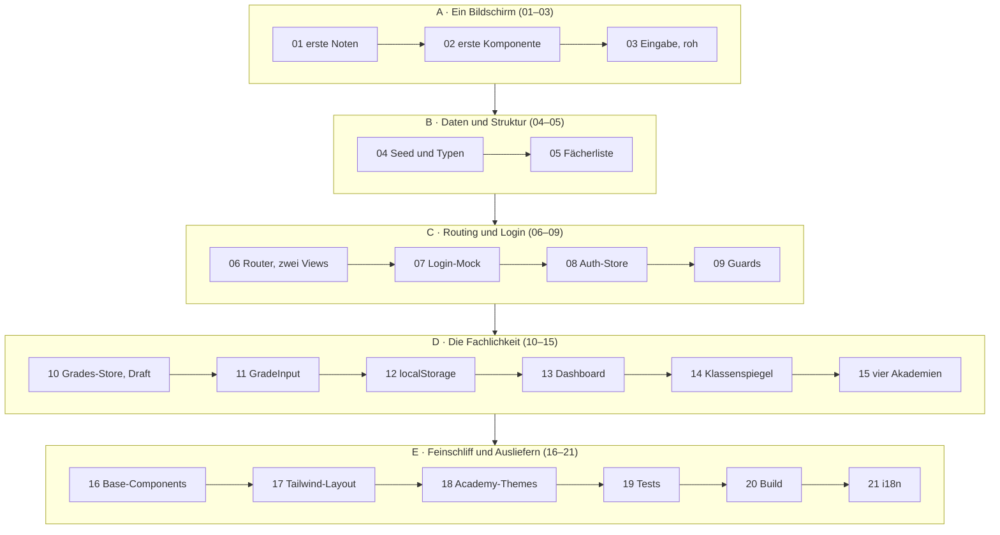
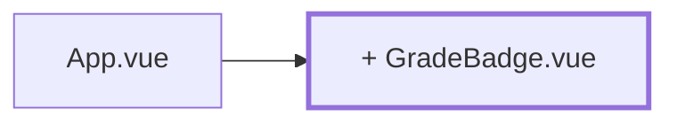

# Die Build-Spur — das Projekt in 21 Kapiteln

Die Seiten in [`konzepte/`](../konzepte/) sind nach **Themen** geschnitten: eine Seite, ein
Konzept. Das ist gut zum Lernen und gut zum Nachschlagen — aber es sagt dir nicht, in welcher
Reihenfolge du die App tatsächlich baust. Wer die
[Ansicht der Lehrenden](../konzepte/10-dozenten-view.md) aufschlägt, steht vor Draft-State,
Watchern, `isDirty` und einer Zugriffsprüfung auf einmal.

Die Kapitel hier machen das Gegenteil: sie schneiden **Arbeit** zu, nicht Themen. Jedes Kapitel
ist ein Stand, den du im Browser sehen kannst, und jedes lässt bewusst etwas vereinfacht, das
ein späteres aufräumt. Erst stehen die Noten hartcodiert in `App.vue`. Dann kommen sie aus einem
Seed. Dann aus einem Store. Dann überleben sie den Reload. Und ganz am Ende gibt es vier
Akademien statt einer.

## Wie du beide Spuren zusammen liest

```
Kapitel aufschlagen  →  „Was dazukommt" lesen  →  Konzeptseite lesen  →  bauen  →  Review
```

Das Kapitel sagt **was und in welcher Reihenfolge**. Die Konzeptseite erklärt **warum und wie**.
Beides brauchst du; keins von beidem ersetzt das andere.

Code steht in den Kapiteln nur da, wo der Zwischenstand in `reference/` **nicht existiert** —
also für die vereinfachten Fassungen, die du sonst nirgends nachschlagen könntest. Sobald ein
Kapitel den Stand der Referenz erreicht, steht dort nur noch die Aufgabe und der Dateipfad. Die
Regel aus der [Tutorial-README](../README.md) gilt unverändert: erst selbst versuchen.

> **Zwei Wörter, zwei Bedeutungen.** *Kapitel* heißt in diesem Tutorial immer eine Seite von
> hier — die Nummern 01 bis 21. Die Erklärseiten in [`konzepte/`](../konzepte/) haben ihre
> eigenen Nummern und werden deshalb mit ihrem Titel genannt, nie mit einer Nummer.

> **Zu den Begriffen.** Fließtext ist deutsch, Fachbegriffe bleiben englisch: Store, Draft,
> Guard, Composable, Props, Slots, Seed, Theme, Layout, localStorage. Die
> [Ansicht der Lehrenden](../konzepte/10-dozenten-view.md) schreibt an einigen Stellen
> „Entwurf", wo hier „Draft" steht — gemeint ist dasselbe.

> **Am Ende jedes Kapitels steht ein Commit.** Ein Kapitel, ein Commit: dein Nachbau bekommt
> damit eine Historie, in der du jeden Zwischenstand wiederfindest — und du kannst jederzeit
> auf einen laufenden Stand zurück, statt eine halb umgebaute App zu retten. Die Nachricht ist
> jeweils vorgeschlagen, [Kapitel 01](01-erste-noten.md) legt das Repo an.

## Die Kapitelübersicht



## Kapitel → Konzepte

| Kapitel | Was am Ende läuft | Zeit | Konzepte |
| --- | --- | --- | --- |
| [01 — Erste Noten](01-erste-noten.md) | eine Notenliste mit Durchschnitt, alles in `App.vue` | 1–1,5 h | [Vue-Reaktivität](../konzepte/04-vue-reactivity.md) |
| [02 — Erste Komponente](02-erste-komponente.md) | `GradeBadge` und `StatTile` als eigene Dateien | 0,5–1 h | [Komponenten](../konzepte/05-komponenten.md) |
| [03 — Eingabe, roh](03-eingabe-roh.md) | Noten hinzufügen und entfernen | 0,5–1 h | [Vue-Reaktivität](../konzepte/04-vue-reactivity.md), [Komponenten](../konzepte/05-komponenten.md) |
| [04 — Seed und Typen](04-seed-und-typen.md) | echte Fächer und Lernende aus `src/data/` | 1,5–2,5 h | [TypeScript](../konzepte/03-typescript.md), [Domänenmodell](../konzepte/06-domaenenmodell.md) |
| [05 — Fächerliste](05-fachliste.md) | Tabelle mit Fortschritt und Durchschnitt | 1–1,5 h | [Domänenmodell](../konzepte/06-domaenenmodell.md) |
| [06 — Router, zwei Views](06-router-zwei-views.md) | Liste und Bewertungsformular unter eigenen URLs | 1–1,5 h | [Vue Router](../konzepte/07-router.md) |
| [07 — Login-Mock](07-login-mock.md) | ein Login-Bildschirm, der noch nichts prüft | 0,5–1 h | [Vue Router](../konzepte/07-router.md) |
| [08 — Auth-Store](08-auth-store.md) | echter Login gegen die Stammdaten, mit Pinia | 1–1,5 h | [Pinia](../konzepte/08-pinia.md) |
| [09 — Guards](09-router-guards.md) | geschützte Routen, Rollen, Logout | 1–1,5 h | [Vue Router](../konzepte/07-router.md), [Pinia](../konzepte/08-pinia.md) |
| [10 — Grades-Store und Draft](10-grades-store-und-draft.md) | Noten eintragen, speichern, verwerfen | 1,5–2 h | [Pinia](../konzepte/08-pinia.md), [Ansicht der Lehrenden](../konzepte/10-dozenten-view.md) |
| [11 — GradeInput](11-grade-input.md) | robuste Eingabe, Zufallswerte, Rückfrage beim Verlassen | 1,5–2 h | [Ansicht der Lehrenden](../konzepte/10-dozenten-view.md) |
| [12 — localStorage](12-localstorage-composable.md) | alles überlebt den Reload | 1–1,5 h | [Composables](../konzepte/09-composables.md) |
| [13 — Student-Dashboard](13-student-dashboard.md) | die eigenen Noten über alle Fächer | 1–1,5 h | [Ansicht der Lernenden](../konzepte/11-studierenden-view.md) |
| [14 — Klassenspiegel](14-klassenspiegel-chart.md) | anonymer Vergleich mit Balkendiagramm | 1,5–2 h | [Composables](../konzepte/09-composables.md), [Ansicht der Lernenden](../konzepte/11-studierenden-view.md) |
| [15 — Vier Akademien](15-vier-akademien.md) | die Akademie als Dimension im Datenmodell | 2–3 h | [Domänenmodell](../konzepte/06-domaenenmodell.md) |
| [16 — Base-Components](16-base-components.md) | `components/base/`, Slots, generische Tabelle | 2–3 h | [Komponenten](../konzepte/05-komponenten.md) |
| [17 — Tailwind-Layout](17-tailwind-layout.md) | Design-Tokens, Navigation, Banner | 1,5–2,5 h | [Styling mit Tailwind](../konzepte/12-styling-tailwind.md) |
| [18 — Academy-Themes](18-academy-themes.md) | vier Erscheinungsbilder an einem Attribut | 1,5–2 h | [Styling mit Tailwind](../konzepte/12-styling-tailwind.md) |
| [19 — Tests](19-tests-vitest.md) | Vitest über `lib/`, Stores und Komponenten | 2–3 h | [Tests mit Vitest](../konzepte/13-tests-vitest.md) |
| [20 — Build und Deployment](20-build-deployment.md) | Produktions-Build im Container | 1–1,5 h | [Build und Deployment](../konzepte/14-build-deployment.md) |
| [21 — i18n](21-i18n.md) | die App spricht zwei Sprachen | 2–3 h | [Mehrsprachigkeit](../konzepte/15-mehrsprachigkeit.md) |

**Zusammen rund 27–40 Stunden** — dieselbe Arbeit, die die Konzeptseiten von
*Vue-Reaktivität* bis *Mehrsprachigkeit* mit 24–35 Stunden veranschlagen. Der Unterschied ist
der Aufschlag dafür, dass du manche Datei zweimal anfasst: einmal vereinfacht, einmal richtig.
Das ist kein verlorener Aufwand, sondern der Punkt der Übung.

Für die Kapitel 01–21 brauchst du ein laufendes Projekt. Das legst du auf der Konzeptseite
[Setup](../konzepte/00-setup.md) an — ein eigenes Kapitel dafür gibt es hier nicht.

## Konzepte → Kapitel

| Konzeptseite | Kapitel |
| --- | --- |
| [Setup](../konzepte/00-setup.md) | Voraussetzung für alles |
| [JavaScript-Grundlagen](../konzepte/01-js-grundlagen.md) bis [TypeScript](../konzepte/03-typescript.md) | keine; `playground/` statt App |
| [Vue-Reaktivität](../konzepte/04-vue-reactivity.md) | [01](01-erste-noten.md), [03](03-eingabe-roh.md) |
| [Komponenten](../konzepte/05-komponenten.md) | [02](02-erste-komponente.md), [03](03-eingabe-roh.md), [16](16-base-components.md) |
| [Domänenmodell](../konzepte/06-domaenenmodell.md) | [04](04-seed-und-typen.md), [05](05-fachliste.md), [15](15-vier-akademien.md) |
| [Vue Router](../konzepte/07-router.md) | [06](06-router-zwei-views.md), [07](07-login-mock.md), [09](09-router-guards.md) |
| [Pinia](../konzepte/08-pinia.md) | [08](08-auth-store.md), [09](09-router-guards.md), [10](10-grades-store-und-draft.md) |
| [Composables](../konzepte/09-composables.md) | [12](12-localstorage-composable.md), [14](14-klassenspiegel-chart.md) |
| [Ansicht der Lehrenden](../konzepte/10-dozenten-view.md) | [10](10-grades-store-und-draft.md), [11](11-grade-input.md) |
| [Ansicht der Lernenden](../konzepte/11-studierenden-view.md) | [13](13-student-dashboard.md), [14](14-klassenspiegel-chart.md) |
| [Styling mit Tailwind](../konzepte/12-styling-tailwind.md) | [17](17-tailwind-layout.md), [18](18-academy-themes.md) |
| [Tests mit Vitest](../konzepte/13-tests-vitest.md) | [19](19-tests-vitest.md) |
| [Build und Deployment](../konzepte/14-build-deployment.md) | [20](20-build-deployment.md) |
| [Mehrsprachigkeit](../konzepte/15-mehrsprachigkeit.md) | [21](21-i18n.md) |

## Zwei Abweichungen von der Kapitelreihenfolge

Beide sind Absicht.

**Die vier Akademien kommen erst in Kapitel 15.** Das
[Domänenmodell](../konzepte/06-domaenenmodell.md) führt sie sofort ein, weil sie
fachlich zum Datenmodell gehören. Zum Bauen ist das der falsche Moment: du kämpfst dann von
Anfang an gleichzeitig mit `Grade`, `Subject`, `Student` **und** mit der Frage, wer wen sehen
darf. Deshalb bauen die Kapitel 04–14 mit *einer* Akademie, und Kapitel 15 zieht die Dimension
nachträglich ein. Das ist unbequem — genau darin liegt der Lerneffekt: du merkst, an wie vielen
Stellen eine vergessene Dimension nachträglich auftaucht, und warum die Konzeptseite sie lieber
gleich im Typsystem hätte.

**Basiskomponenten und Styling wandern nach hinten (16–18).** Bis Kapitel 15 sieht die App
absichtlich karg aus. Ein paar Tailwind-Klassen nebenbei sind in Ordnung, aber die Design-Tokens
lohnen erst, wenn feststeht, welche Komponenten es überhaupt gibt.

## Der Aufbau eines Kapitels

Jede Datei hat dieselben neun Abschnitte:

| Abschnitt | Wofür |
| --- | --- |
| Kopfzeile | Zeit und die Konzeptseiten, die dazugehören |
| Wo du stehst | der Stand nach dem vorigen Kapitel |
| Was dazukommt | ein Satz |
| Diagramm | die Architektur, wie sie nach diesem Kapitel aussieht |
| Der Weg | die einzelnen Schritte |
| Was noch vereinfacht ist | **der wichtigste Abschnitt** — mit Verweis auf das Kapitel, das es aufräumt |
| Review | was im Browser passieren muss |
| Commit | der vorgeschlagene Commit für diesen Stand |
| Zum Nachlesen | Konzeptseiten; `reference/`-Pfade nur, wenn das Kapitel die Endfassung erreicht |

Im Diagramm ist neu Hinzugekommenes **dick umrandet** und mit `+` markiert:



Los geht es mit [Kapitel 01](01-erste-noten.md).
