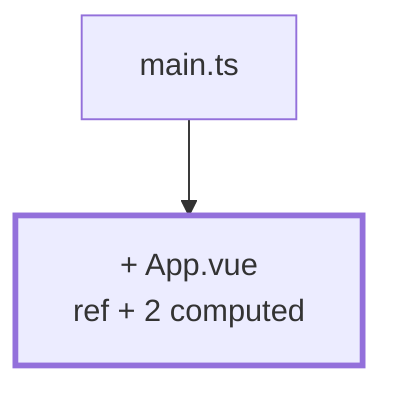

# Chapter 01 — First grades on screen

> **Time:** about 1–1.5 h
> **Concepts:** [Vue reactivity](../concepts/04-vue-reactivity.md)

## Where you stand

You've been through [Setup](../concepts/00-setup.md): the dev container runs, `npm run dev`
serves the Vite starter page. `src/` still has the scaffold from `npm create vue@latest`.

## What's new

A list of hardcoded assessments in `App.vue`, plus average and distribution as `computed` —
nothing more.



## The path

1. **Create the repo.** [Setup](../concepts/00-setup.md) created the project but no history yet.
   Catch up on that now — from the end of this chapter on, every chapter closes with a commit:

   ```bash
   git init
   git add -A && git commit -m "chore: Vue project with Vite and TypeScript"
   ```

   `npm create vue@latest` adds a `.gitignore` with `node_modules` and `dist`. Take a look
   inside before your first commit — anything that ends up in the history is a pain to remove
   again.

2. **Clean up.** Delete everything in `src/components/` the scaffold brought along
   (`HelloWorld.vue`, `TheWelcome.vue`, `icons/`). Same for `src/assets/logo.svg` and the sample
   styles. You want a blank canvas.

3. **Replace `App.vue`.** This is the complete state of this chapter:

   ```vue
   <script setup lang="ts">
   import { computed, ref } from 'vue'

   // Hardcoded. Where the numbers really come from is chapter 04.
   const grades = ref([1, 3, 2, 5, 2, 4, 3, 2])

   const average = computed(() => {
     if (grades.value.length === 0) return null
     const sum = grades.value.reduce((a, b) => a + b, 0)
     return sum / grades.value.length
   })

   const distribution = computed(() => {
     const counts: Record<number, number> = { 1: 0, 2: 0, 3: 0, 4: 0, 5: 0 }
     for (const grade of grades.value) counts[grade] += 1
     return counts
   })
   </script>

   <template>
     <main>
       <h1>Galactic Gradebook</h1>

       <p>
         Average: {{ average === null ? '–' : average.toFixed(1) }}
         ({{ grades.length }} grades)
       </p>

       <ul>
         <li v-for="(grade, index) in grades" :key="index">Grade {{ grade }}</li>
       </ul>

       <p v-for="(count, grade) in distribution" :key="grade">{{ grade }}: {{ count }}×</p>
     </main>
   </template>
   ```

4. **Practice `.value`.** Wire up a button that calls `grades.value.push(3)`, and watch average
   and distribution follow along without any extra work from you. That's exactly what
   `computed` is for.

5. **Add a `watch`** that logs the count to the console on every change. Not because the app
   needs it — just so you've seen once when it fires and when it doesn't.

## What's still simplified

| Simplification | Why that's fine for now | Cleaned up in |
| --- | --- | --- |
| Numbers live in the source | there's no data model yet | [Chapter 04](04-seed-and-types.md) |
| `number` instead of `Grade` | a 7 would be legal here | [Chapter 04](04-seed-and-types.md) |
| Average is formatted in the template | the `formatAverage` function doesn't exist yet | [Chapter 04](04-seed-and-types.md) |
| `:key="index"` | the list has no IDs yet, and that bites you soon | [Chapter 03](03-raw-input.md) |
| Everything in one file | there's nothing to split out yet | [Chapter 02](02-first-component.md) |

## Review

- [ ] `npm run dev` shows the heading, average, grade list and distribution
- [ ] The button changes all three values at once
- [ ] Emptying the array in the source shows `–`, **not** `NaN`
- [ ] The browser updates without a reload (otherwise see [Setup](../concepts/00-setup.md), `usePolling`)
- [ ] `npm run type-check` is clean

## Commit

The state runs — create the repo and save it.

```bash
git add -A && git commit -m "feat: grade list with average and distribution"
```

## Further reading

- [Concepts: Vue reactivity](../concepts/04-vue-reactivity.md) — `ref`, `computed`, `watch`, template syntax
- The rule everything here hangs on: *if a value can be derived, derive it.*
