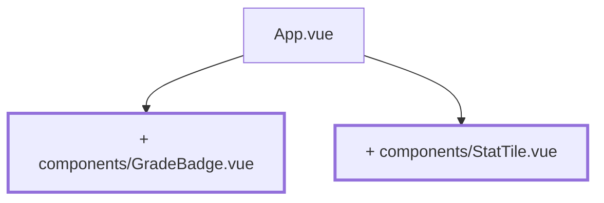

# Chapter 02 — The first custom component

> **Time:** about 0.5–1 h
> **Concepts:** [Components](../concepts/05-components.md)

## Where you stand

`App.vue` shows a grade list with average and distribution. Everything lives in one file.

## What's new

Two components with props: `GradeBadge` shows a single grade, `StatTile` shows a metric. Both
stay in the project until the end.



## The path

1. **`src/components/GradeBadge.vue`** — takes a grade and renders it:

   ```vue
   <script setup lang="ts">
   defineProps<{
     grade: number | null
   }>()
   </script>

   <template>
     <span class="badge">{{ grade === null ? '–' : grade }}</span>
   </template>

   <style scoped>
   .badge {
     display: inline-flex;
     min-width: 2rem;
     justify-content: center;
     border-radius: 0.5rem;
     padding: 0.25rem 0.5rem;
     background: #eee;
   }
   </style>
   ```

2. **`src/components/StatTile.vue`** — `label`, `value`, and an optional `hint`. The props
   declaration lives in `defineProps<{ … }>()`, optional ones marked with `?`.

3. **Use both in `App.vue`.** The `v-for` list now renders `<GradeBadge :grade="grade" />`, and
   three `<StatTile>`s sit above the list: count, average, most common grade.

4. **Props are one-way.** Try, deliberately, to write `grade = 4` inside the component. Vue
   warns in the console. If data needs to flow back out, that's an emit —
   [chapter 03](03-raw-input.md) covers it.

## What's still simplified

| Simplification | Why that's fine for now | Cleaned up in |
| --- | --- | --- |
| `grade: number \| null` instead of `Grade \| null` | the `Grade` type doesn't exist yet | [Chapter 04](04-seed-and-types.md) |
| No color per grade | without design tokens it'd be double work | [Chapter 17](17-tailwind-layout.md) |
| `<style scoped>` instead of Tailwind | fine for two components | [Chapter 17](17-tailwind-layout.md) |
| No `title`, no `aria-label` | comes with the labels from the academy | [Chapter 15](15-four-academies.md) |

## Review

- [ ] The grade list is made of `GradeBadge` components
- [ ] Three metrics sit above the list as `StatTile`
- [ ] `<GradeBadge :grade="null" />` shows `–`
- [ ] A missing required prop is an error in `npm run type-check`, not just in the browser

## Commit

The state runs — save it before you move on.

```bash
git add -A && git commit -m "refactor: GradeBadge and StatTile as their own components"
```

## Further reading

- [Concepts: Components](../concepts/05-components.md) — props, emits, slots
- `reference/src/components/StatTile.vue` — the final version is nearly identical, just with
  Tailwind classes instead of `scoped`
