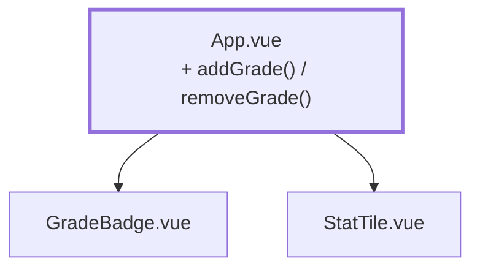

# Chapter 03 — Recording assessments, the raw way

> **Time:** about 0.5–1 h
> **Concepts:** [Vue reactivity](../concepts/04-vue-reactivity.md),
> [Components](../concepts/05-components.md)

## Where you stand

A grade list made of `GradeBadge` components, three metrics above it. The numbers come from a
hardcoded array.

## What's new

An input field and two buttons: add a grade, remove a grade. No validation yet — a 9 still
slips through here.



## The path

1. **IDs instead of indexes.** Before you can remove anything, entries need a stable identity.
   `ref([1, 3, 2])` becomes:

   ```ts
   type Entry = { id: number; grade: number }

   let nextId = 1
   const entries = ref<Entry[]>([
     { id: nextId++, grade: 1 },
     { id: nextId++, grade: 3 },
     { id: nextId++, grade: 2 },
   ])
   ```

   And in the template, `:key="entry.id"`. Why this isn't a footnote is explained in
   [Vue reactivity](../concepts/04-vue-reactivity.md#lists): with `:key="index"`, the wrong row
   keeps its state when you delete an item.

2. **Input with `v-model`:**

   ```vue
   <script setup lang="ts">
   const input = ref('')

   function addGrade() {
     const value = Number(input.value)
     // Deliberately unvalidated - chapter 11 turns this into something solid.
     entries.value.push({ id: nextId++, grade: value })
     input.value = ''
   }

   function removeGrade(id: number) {
     entries.value = entries.value.filter((entry) => entry.id !== id)
   }
   </script>

   <template>
     <form @submit.prevent="addGrade">
       <input v-model="input" type="number" min="1" max="5" />
       <button type="submit">Add</button>
     </form>
   </template>
   ```

   `@submit.prevent` on a real `<form>` instead of `@click` on the button: that's the only way
   the Enter key in the field works.

3. **Remove via an emit.** Give `GradeBadge` a button and have it emit `remove` instead of
   placing the button next to it. That's the smallest useful exercise for
   `defineEmits<{ remove: [] }>()`.

4. **Try the gap.** Type a `9` and hit Add. The distribution gets an entry that shouldn't be
   able to exist, and the average is nonsense. Remember what that looks like —
   [chapter 11](11-grade-input.md) is exactly what cleans it up.

## What's still simplified

| Simplification | Why that's fine for now | Cleaned up in |
| --- | --- | --- |
| Any number is accepted | validation needs the `Grade` type and `parseGrade` | [Chapter 11](11-grade-input.md) |
| The input is a bare `<input>` | a dedicated component only pays off at ten fields | [Chapter 11](11-grade-input.md) |
| Grades aren't attached to anything — no subject, no person | the data model is still missing | [Chapter 04](04-seed-and-types.md) |
| The add/remove UI itself is throwaway | it exercises `v-model` and emits; from chapter 04 on every grade belongs to a person, entered row by row | [Chapter 04](04-seed-and-types.md), [Chapter 10](10-grades-store-and-draft.md) |
| `let nextId` as a module-level counter | real IDs come from the seed | [Chapter 04](04-seed-and-types.md) |
| Everything's gone on reload | persistence gets its own chapter | [Chapter 12](12-localstorage-composable.md) |

## Review

- [ ] Add appends to the list, clears the field, and updates every metric
- [ ] Remove hits **the** row you clicked — including the one in the middle
- [ ] The Enter key in the field triggers Add
- [ ] A `9` slips through (that's the expected state here, not a bug)
- [ ] `npm run type-check` and `npm run lint` are clean

## Commit

The state runs — save it before you move on.

```bash
git add -A && git commit -m "feat: add and remove grades"
```

## Further reading

- [Concepts: Vue reactivity](../concepts/04-vue-reactivity.md) — `v-for`, `:key`, event modifiers
- [Concepts: Components](../concepts/05-components.md) — emits
