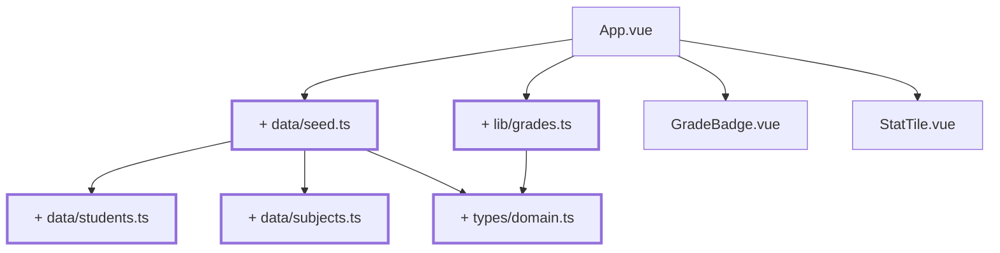

# Chapter 04 — Getting the data out of the view

> **Time:** about 1.5–2.5 h
> **Concepts:** [TypeScript](../concepts/03-typescript.md),
> [Domain model](../concepts/06-domain-model.md)

## Where you stand

You can display, add, and remove grades. They're attached to nothing: no subject, no person, no
type that would forbid a 9.

## What's new

A data model in `src/types/`, master data in `src/data/`, calculation functions in `src/lib/` —
and **one** academy: the Jedi Temple, with ten trainees and six subjects.



## The path

1. **`src/types/domain.ts`** — the core. Still **without** an academy:

   ```ts
   export type Grade = 1 | 2 | 3 | 4 | 5

   /** The same values at runtime - for loops and charts. */
   export const GRADES = [1, 2, 3, 4, 5] as const satisfies readonly Grade[]

   export interface Identifiable {
     readonly id: string
   }

   export interface Student extends Identifiable {
     readonly firstName: string
     readonly lastName: string
     readonly matriculationNumber: string
   }

   export interface Subject extends Identifiable {
     readonly name: string
     readonly shortName: string
     readonly semester: number
     readonly ects: number
   }

   export type SubjectId = string
   export type StudentId = string

   /** Subject -> trainee -> grade. `null` means "not assessed yet". */
   export type GradeBook = Record<SubjectId, Record<StudentId, Grade | null>>
   ```

   From here on, `const g: Grade = 7` is a compile error. That's the real payoff of this
   chapter — not the data, but the fact that invalid values can no longer come into existence
   at all.

   On `null` instead of `undefined` or `0`: `undefined` would be indistinguishable from "key
   missing", and `0` invites accidental arithmetic.
   [Domain model](../concepts/06-domain-model.md) makes the case in full.

2. **`src/data/students.ts`** — ten trainees. Feel free to take the names from the reference
   (`reference/src/data/students.ts`, the first ten); this isn't about inventing them yourself.

   ```ts
   import type { Student } from '@/types/domain'

   export const STUDENTS = [
     { id: 's01', firstName: 'Ahsoka', lastName: 'Tano', matriculationNumber: '2400001' },
     { id: 's02', firstName: 'Kanan', lastName: 'Jarrus', matriculationNumber: '2400002' },
     // … eight more
   ] as const satisfies readonly Student[]
   ```

   `satisfies` instead of `:` — the compiler checks the structure but keeps the narrow literal
   types. Why that's a difference is covered in [TypeScript](../concepts/03-typescript.md).

3. **`src/data/subjects.ts`** — six subjects across four semesters, with `name`, `shortName`,
   `semester`, `ects`.

4. **`src/data/seed.ts`** — the entry point for everything data-shaped:

   ```ts
   import type { Grade, GradeBook } from '@/types/domain'
   import { STUDENTS } from './students'
   import { SUBJECTS } from './subjects'

   export const students = [...STUDENTS].sort((a, b) => a.lastName.localeCompare(b.lastName))
   export const subjects = [...SUBJECTS].sort((a, b) => a.semester - b.semester)

   /** Two subjects are fully graded, four still empty - otherwise there's nothing to see. */
   const PREFILLED: Partial<Record<string, readonly Grade[]>> = {
     f01: [2, 3, 1, 2, 4, 2, 3, 1, 3, 2],
     f04: [3, 2, 2, 4, 3, 1, 2, 3, 5, 3],
   }

   /**
    * A function, not a constant: every call returns a fresh object.
    * Otherwise store and tests would later share the same reference.
    */
   export function createGradeBook(): GradeBook {
     const book: GradeBook = {}
     for (const subject of subjects) {
       const prefilled = PREFILLED[subject.id]
       const row: Record<string, Grade | null> = {}
       students.forEach((student, index) => {
         row[student.id] = prefilled?.[index] ?? null
       })
       book[subject.id] = row
     }
     return book
   }
   ```

5. **`src/lib/grades.ts`** — the domain logic, **with no Vue import at all**. These are exactly
   the functions you'll need until the end:

   | Function | Returns |
   | --- | --- |
   | `isGrade(value: unknown): value is Grade` | type guard from runtime data into the narrow type |
   | `average(grades: readonly (Grade \| null)[])` | `number \| null` — `null` entries don't count |
   | `distribution(grades)` | `Record<Grade, number>`, grades with zero occurrences still show `0` |
   | `gradedCount(grades)` | how many are actually assigned |
   | `formatGrade(grade)` | `'–'` for `null` |
   | `formatAverage(value)` | `'2,3'` — one decimal place, German comma |

   Why Vue has no business here is explained in
   [Domain model](../concepts/06-domain-model.md#why-vue-has-no-business-here). Short version:
   what's pure can be tested without a framework — that pays off in
   [chapter 19](19-tests-vitest.md).

6. **Rework `App.vue`.** The hardcoded array goes — and with it the add/remove UI from
   [chapter 03](03-raw-input.md). It's served its purpose: from here on a grade belongs to a
   person, and entry happens row by row ([chapter 10](10-grades-store-and-draft.md)). Instead:
   pick one fixed subject (`const subjectId = 'f01'`), pull its grade row from
   `createGradeBook()`, and list the trainees against it — name on the left, `GradeBadge` on
   the right. The metrics now come from `average`, `distribution`, and `gradedCount`.

7. **Bring `GradeBadge` and `StatTile` along:** `number | null` becomes `Grade | null`.

## What's still simplified

| Simplification | Why that's fine for now | Cleaned up in |
| --- | --- | --- |
| Only one academy, no `academyId` | two new concepts at once is one too many | [Chapter 15](15-four-academies.md) |
| `subject.name` lives in the master data | there's only one language | [Chapter 21](21-i18n.md) |
| Plain arrays with `.filter()` / `.sort()` | a generic `Collection<T>` only pays off once you filter by academy | [Chapter 15](15-four-academies.md) |
| The subject is hardcoded | picking one needs either state or routing | [Chapter 05](05-subject-list.md), [Chapter 06](06-router-two-views.md) |
| The grade book only lives in a local variable | a store comes later | [Chapter 10](10-grades-store-and-draft.md) |
| Input doesn't write into the matrix yet | that needs the draft | [Chapter 10](10-grades-store-and-draft.md) |

## Review

- [ ] `App.vue` contains **no** grade number in its source anymore
- [ ] Ten names with grades are on screen, two subjects are prefilled
- [ ] `const g: Grade = 6` anywhere is an error in `npm run type-check`
- [ ] `average([])` returns `null`, not `NaN`
- [ ] `formatAverage(2.3333)` returns `'2,3'`
- [ ] There's **no** `import … from 'vue'` in `src/lib/` or `src/data/`

## Commit

The state runs — save it before you move on.

```bash
git add -A && git commit -m "refactor: move domain model, seed and grade logic into their own modules"
```

## Further reading

- [Concepts: Domain model](../concepts/06-domain-model.md) — types, fixtures, Vue-free domain logic
- [Concepts: TypeScript](../concepts/03-typescript.md) — unions, `satisfies`, type guards, `noUncheckedIndexedAccess`
- `reference/src/lib/grades.ts` — your final version; only `gradeLabel` and `passRate` are
  still missing, and you won't need them until [chapter 14](14-cohort-comparison-chart.md)
