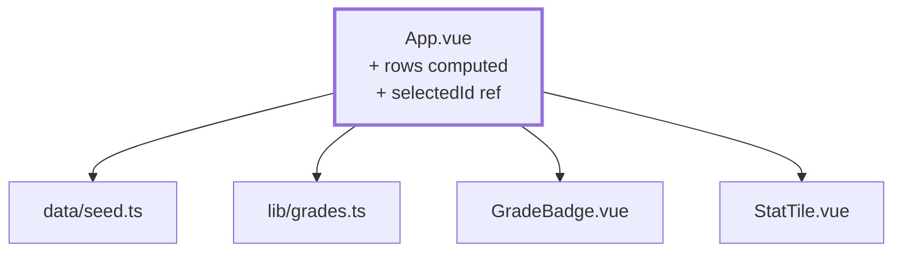

# Chapter 05 — The subject list

> **Time:** about 1–1.5 h
> **Concepts:** [Domain model](../concepts/06-domain-model.md)

## Where you stand

Six subjects and ten trainees sit in the seed, `lib/grades.ts` does the math. But only the one
subject hardcoded in the source ever shows up.

## What's new

A table of **every** subject with progress and average, and a click switches the subject on
screen. Still no router — the selection is a `ref`.



## The path

1. **The enriched row.** A table row is more than a subject — it carries progress and average
   along with it. That enrichment belongs in a `computed`, not in the template, where it would
   re-run on every render:

   ```ts
   const rows = computed(() =>
     subjects.map((subject) => {
       const grades = students.map((student) => book.value[subject.id]?.[student.id] ?? null)
       const graded = gradedCount(grades)

       return {
         subject,
         graded,
         isComplete: graded === students.length,
         average: average(grades),
       }
     }),
   )
   ```

2. **The table** with subject, semester, `graded / total`, average, and an "Assess" button.
   `:key="row.subject.id"`.

3. **The selection** as `const selectedId = ref<SubjectId | null>(null)`. When it's `null`, the
   page shows the list; otherwise the grade rows for the chosen subject plus a back button.

4. **The metrics up top:** subject count, subjects still open, overall average across every
   subject. For the last one, `flatMap` is the right tool — one list of all grades across all
   subjects, then `average` on top of that.

5. **Sort by two criteria.** Subjects should be ordered by semester, and within a semester by
   number. Instead of a two-step comparator, a single sort key is enough:

   ```ts
   subjects.sort((a, b) => key(a) - key(b))
   const key = (s: Subject) => s.semester * 1000 + Number(s.id.slice(1))
   ```

   The first criterion dominates because its contribution is always larger than anything the
   second one can add.

6. **A moment for cosmetics.** A few Tailwind classes for spacing and a readable table are fine
   now. But don't start on colors and tokens yet — that only pays off once you know which
   components actually exist ([chapter 17](17-tailwind-layout.md)).

## What's still simplified

| Simplification | Why that's fine for now | Cleaned up in |
| --- | --- | --- |
| Switching subjects via a `ref` instead of the URL | you'll see for yourself why that isn't enough | [Chapter 06](06-router-two-views.md) |
| List and form in one file | two views need a router first | [Chapter 06](06-router-two-views.md) |
| `book` is a local `ref` in `App.vue` | a store comes later | [Chapter 10](10-grades-store-and-draft.md) |
| Everyone sees every subject | there's no sign-in yet | [Chapter 08](08-auth-store.md), [Chapter 15](15-four-academies.md) |
| Table as a bare `<table>` | `BaseTable` only pays off with several tables | [Chapter 16](16-base-components.md) |

## Review

- [ ] Six subjects sit in the table, sorted by semester
- [ ] Two subjects show `10 / 10`, four show `0 / 10`
- [ ] The overall average looks right and becomes `–` if you empty `PREFILLED`
- [ ] Clicking "Assess" shows the ten trainees for that subject
- [ ] **The sore spot:** hitting reload on the detail view drops you back on the list, and you
      can't send anyone a link to a subject. Remember that — it's the reason for
      [chapter 06](06-router-two-views.md).

## Commit

The state runs — save it before you move on.

```bash
git add -A && git commit -m "feat: subject list with progress and average"
```

## Further reading

- [Concepts: Domain model](../concepts/06-domain-model.md) — fixtures, sort keys, working with assessments
- `reference/src/views/lecturer/SubjectListView.vue` — the same `rows` idea, just with a store
  and an academy
