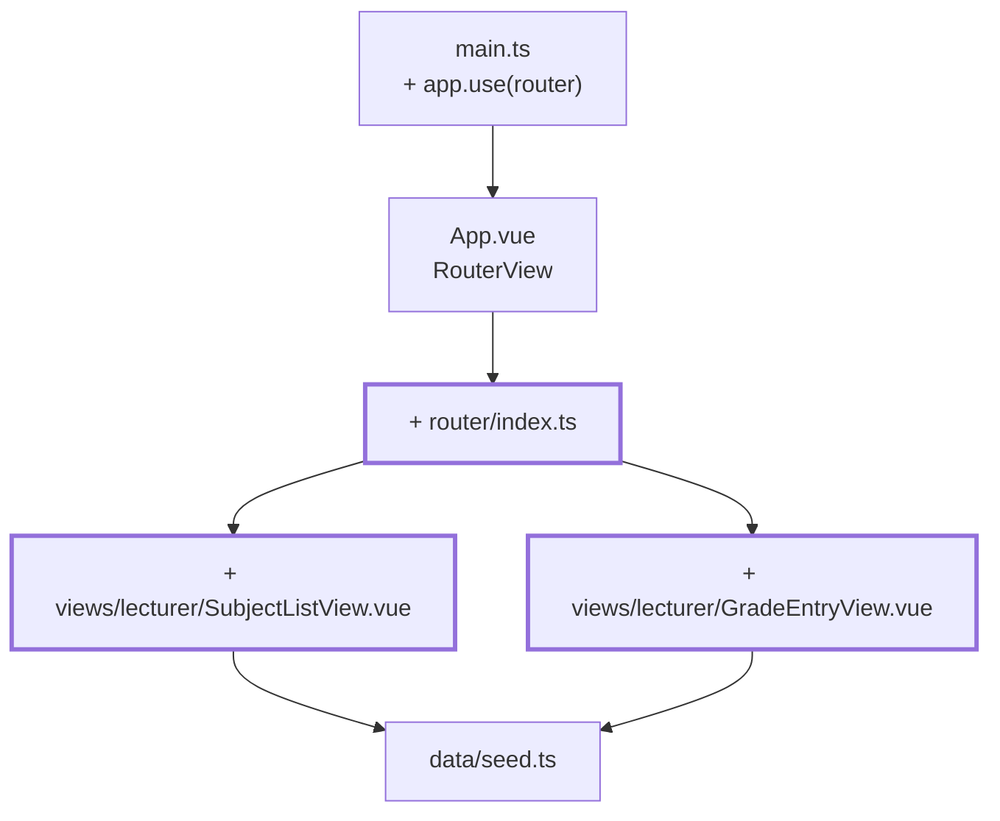
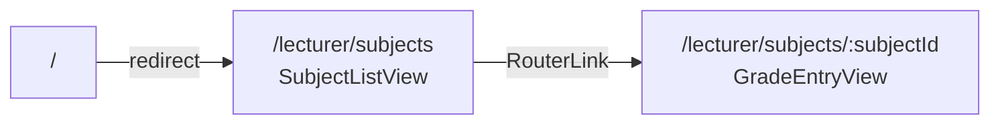

# Chapter 06 — Two views under their own URLs

> **Time:** about 1–1.5 h
> **Concepts:** [Router](../concepts/07-router.md)

## Where you stand

Subject list and grade form both live in `App.vue`, switched by a `ref`. A reload throws you
back to the list, and there's no such thing as a link to a single subject.

## What's new

vue-router with two routes. `App.vue` becomes the shell, the two views move to `src/views/`.
Still no sign-in.



**This chapter's route map:**



## The path

1. **Install and wire it up:** `npm install vue-router`, then `app.use(router)` in `main.ts`.
   `App.vue` shrinks to just the shell with `<RouterView />`.

2. **`src/router/index.ts`** with `createWebHistory` and the two routes. For the second one:

   ```ts
   {
     path: '/lecturer/subjects/:subjectId',
     name: 'lecturer-grade-entry',
     props: true,
     component: () => import('@/views/lecturer/GradeEntryView.vue'),
   }
   ```

   `props: true` passes the route parameter in as a prop. The view then never calls
   `useRoute()` and stays testable in isolation — that pays off in
   [chapter 19](19-tests-vitest.md). `() => import(...)` loads the view only on first visit; in
   [chapter 20](20-build-deployment.md) you'll see in the build output that this really does
   produce separate files.

3. **Create the two views** and move the content out of `App.vue`. The list links with
   `<RouterLink :to="{ name: 'lecturer-grade-entry', params: { subjectId: row.subject.id } }">`
   instead of a button — named routes with params, no strings glued together.

4. **`GradeEntryView`** takes `defineProps<{ subjectId: string }>()` and looks the subject up
   in the seed itself.

5. **Catch an unknown subject.** Visit `/lecturer/subjects/f99`. If the view crashes, that's
   the normal first attempt: an ID from the URL is freely chosen. Show a friendly message with
   a link back to the list instead.

6. **The watcher you'll need soon.** Switch from `f02` to `f03` via the list. If the view had
   local state, it would stay put — Vue reuses the component because the same route matches.
   You won't notice anything yet; in [chapter 10](10-grades-store-and-draft.md) that's exactly
   the bug that lets you enter grades into the wrong subject.

## What's still simplified

| Simplification | Why that's fine for now | Cleaned up in |
| --- | --- | --- |
| Every URL is open to everyone | with no sign-in there's nothing to protect | [Chapter 09](09-router-guards.md) |
| No 404 route | one more route once the rest is in place | [Chapter 09](09-router-guards.md) |
| Only the instructor side | the trainee view needs a sign-in first | [Chapter 13](13-trainee-dashboard.md) |
| The form only displays grades | input needs the draft | [Chapter 10](10-grades-store-and-draft.md) |

## Review

- [ ] `/lecturer/subjects` shows the list, clicking leads to `/lecturer/subjects/f01`
- [ ] Reloading on `/lecturer/subjects/f01` still shows the same subject
- [ ] The browser's back button works
- [ ] `/` redirects to the list
- [ ] `/lecturer/subjects/f99` shows a message instead of crashing
- [ ] In the network tab, the first click loads its own JS chunk

## Commit

The state runs — save it before you move on.

```bash
git add -A && git commit -m "feat: router with subject list and assessment form"
```

## Further reading

- [Concepts: Router](../concepts/07-router.md) — routes, params, `props: true`, lazy loading
- `reference/src/router/index.ts` — the same two routes, plus the four still missing
