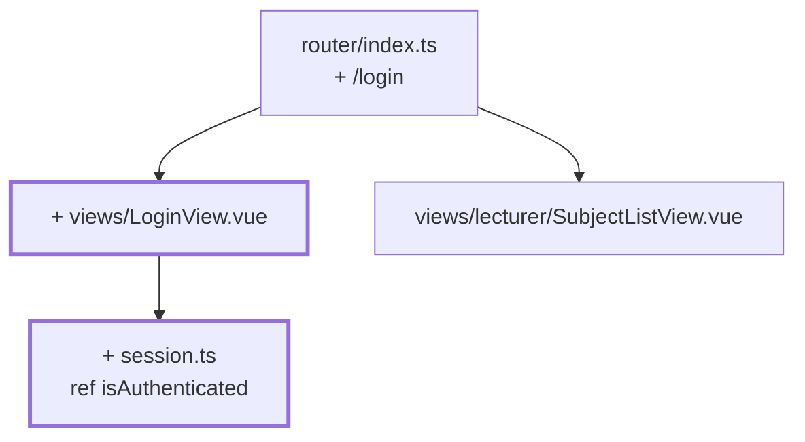

# Chapter 07 — The sign-in that checks nothing yet

> **Time:** about 0.5–1 h
> **Concepts:** [Router](../concepts/07-router.md)

## Where you stand

Two routes, both open. Whoever opens the app lands straight in the subject list.

## What's new

A sign-in screen with two fields and a button. The button checks **nothing** — it sets a flag
and navigates on. That's the whole point of this chapter: the flow first, the logic later.



## The path

1. **`src/session.ts`** — a single `ref`, deliberately outside any component:

   ```ts
   import { ref } from 'vue'

   /**
    * Module state: exists exactly ONCE for the whole app, because the `ref`
    * sits outside a function. A stand-in until chapter 08.
    */
   export const isAuthenticated = ref(false)
   ```

   That a module-level `ref` behaves differently from one inside a function isn't an
   incidental detail — you'll need the same distinction again in
   [chapter 18](18-academy-themes.md).

2. **`src/views/LoginView.vue`** with a real `<form>`, two `<input>`s, and a submit button:

   ```vue
   <script setup lang="ts">
   import { ref } from 'vue'
   import { useRouter } from 'vue-router'
   import { isAuthenticated } from '@/session'

   const router = useRouter()
   const username = ref('')
   const password = ref('')

   function handleSubmit() {
     // Chapter 08 actually checks something here. For now: door's open.
     isAuthenticated.value = true
     router.push({ name: 'lecturer-subjects' })
   }
   </script>

   <template>
     <form @submit.prevent="handleSubmit">
       <label>Username <input v-model="username" autocomplete="username" /></label>
       <label>Password <input v-model="password" type="password" autocomplete="current-password" /></label>
       <button type="submit">Sign in</button>
     </form>
   </template>
   ```

3. **Add the `/login` route** and redirect `/` there instead of to the subject list.

4. **Put a sign-out button** somewhere up top: `isAuthenticated.value = false` and
   `router.push({ name: 'login' })`.

5. **Click through the flow** until it feels right: sign in → list → subject → back → sign out
   → sign in. Only once that sits does [chapter 08](08-auth-store.md) add the actual check.

## What's still simplified

| Simplification | Why that's fine for now | Cleaned up in |
| --- | --- | --- |
| Any input is accepted, even empty | the flow comes before the rule | [Chapter 08](08-auth-store.md) |
| `isAuthenticated` is a loose module `ref` | a store only pays off with more than one field | [Chapter 08](08-auth-store.md) |
| There's no role and no person | that needs the master data | [Chapter 08](08-auth-store.md) |
| Protected URLs are still directly reachable | guards get their own chapter | [Chapter 09](09-router-guards.md) |
| A reload signs you out | persistence comes later | [Chapter 12](12-localstorage-composable.md) |
| No error text on the form | there's no error case yet | [Chapter 08](08-auth-store.md) |

## Review

- [ ] `/` lands on `/login`
- [ ] The button leads into the subject list — even with empty fields
- [ ] The Enter key in the password field submits the form
- [ ] Signing out leads back to `/login`
- [ ] `/lecturer/subjects` is directly reachable without signing in (expected — that's
      [chapter 09](09-router-guards.md))

## Commit

The state runs — save it before you move on.

```bash
git add -A && git commit -m "feat: sign-in screen with no validation"
```

## Further reading

- [Concepts: Router](../concepts/07-router.md) — programmatic navigation, named routes
- [Concepts: Components](../concepts/05-components.md) — why a real `<form>` and not `@click`
