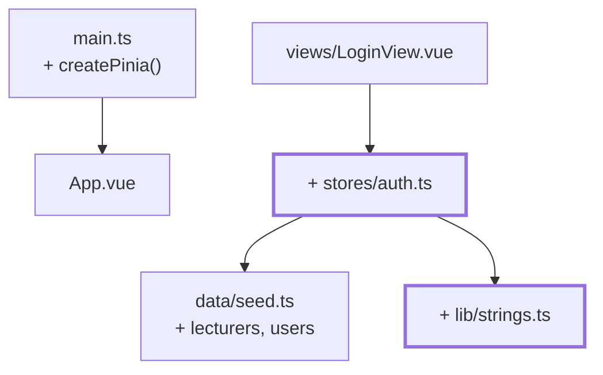

# Chapter 08 — The real sign-in

> **Time:** about 1–1.5 h
> **Concepts:** [Pinia](../concepts/08-pinia.md)

## Where you stand

The sign-in screen works as a flow but checks nothing. State is a loose `ref` in
`src/session.ts`.

## What's new

Pinia, an `auth` store, and a check against the master data. Plus the second role: so far
there've only been instructors, now there are trainees too.



## The path

1. **Extend the master data.** `src/data/lecturers.ts` with **one** instructor, and the role in
   `types/domain.ts`:

   ```ts
   export type Role = 'lecturer' | 'student'

   export interface Student extends Person { readonly role: 'student'; … }
   export interface Lecturer extends Person { readonly role: 'lecturer'; readonly academicTitle: string }

   /** Discriminated union - the `role` field enables narrowing. */
   export type User = Student | Lecturer
   ```

   Plus the two type guards `isStudent(user)` and `isLecturer(user)`. In `seed.ts`, add
   `users = [...LECTURERS, ...STUDENTS]` — sign-in searches **one** collection.

2. **`src/lib/strings.ts`** with `toUsername(lastName)`: lowercase, `ä→ae`, `ß→ss`, then strip
   accents via `normalize('NFD')`. `Sabé` becomes `sabe`. And `fullName(person)`, which
   collapses `Yoda Yoda` down to `Yoda` — mononyms exist in the real world too.

3. **`npm install pinia`**, `app.use(createPinia())` in `main.ts`, **before**
   `app.use(router)`.

4. **`src/stores/auth.ts`** as a setup store — the function is shaped like a `<script setup>`:
   `ref`s are state, `computed`s are getters, plain functions are actions.

   ```ts
   export const useAuthStore = defineStore('auth', () => {
     /** Only the ID, not the whole user object. */
     const currentUserId = ref<string | null>(null)
     const error = ref<string | null>(null)

     /** Read fresh from the master data every time - a single source of truth. */
     const currentUser = computed<User | null>(() =>
       currentUserId.value === null
         ? null
         : (users.find((u) => u.id === currentUserId.value) ?? null),
     )

     const isAuthenticated = computed(() => currentUser.value !== null)
     const role = computed(() => currentUser.value?.role ?? null)

     function login(username: string, password: string): boolean {
       const normalized = toUsername(username)
       const match = users.find((user) => toUsername(user.lastName) === normalized)

       // Same message in both cases: don't reveal which part was wrong.
       if (match === undefined || toUsername(password) !== normalized) {
         error.value = 'Username or password is incorrect.'
         return false
       }

       currentUserId.value = match.id
       error.value = null
       return true
     }

     function logout(): void { … }

     return { currentUserId, currentUser, error, isAuthenticated, role, login, logout }
   })
   ```

   > **This is not real authentication.** Username and password are both the last name,
   > checked in the browser. A learning exercise — real sign-in happens server-side against
   > hashed passwords. Write that caveat as a comment in the file, so the limitation doesn't
   > quietly turn into a feature down the line.

   Why only the ID sits in state and `currentUser` is derived: storing the whole object would
   give you a second source of truth that goes stale after every data change.

   And why `login` returns `false` instead of throwing: a wrong password is a normal outcome,
   not an exceptional one.

5. **Rework `LoginView`:** `auth.login(username, password)`, clear the password field and show
   `error` on `false`, navigate on on `true`. Delete `src/session.ts`.

6. **Offer an accounts list.** Nobody guesses ten last names. Build a collapsible list of every
   account whose click fills both fields. `seed.ts` needs a function for this that returns
   **raw data** (`{ id, name, login, isLecturer }`), not a finished display string — that
   depends on the language and belongs in the view.

7. **Use `storeToRefs`** whenever you destructure state out of the store:
   `const { error } = storeToRefs(auth)`. Without it, reactivity is gone. Actions, by contrast,
   you destructure normally.

## What's still simplified

| Simplification | Why that's fine for now | Cleaned up in |
| --- | --- | --- |
| Plain-text password checked in the browser | a learning project with no backend — stays this way, but commented | — |
| The role doesn't change the view yet | the trainee view doesn't exist yet | [Chapter 13](13-trainee-dashboard.md) |
| Protected URLs are still open | guards are the next chapter | [Chapter 09](09-router-guards.md) |
| A reload signs you out | `useLocalStorage` comes later | [Chapter 12](12-localstorage-composable.md) |
| Every user in one pot | with no academies there's nothing to separate | [Chapter 15](15-four-academies.md) |
| `users.find(...)` by hand | a `Collection<T>` only pays off once you filter | [Chapter 15](15-four-academies.md) |

## Review

- [ ] `tano` / `tano` signs in, `tano` / `wrong` doesn't
- [ ] On failure, a message shows at the field and the password is cleared
- [ ] The message for an unknown username is **the same** as for a wrong password
- [ ] Clicking an entry in the accounts list fills both fields
- [ ] `sabe` works as the login for `Sabé`
- [ ] The Vue devtools show the `auth` store with `currentUserId`
- [ ] `npm run type-check` is clean — the `User` union forces you to branch in one or two
      places, and that's intentional

## Commit

The state runs — save it before you move on.

```bash
git add -A && git commit -m "feat: sign-in against the master data with Pinia"
```

## Further reading

- [Concepts: Pinia](../concepts/08-pinia.md) — setup stores, `storeToRefs`
- [Concepts: Domain model](../concepts/06-domain-model.md#the-login-name) — `toUsername` in detail
- `reference/src/stores/auth.ts`, `reference/src/lib/strings.ts` — your current state, except
  for `academy` and `useLocalStorage`
