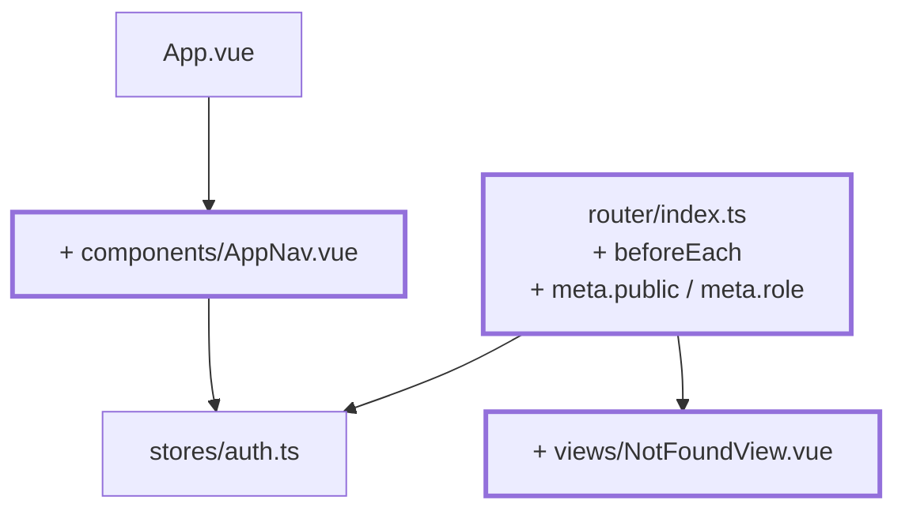
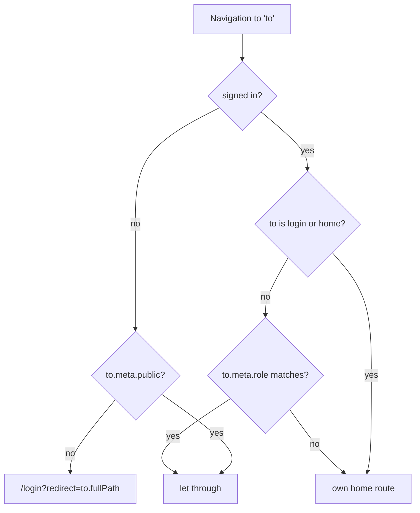

# Chapter 09 — Guarding routes

> **Time:** about 1–1.5 h
> **Concepts:** [Router](../concepts/07-router.md), [Pinia](../concepts/08-pinia.md)

## Where you stand

Sign-in checks against the master data, the `auth` store knows the person and role. Only:
`/lecturer/subjects` is still reachable without signing in.

## What's new

A global guard, roles on the routes, a 404 page, and a nav bar with sign-out.



**What the guard decides:**



## The path

1. **Make `meta` type-safe.** TypeScript lets you extend an interface from a foreign module —
   that turns `meta: { rolle: 'x' }` into a compile error instead of a silent bug:

   ```ts
   declare module 'vue-router' {
     interface RouteMeta {
       public?: boolean
       role?: Role
     }
   }
   ```

2. **Set `meta` on the routes:** `/login` gets `public: true`, the instructor routes get
   `role: 'lecturer'`.

3. **One global `beforeEach` instead of `beforeEnter` per route.** The rule applies to
   everything; repeat it per route and the one you forget stays unprotected.

   ```ts
   router.beforeEach((to) => {
     // The store may only be fetched *inside* the guard - when this module
     // is imported, the Pinia instance doesn't exist yet.
     const auth = useAuthStore()

     if (!auth.isAuthenticated) {
       if (to.meta.public) return true
       return { name: 'login', query: { redirect: to.fullPath } }
     }
     …
   })
   ```

   Return value: `true` or nothing lets it through, a route object redirects.

4. **`homeRouteFor(role)`** as an exported function — it answers, in exactly one place, where a
   role lands after signing in. The guard needs it, and so does `LoginView`.

5. **Honor the `redirect`.** After a successful sign-in, `LoginView` sends the person to their
   original destination. **Important:** `redirect` is a query parameter and therefore freely
   influenced from outside — accept only values that start with `/`, or you've just built an
   open redirect.

6. **Wrong role → own home route**, not an error page. A trainee landing on an instructor URL
   made a mistake; an error message helps nobody there.

7. **404 route** with `path: '/:pathMatch(.*)*'` and `meta: { public: true }`.

8. **`components/AppNav.vue`** with the signed-in person's name and a sign-out button. Above
   `<RouterView />` in `App.vue`.

## What's still simplified

| Simplification | Why that's fine for now | Cleaned up in |
| --- | --- | --- |
| There are only routes for `role: 'lecturer'` | the trainee view doesn't exist yet | [Chapter 13](13-trainee-dashboard.md) |
| A reload signs you out, the guard sends you to sign-in | session persistence comes right up | [Chapter 12](12-localstorage-composable.md) |
| The guard checks the role, not the academy | there's only one | [Chapter 15](15-four-academies.md) |
| `AppNav` is a plain bar | layout and banner later | [Chapter 17](17-tailwind-layout.md) |

## Review

- [ ] `/lecturer/subjects` with no sign-in → `/login?redirect=/lecturer/subjects`
- [ ] After signing in you land **on the original destination**, not the home route
- [ ] `?redirect=https://example.com` does **not** send you there
- [ ] Signed in, visiting `/login` → immediately forwarded to your own home route
- [ ] `/does-not-exist` shows the 404 page, even without signing in
- [ ] Signing out and then hitting back doesn't return you to the protected view

## Commit

The state runs — save it before you move on.

```bash
git add -A && git commit -m "feat: protect routes with a global guard"
```

## Further reading

- [Concepts: Router](../concepts/07-router.md) — guards, `meta`, declaration merging
- `reference/src/router/index.ts` — the full guard, including the trainee routes
