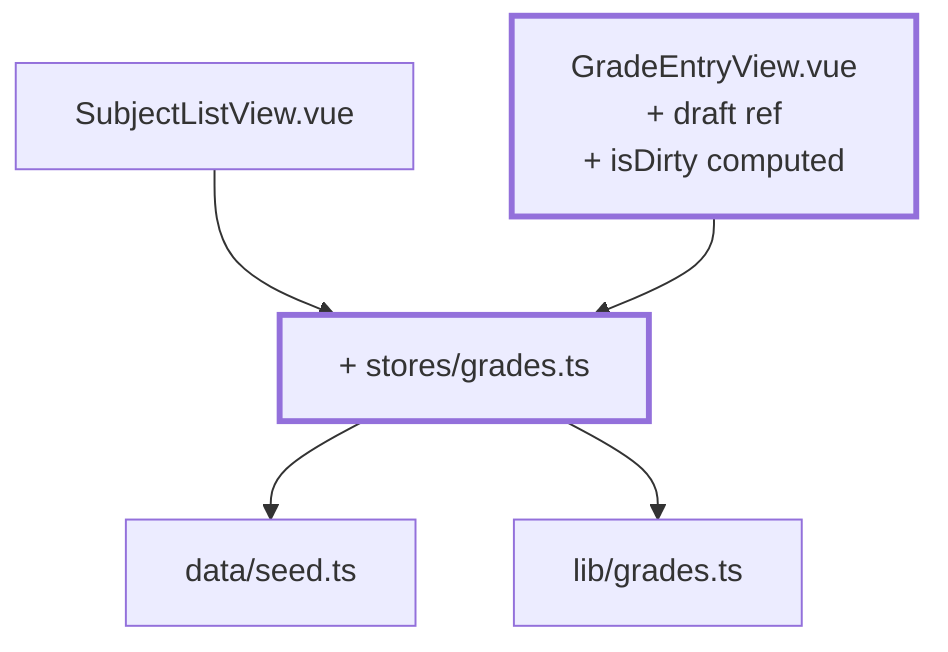
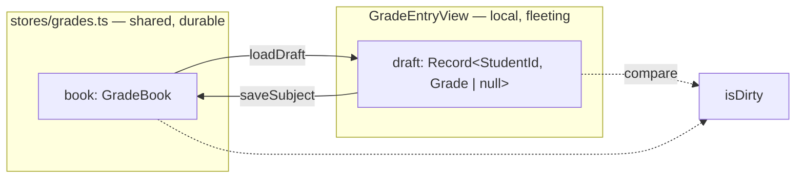

# Chapter 10 — Recording and saving assessments

> **Time:** about 1.5–2 h
> **Concepts:** [Pinia](../concepts/08-pinia.md),
> [The instructor view](../concepts/10-instructor-view.md)

## Where you stand

Signed in, protected routes, subject list and form. The grade book is a local `ref` inside a
view — every navigation resets it, and the list has no idea what's happening in the form.

## What's new

A `grades` store as the shared source of truth, and a **draft** in the form: a local copy that
only moves into the store on save.



**Who owns which state:**



## The path

1. **`src/stores/grades.ts`** with `book = ref(createGradeBook())` and the access functions:

   | Function | Purpose |
   | --- | --- |
   | `gradesForSubject(subjectId)` | a subject's grades, in trainee order |
   | `gradeMapForSubject(subjectId)` | the same data as an object — a **shallow copy** for the draft |
   | `gradeOf(subjectId, studentId)` | a single grade |
   | `saveSubject(subjectId, draft)` | commits an entire draft |
   | `gradedCountBySubject` | `computed`: subject ID → number of grades assigned |

   `gradeMapForSubject` deliberately returns a copy. Without it, every keystroke in the form
   would mutate the store directly — and "discard" would be impossible.

   `saveSubject` is **one** call instead of many individual setters. One write later means
   exactly one `localStorage` write too ([chapter 12](12-localstorage-composable.md)).

2. **The draft in `GradeEntryView`:**

   ```ts
   const draft = ref<Record<string, Grade | null>>({})
   const savedAt = ref<Date | null>(null)

   function loadDraft() {
     draft.value = gradesStore.gradeMapForSubject(props.subjectId)
     savedAt.value = null
   }
   ```

3. **The watcher, without which the view is broken:**

   ```ts
   watch(() => props.subjectId, loadDraft, { immediate: true })
   ```

   Switch from `/lecturer/subjects/f02` to `/f03` and the component gets **reused** —
   `<script setup>` doesn't run again, and the old draft stays put. You enter grades into the
   wrong subject. That's the bug [chapter 06](06-router-two-views.md) warned you about.

   Two pitfalls at once: `watch(props.subjectId, …)` does **not** work (you're passing the
   value, not the source), and without `immediate: true` everything's empty on first render.

4. **Derive `isDirty` instead of maintaining it:**

   ```ts
   const isDirty = computed(() =>
     students.some((s) => draft.value[s.id] !== gradesStore.gradeOf(props.subjectId, s.id)),
   )
   ```

   After saving, `isDirty` is `false` on its own — it compares against the store. You don't
   have to reset anything. That's the payoff from the rule in
   [Vue reactivity](../concepts/04-vue-reactivity.md): derive instead of maintaining.

5. **Four buttons:** *Save*, *Discard* (both active only when `isDirty`), *Clear*, and a hint
   reading "Unsaved changes" or "Saved at HH:MM:SS".

6. **The input fields** stay bare `<input type="number">`s for now, one per row, bound via
   index access. Here you run into `noUncheckedIndexedAccess` from
   [TypeScript](../concepts/03-typescript.md): `draft[student.id]` is `Grade | null | undefined`.
   Split `v-model` into its two halves:

   ```vue
   :model-value="draft[student.id] ?? null"
   @update:model-value="(value) => (draft[student.id] = value)"
   ```

7. **The list follows along.** `SubjectListView` now reads from the store — save in the form,
   and progress updates on the way back, with nothing to synchronize by hand.

## What's still simplified

| Simplification | Why that's fine for now | Cleaned up in |
| --- | --- | --- |
| A `9` in the field corrupts the draft | robust input is the next chapter | [Chapter 11](11-grade-input.md) |
| No "fill at random" | the draft has to exist first | [Chapter 11](11-grade-input.md) |
| Navigating away discards unsaved changes silently | `onBeforeRouteLeave` comes right up | [Chapter 11](11-grade-input.md) |
| A reload resets every grade to the seed | persistence gets its own chapter | [Chapter 12](12-localstorage-composable.md) |
| The store knows every subject for every person | with no academies there's no dividing line | [Chapter 15](15-four-academies.md) |
| Metrics computed by hand | `useGradeStats` bundles that | [Chapter 14](14-cohort-comparison-chart.md) |

## Review

- [ ] Open an empty subject, enter grades → "unsaved" appears
- [ ] The store is still **unchanged** (check the Vue devtools)
- [ ] *Discard* restores the old state
- [ ] *Save* → the hint changes, and the subject list shows the new progress
- [ ] Switching subjects via the list shows the **right** grades, not the previous ones
- [ ] Visiting `/lecturer/subjects/f03` directly shows the grades immediately, not empty fields

## Commit

The state runs — save it before you move on.

```bash
git add -A && git commit -m "feat: save grades in the store, draft in the form"
```

## Further reading

- [Concepts: The instructor view](../concepts/10-instructor-view.md) — draft vs. saved state, the watcher in detail
- [Concepts: Pinia](../concepts/08-pinia.md) — setup stores
- `reference/src/stores/grades.ts` — the same functions, plus `rosterFor` for the academies
