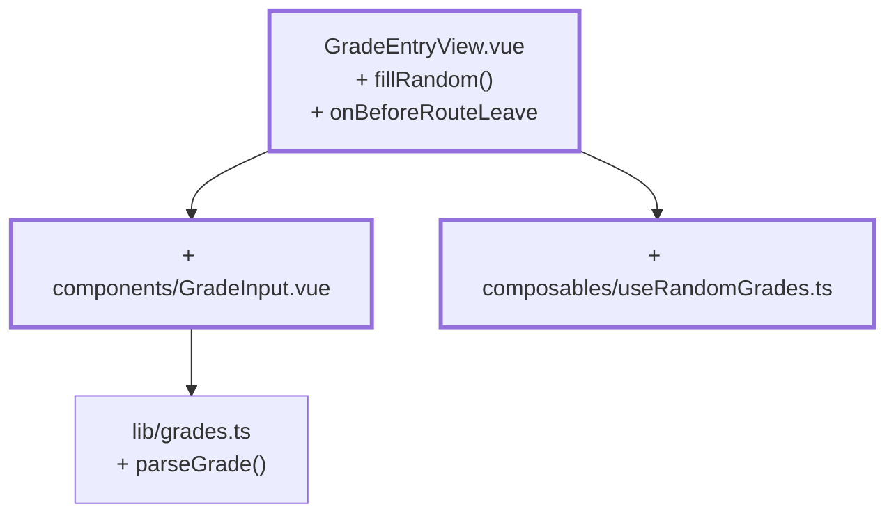

# Chapter 11 — An input you can't break

> **Time:** about 1.5–2 h
> **Concepts:** [The instructor view](../concepts/10-instructor-view.md)

## Where you stand

The draft works, saving and discarding too. But a `9` in a field lands right in the draft, and
navigating away with unsaved changes loses them without a word.

## What's new

`GradeInput` as its own component with a clear promise: **invalid input is displayed, but never
reported upward.** Plus "fill at random" and a confirmation before leaving.



## The path

1. **`parseGrade` in `lib/grades.ts`** — three return cases, and the distinction is the whole
   trick:

   ```ts
   /** '' -> null (not assessed) · '3' -> 3 · '9' -> undefined (error) */
   export function parseGrade(input: string): Grade | null | undefined
   ```

   "Field cleared" is a valid action, "field contains 9" is an error the UI has to report.
   Watch out for `Number('')`, which is `0` — the empty check has to come first.

2. **`components/GradeInput.vue`.** An `<input>` always produces a string, the model wants
   `Grade | null`. So the component keeps its own text `ref` and translates in both directions:

   ```ts
   const model = defineModel<Grade | null>({ required: true })
   const text = ref(model.value === null ? '' : String(model.value))
   const invalid = ref(false)

   // outside in: random fill, switching subjects
   watch(model, (value) => {
     const next = value === null ? '' : String(value)
     if (next !== text.value) {          // without this check: infinite loop
       text.value = next
       invalid.value = false
     }
   })

   // inside out: typing
   watch(text, (value) => {
     const parsed = parseGrade(value)
     if (parsed === undefined) {
       invalid.value = true              // show it, but do NOT report it
       return
     }
     invalid.value = false
     model.value = parsed
   })
   ```

   That keeps the model valid at **every** point in time. Type a 9 and "only 1–5" appears at
   the field, while the previous grade stays untouched.

3. **Accessibility that costs you nothing extra.** Ten fields with no visible label need an
   `aria-label` (`Assessment for Ahsoka Tano`), or a screen reader announces "text field" ten
   times over. And the error message needs a unique ID from `useId()` — ten fields sharing one
   fixed ID would all point at the same message.

4. **`composables/useRandomGrades.ts`.** A weighted distribution instead of
   `Math.random() * 5`: a real exam rarely produces as many ones as fives. The method
   ("roulette wheel") lives in the reference.

   ```ts
   function fillRandom() {
     draft.value = randomGradesFor(students.map((s) => s.id))
   }
   ```

   **One new object instead of ten individual assignments:** one assignment, one render. And it
   writes into the *draft*, not the store — the generator fills the fields, you see the result
   and confirm it.

5. **`onBeforeRouteLeave`** with a confirmation when `isDirty`.

## What's still simplified

| Simplification | Why that's fine for now | Cleaned up in |
| --- | --- | --- |
| The component brings its own markup | `BaseInput` doesn't exist yet | [Chapter 16](16-base-components.md) |
| The confirmation is a `window.confirm` | stays this way — even in the reference | — |
| No test for the central promise | tests get their own chapter | [Chapter 19](19-tests-vitest.md) |

## Review

- [ ] *Fill at random* on an empty subject fills **ten** fields, "unsaved" appears
- [ ] The store is still unchanged afterward
- [ ] Type a `9` → hint at the field, **previous value stays intact**
- [ ] Clear a field → saved as "not assessed", with no error message
- [ ] Switching subjects swaps the fields, with none left stuck
- [ ] Navigating away with unsaved changes → confirmation prompt
- [ ] A screen reader (or the devtools' accessibility view) reads out each field's name

## Commit

The state runs — save it before you move on.

```bash
git add -A && git commit -m "feat: GradeInput with validation and random fill"
```

## Further reading

- [Concepts: The instructor view](../concepts/10-instructor-view.md) — `GradeInput` line by line
- `reference/src/components/GradeInput.vue` — your final version
- `reference/src/composables/useRandomGrades.ts` — the weighted draw
