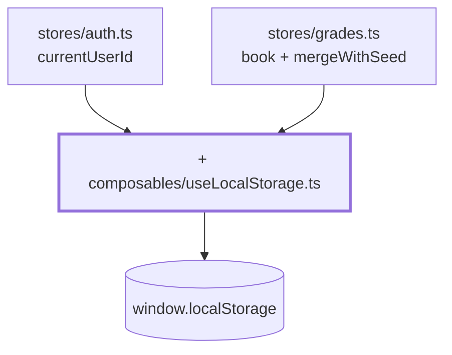

# Chapter 12 — Everything survives a reload

> **Time:** about 1–1.5 h
> **Concepts:** [Composables](../concepts/09-composables.md)

## Where you stand

Recording and saving grades works. Hitting reload wipes it all out: session gone, grades back
to the seed.

## What's new

A generic `useLocalStorage<T>` — **one** composable that serves both stores.



## The path

1. **The signature first.** The type parameter makes the composable universal — the return
   type follows from the fallback:

   ```ts
   export function useLocalStorage<T>(
     key: string,
     fallback: T,
     parse: (raw: unknown, fallback: T) => T = (raw) => raw as T,
   ): Ref<T>
   ```

   ```ts
   const id   = useLocalStorage<string | null>('gradebook.session', null)  // Ref<string | null>
   const book = useLocalStorage('gradebook.grades', createGradeBook())      // Ref<GradeBook>
   ```

2. **Read with `try`/`catch`.** Not optional: a half-written or hand-edited entry makes
   `JSON.parse` throw, and that would take down the app on startup. `undefined` means "nothing
   usable stored".

3. **Write through a `watch` with `deep: true`.** Without `deep`, the nested grade book would
   only report a whole-reference swap, not the change of a single entry. Writing needs a
   `catch` too: private browsing or a full quota is no reason to halt the app — persistence
   here is a convenience, not a requirement.

4. **Wire it into the `auth` store.** `currentUserId` becomes a `useLocalStorage`. Note that
   **only the ID** is still persisted and `currentUser` stays derived — otherwise you'd have
   stale person data sitting in storage.

5. **The `parse` parameter earns its keep now.** Your data model changes over time,
   `localStorage` is persistent. Add a subject to `subjects.ts` and it's missing from old
   states — without a merge, `book.value['f07']` would be `undefined` and the view would crash.

   ```ts
   const book = useLocalStorage('gradebook.grades', createGradeBook(), mergeWithSeed)
   ```

   `mergeWithSeed` lets the seed provide the **structure** and the stored state provide the
   **values** — and only accepts values that pass `isGrade`. One detail that's easy to get
   wrong: "key missing" and "value is `null`" are two different things. A missing key means the
   person is new → seed value. A stored `null` means the grade was deliberately cleared →
   `null` stays.

6. **Offer a reset.** `resetAll()` in the store, an unobtrusive link on the sign-in screen with
   `window.confirm`. Without it you can never get back to a fresh state while developing.

## What's still simplified

| Simplification | Why that's fine for now | Cleaned up in |
| --- | --- | --- |
| The `localStorage` key is a string in the module | one constant per store is enough | — |
| No session expiry | a learning project with no backend | — |
| Two tabs: whichever writes last wins | `storage` events would be their own exercise | — |
| The merge only knows the grade book | there's nothing else to migrate | — |

## Review

- [ ] Sign in, reload → you're still signed in, on the same page
- [ ] Save grades, reload → the grades are still there
- [ ] In devtools, under Application → Local Storage, there are two entries
- [ ] Corrupt the value by hand (`{{{`) and reload → the app still starts
- [ ] Add a subject in `subjects.ts`, reload → it shows up empty, the rest is unchanged
- [ ] Hand-set a grade to `9` and reload → it becomes `null`, no crash
- [ ] "Reset data" returns you to the shipped state

## Commit

The state runs — save it before you move on.

```bash
git add -A && git commit -m "feat: persist session and grades in localStorage"
```

## Further reading

- [Concepts: Composables](../concepts/09-composables.md) — composables, the generic `useLocalStorage<T>`
- `reference/src/composables/useLocalStorage.ts` — your final version
- `reference/src/stores/grades.ts` — `mergeWithSeed` near the bottom
