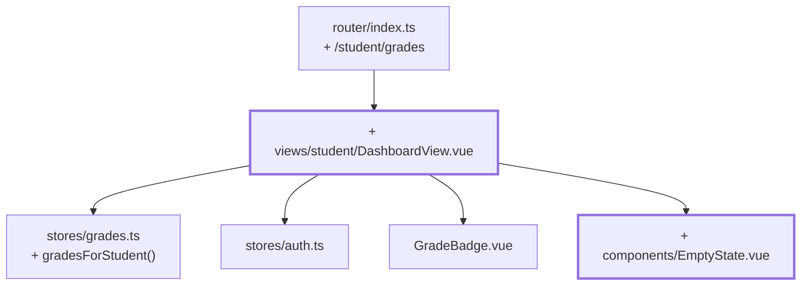

# Chapter 13 — The trainee's view

> **Time:** about 1–1.5 h
> **Concepts:** [The trainee view](../concepts/11-trainee-view.md)

## Where you stand

The instructor side is done and survives a reload. A trainee who signs in still lands in the
instructor's subject list — the second role has no view of its own yet.

## What's new

A dashboard with **your own** grades across every subject, and the role finally decides where
you land after signing in.



## The path

1. **`gradesForStudent(studentId)` in the store** — every subject with its own grade attached:

   ```ts
   export interface StudentGradeRow {
     subject: Subject
     grade: Grade | null
   }
   ```

   A dedicated type instead of an anonymous object, because the view needs it in `v-for` and
   you'll want to test it in [chapter 19](19-tests-vitest.md).

2. **`views/student/DashboardView.vue`** with the route `/student/grades` and
   `meta: { role: 'student' }`. `homeRouteFor` from [chapter 09](09-router-guards.md) now
   returns something sensible for both roles.

3. **The person comes from the store, not the URL.** That's the important decision in this
   chapter:

   ```ts
   const rows = computed(() => {
     const user = currentUser.value
     if (user === null) return []
     return gradesStore.gradesForStudent(user.id)
   })
   ```

   Had the route been `/student/grades/:studentId` instead, a foreign ID in the address bar
   could read someone else's grades. Whatever never comes from the URL can't be manipulated
   either.

   `currentUser` can in theory be `null` — the guard rules that out in practice, but the
   compiler doesn't know that. Handle the case cleanly instead of pushing it away with `!`.

4. **Metrics up top:** number of graded subjects, own average, subjects still open.

5. **`EmptyState`** for when nothing's been assessed yet. An empty table looks like a bug.

6. **`AppNav`, role-aware.** Instructors see the link to the subject list, trainees the one to
   the dashboard. The type guard `isStudent(user)` from [chapter 08](08-auth-store.md) makes
   that type-safe.

## What's still simplified

| Simplification | Why that's fine for now | Cleaned up in |
| --- | --- | --- |
| No cohort comparison | that's the next chapter | [Chapter 14](14-cohort-comparison-chart.md) |
| Metrics computed by hand | `useGradeStats` is coming right up | [Chapter 14](14-cohort-comparison-chart.md) |
| Every trainee sees all six subjects | there's only one academy | [Chapter 15](15-four-academies.md) |
| The grade label ("good") is missing | it depends on the academy | [Chapter 15](15-four-academies.md) |

## Review

- [ ] `tano` / `tano` lands on `/student/grades` after signing in
- [ ] `yoda` / `yoda` still lands on `/lecturer/subjects`
- [ ] The dashboard shows six subjects, two of them graded
- [ ] Visiting `/lecturer/subjects` as a trainee → sent back to your own dashboard
- [ ] Save a grade as instructor, sign out, sign in as trainee → the grade is there
- [ ] Clear every grade → `EmptyState` instead of an empty table

## Commit

The state runs — save it before you move on.

```bash
git add -A && git commit -m "feat: dashboard with your own grades"
```

## Further reading

- [Concepts: The trainee view](../concepts/11-trainee-view.md) — the trainee's view
- `reference/src/views/student/DashboardView.vue`
