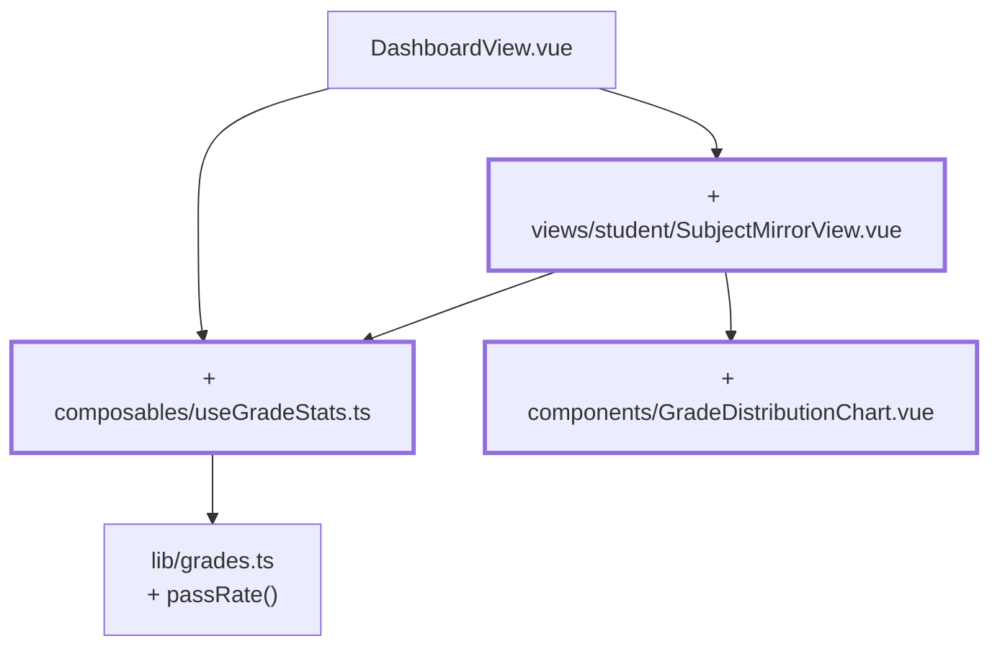

# Chapter 14 — Cohort comparison and bar chart

> **Time:** about 1.5–2 h
> **Concepts:** [Composables](../concepts/09-composables.md),
> [The trainee view](../concepts/11-trainee-view.md)

## Where you stand

Trainees see their own grades. The question that comes next — "so how's everyone else doing?"
— the app doesn't answer yet.

## What's new

A detail page per subject with an anonymous comparison and a bar chart, and `useGradeStats` as
a bundle of every metric.



## The path

1. **`composables/useGradeStats.ts`** — the metrics as a `computed` bundle: `count`, `total`,
   `average`, `distribution`, `passRate`, `peak`, `isEmpty`, `isComplete`.

   The signature is the real lesson here:

   ```ts
   export function useGradeStats(source: MaybeRefOrGetter<readonly (Grade | null)[]>) {
     const grades = computed(() => toValue(source))
     …
   }
   ```

   `MaybeRefOrGetter<T>` is the usual shape for composable inputs: a plain value, a `ref`, or a
   function are all allowed, and `toValue()` unwraps any of them. Take `(grades: Grade[])`
   instead, and the value would freeze at call time, and the stats would never update.

2. **Use `useGradeStats` everywhere** you've been computing by hand so far: dashboard, subject
   list, and the assessment form. There, with the **draft** values as the source — the metrics
   should update live as you type, not only on save.

3. **`views/student/SubjectMirrorView.vue`** under `/student/grades/:subjectId` with
   `props: true`.

4. **Anonymous means: the view never gets the names at all.**

   ```ts
   const classGrades = computed(() => gradesStore.gradesForSubject(props.subjectId))
   ```

   A list of grades, no attribution. What a view never receives, it can never accidentally
   display — that's the difference between "we don't show the names" and "we don't have them".

5. **`components/GradeDistributionChart.vue`** — five bars, deliberately without a chart
   library. Height is a percentage, scaled against the tallest bar; that's plain CSS. A library
   for this would be around 100 kB that nobody needs.

   An inline `:style` is the right call here, because the value is computed — for everything
   else: classes.

   ```vue
   <div :style="{ height: `${(count / peak) * 100}%` }" />
   ```

   And: a chart is useless to a screen reader. Give every bar an `aria-label` with the grade
   and its count, or put a table next to it.

6. **Highlight the trainee's own grade** — `GradeBadge` gets the `highlight` prop for this,
   which it hasn't had since [chapter 02](02-first-component.md).

## What's still simplified

| Simplification | Why that's fine for now | Cleaned up in |
| --- | --- | --- |
| The comparison covers every trainee that exists | there's only one academy — later it's your own cohort | [Chapter 15](15-four-academies.md) |
| `/student/grades/f99` only checks "does the subject exist" | the question "is this person allowed to?" arrives with the academies | [Chapter 15](15-four-academies.md) |
| Grade labels are neutral ("good") | academy-specific labels later | [Chapter 15](15-four-academies.md), [Chapter 21](21-i18n.md) |
| Bar colors are fixed | design tokens later | [Chapter 17](17-tailwind-layout.md) |

## Review

- [ ] Clicking in the dashboard leads to `/student/grades/f01`
- [ ] The cohort comparison shows ten grades, but **not a single name**
- [ ] Your own grade is highlighted
- [ ] Five bars, the tallest fills the space, empty grades have height 0
- [ ] A subject with no grades shows an `EmptyState` instead of five zeros
- [ ] In the assessment form, metrics change **as you type**, not only on save
- [ ] No name and no matriculation number appears in the chart's DOM

## Commit

The state runs — save it before you move on.

```bash
git add -A && git commit -m "feat: cohort comparison with grade distribution"
```

## Further reading

- [Concepts: Composables](../concepts/09-composables.md) — `MaybeRefOrGetter`, `toValue`
- [Concepts: The trainee view](../concepts/11-trainee-view.md) — cohort comparison and chart
- `reference/src/composables/useGradeStats.ts`, `reference/src/components/GradeDistributionChart.vue`
