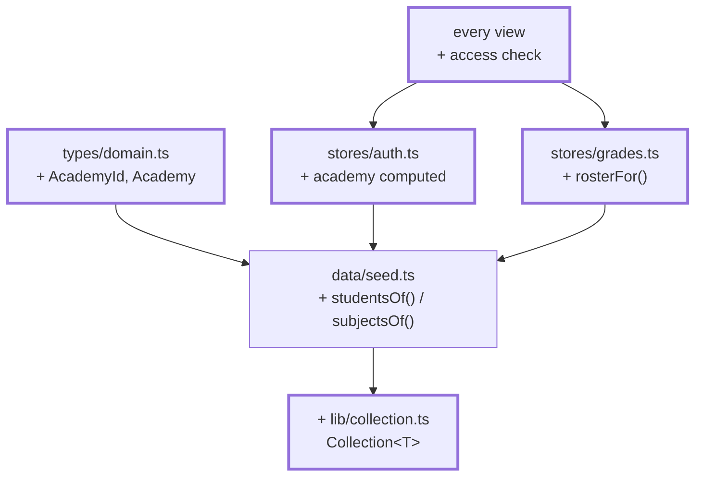
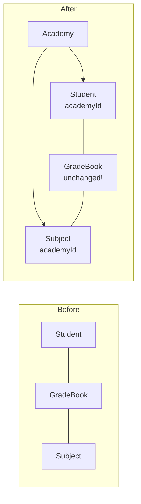

# Chapter 15 — From one academy to four

> **Time:** about 2–3 h
> **Concepts:** [Domain model](../concepts/06-domain-model.md)

## Where you stand

The app is functionally done: sign-in, roles, recording grades, cohort comparison, everything
survives a reload. And all of it knows exactly **one** academy — it appears nowhere in the code,
because there was nothing to tell apart.

## What's new

The academy as a **dimension in the data model**. This is the most demanding chapter, and not
because of its size — because a dimension pulled in after the fact surfaces in surprisingly
many places.



**What changes in the model:**



## The path

1. **`AcademyId` as a union, not a `string`:**

   ```ts
   export type AcademyId = 'jedi' | 'sith' | 'empire' | 'rebels'
   export interface Academy extends Identifiable { readonly id: AcademyId }
   ```

   That forces every mapping — color palette, crest, labels — to be complete, or the compiler
   complains. A typo shows up at build time, not at runtime.

2. **`academyId` on `Person` and `Subject`.** From here on `npm run type-check` will show you
   itself where something's still missing. Work the list down — that's the core of this
   chapter.

3. **The grade book stays unchanged.** Two levels, no academy layer: the subject already
   determines the academy, and a person belongs to exactly one. A third level of nesting would
   be redundant and would have to be kept consistent on every change. If that surprises you,
   read
   [Domain model](../concepts/06-domain-model.md#why-the-grade-book-stays-as-it-is).

4. **The central dividing line** — two functions in `seed.ts` that everything routes through:

   ```ts
   export function studentsOf(academyId: AcademyId): readonly Student[]
   export function subjectsOf(academyId: AcademyId): readonly Subject[]
   ```

   Whenever "every trainee" is needed anywhere from now on, it almost always means
   `studentsOf`.

5. **Adjust `createGradeBook`:** for a subject, only **trainees from its own academy** get
   entered. A Padawan never even shows up in an Imperial subject — the separation becomes a
   property of the data structure instead of a matter of diligence in the views.

6. **`lib/collection.ts` — the generic collection finally pays off.** So far you've been
   writing `.filter().sort()` by hand everywhere. With four academies that turns into a
   pattern:

   ```ts
   students.filter((s) => s.academyId === id).sortBy((s) => s.lastName).all()
   ```

   A generic class with `byId`, `find`, `filter`, `sortBy`, `map`, and `[Symbol.iterator]`. How
   to build one is covered in [TypeScript](../concepts/03-typescript.md) and
   [Domain model](../concepts/06-domain-model.md#the-generic-collection). Pull it in **after**
   the first five steps, not before — that way you know exactly which methods you need.

7. **`academy` in the `auth` store**, derived and never stored:

   ```ts
   const academy = computed(() => {
     const user = currentUser.value
     return user === null ? null : (academies.byId(user.academyId) ?? null)
   })
   ```

   This is the app's pivot point: which subjects are visible, who shows up in the cohort
   comparison, what the design looks like later — it all follows from here.

8. **`rosterFor(subjectId)` in the `grades` store:** exactly one place that says which trainees
   belong to a subject. Every access function routes through it. An unknown subject yields an
   empty list instead of a crash.

9. **The access check — the most important point in this chapter.** In both detail views:

   ```ts
   const subject = computed(() => {
     const found = subjects.byId(props.subjectId)
     if (found === undefined || academy.value === null) return undefined
     // A foreign subject == a subject that doesn't exist.
     return found.academyId === academy.value.id ? found : undefined
   })
   ```

   > **This is not a hypothetical case.** While building the reference, this exact check was
   > missing at first: `byId` finds *any* subject, and the ID comes from the URL. A recruit
   > could view the Sith cohort comparison through the address bar. Whenever an identifier
   > comes from the URL, it comes with the question: *is this person even allowed to see it?*

10. **Fill in the master data:** four academies, one instructor each, ten trainees each, six
    subjects each. Last names must be **unique across academies** — sign-in searches a single
    collection. This is the hour of plain typing from
    [Domain model](../concepts/06-domain-model.md); take the data from `reference/src/data/`.

11. **Make the academy selectable on the sign-in screen.** Four real radio buttons
    (`<input type="radio">` inside a `<fieldset>` with a `<legend>`), not four `<button>`s:
    grouping, arrow-key navigation, and focus behavior all come from the browser this way. The
    selection filters the accounts list — and in [chapter 18](18-academy-themes.md) it switches
    the design.

## What's still simplified

| Simplification | Why that's fine for now | Cleaned up in |
| --- | --- | --- |
| All four academies look the same | theming gets its own chapter | [Chapter 18](18-academy-themes.md) |
| Names and mottos live in `academies.ts` | one language — they move to the locale files later | [Chapter 21](21-i18n.md) |
| Labels ("Padawan", "recruit") are still neutral | ditto | [Chapter 21](21-i18n.md) |
| No test locks the separation in | tests get their own chapter | [Chapter 19](19-tests-vitest.md) |

## Review

- [ ] Four academies on the sign-in screen, the accounts list shows only the matching accounts
- [ ] As a Jedi instructor you see **six** subjects, not 24
- [ ] *Fill at random* fills **ten** fields, not 40
- [ ] The cohort comparison shows ten grades — your own year
- [ ] `/lecturer/subjects/f07` (a Sith subject) as a Jedi → the same message as `f99`
- [ ] `/student/grades/f07` as a Jedi, likewise
- [ ] `npm run type-check` is clean, and you haven't used `as` anywhere to force it green

## Commit

The state runs — save it before you move on.

```bash
git add -A && git commit -m "feat: four academies as a dimension in the data model"
```

## Further reading

- [Concepts: Domain model](../concepts/06-domain-model.md) — the academy as a dimension, `Collection<T>`
- `reference/src/data/seed.ts` — `studentsOf`, `subjectsOf`, `createGradeBook`
- `reference/src/lib/collection.ts`
- `reference/src/views/student/SubjectMirrorView.vue` — the access check in context
