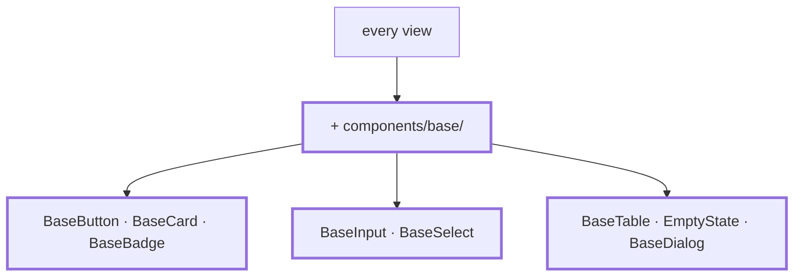

# Chapter 16 — Base components

> **Time:** about 2–3 h
> **Concepts:** [Components](../concepts/05-components.md)

## Where you stand

Four academies, every feature in place. And every view has its own `<table>`, its own
`<button class="…">`, its own `<input>` with a `<label>`. Five times, almost the same thing.

## What's new

A `components/base/` folder with the building blocks every view is made of from now on. This is
the moment slots and `defineModel` pay off — earlier it would have been abstraction on
speculation.



## The path

1. **Take stock first, then build.** Go through your views and write down what shows up more
   than twice. Whatever shows up only once doesn't become a base component — that's exactly
   where most component libraries fail.

2. **`BaseButton`** with `variant` (`primary` / `secondary` / `ghost`), `block`, and `type`.
   Anything not declared as a prop falls through to the root element automatically — you don't
   need to forward `disabled`, `aria-*`, or `@click` yourself.

3. **`BaseCard`** with `title`, `subtitle`, and a default slot. The difference from props:
   markup goes in, not just text.

4. **`BaseInput`** with `label`, `error`, and `defineModel<string>()`. This is where the
   `<label>` with `for`/`id` belongs, so you never write it by hand again — plus
   `aria-describedby` pointing at the error message, with an ID from `useId()`.

5. **`BaseTable`, generically.** A component can have type parameters:

   ```vue
   <script setup lang="ts" generic="T">
   defineProps<{ rows: readonly T[] }>()
   </script>
   ```

   Whether you go that far or settle for a component with a `#head` slot and a free default
   slot is a matter of taste; the reference does the latter.

6. **`BaseDialog` on the native `<dialog>`.** No modal from a library: focus trap, Escape key,
   backdrop, and `inert` for the background all come with the element. You need to wire
   `showModal()` / `close()` to a `defineModel<boolean>()` — the path is shown in
   [Components](../concepts/05-components.md#a-modal-without-a-library-the-native-dialog).

7. **`BaseBadge`** (`tone`: `success` / `warning` / `neutral`), and **`EmptyState`** moves
   from `components/`, where [chapter 13](13-trainee-dashboard.md) left it, into
   `components/base/` — that's where it belongs now that it has more than one use.

8. **Rebuild, one view at a time.** Click through each view once you've converted it. If a view
   won't convert cleanly, it's usually the base component that's cut too narrow — not the view
   that's wrong.

## What's still simplified

| Simplification | Why that's fine for now | Cleaned up in |
| --- | --- | --- |
| Colors and spacing are still one-off values | design tokens are the next chapter | [Chapter 17](17-tailwind-layout.md) |
| No tests for `BaseDialog` | tests get their own chapter | [Chapter 19](19-tests-vitest.md) |

## Review

- [ ] `components/base/` contains only components used **at least twice**
- [ ] No bare `<table>` and no bare `<button class="…">` left in any view
- [ ] `<BaseButton disabled>` is genuinely disabled, without you declaring `disabled` as a prop
- [ ] The dialog closes on Escape, focus stays trapped inside, and returns to the triggering
      element afterward
- [ ] Every `BaseInput` has an associated `<label>` — checkable in the accessibility view
- [ ] `npm run type-check` and `npm run lint` are clean

## Commit

The state runs — save it before you move on.

```bash
git add -A && git commit -m "refactor: recurring markup into base components"
```

## Further reading

- [Concepts: Components](../concepts/05-components.md) — slots, fall-through attributes, generic components
- `reference/src/components/base/` — all eight components
