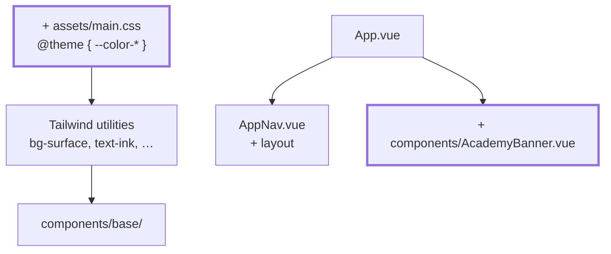

# Chapter 17 — Design tokens and layout

> **Time:** about 1.5–2.5 h
> **Concepts:** [Styling and theming](../concepts/12-styling-tailwind.md)

## Where you stand

The app can do everything and looks like a form from 1998. The base components are in place —
now it's worth giving them a look that's defined in **one** place.

## What's new

Tailwind 4 configuration in CSS, semantic tokens instead of color names, and a layout that
doesn't fall apart on a phone.



## The path

1. **Tailwind 4 is configured CSS-first** — no `tailwind.config.js` anymore. Every tutorial you
   find online describes version 3. Read
   [Styling and theming](../concepts/12-styling-tailwind.md#tailwind-4-is-different-from-every-tutorial-youll-find)
   before you start, or you'll spend an hour hunting for a file that isn't supposed to exist.

2. **`@theme` in `assets/main.css`.** Whatever lives there turns into CSS custom properties
   **and** utility classes: `--color-grade-1` produces `bg-grade-1`, `text-grade-1`, and so on.

3. **Semantic tokens instead of color names.** `--color-surface`, `--color-ink`,
   `--color-line`, `--color-link` — not `--color-gray-100`. The difference is what makes
   [chapter 18](18-academy-themes.md) possible: a surface named `bg-surface` can differ per
   academy; one named `bg-gray-100` can't.

   A token that's easy to collapse into one and regret later: `--color-link` has to stay
   separate from `--color-brand-600`. Brand-600 needs to carry white text (buttons) **and**
   stay readable as text color on a light surface. One value can't do both.

4. **Grade colors** `--color-grade-1` through `-5`. In `GradeBadge` and the chart, that needs a
   spelled-out mapping:

   ```ts
   const GRADE_CLASSES: Record<Grade, string> = { 1: 'bg-grade-1', … }
   ```

   Class names must **not** be assembled at runtime. `bg-grade-${grade}` simply doesn't appear
   in the compiled CSS, because Tailwind only scans the source for complete class names.

5. **Layout with the three tools that suffice:** a centered container
   (`mx-auto max-w-5xl px-4`), `grid` for tile rows, `flex` for lines. Mobile first, then `sm:`
   and `md:`.

6. **`AcademyBanner`** with the academy's name and motto, and `AppNav` as a real navigation
   bar.

7. **Accessibility along the way:** a visible focus ring (not `outline: none`), at least 4.5:1
   contrast, and never distinguish states by color alone — that's why the progress badge
   carries text and not just green or yellow.

## What's still simplified

| Simplification | Why that's fine for now | Cleaned up in |
| --- | --- | --- |
| There's exactly one palette | the four academies are the next chapter | [Chapter 18](18-academy-themes.md) |
| No dark mode | the dark academies take on that role | [Chapter 18](18-academy-themes.md) |
| The crests are missing | they belong to the theme | [Chapter 18](18-academy-themes.md) |

## Review

- [ ] `assets/main.css` contains a `@theme` block, and there's **no** `tailwind.config.js`
- [ ] Changing `--color-surface` recolors the whole app
- [ ] No more `bg-gray-…` in any component, only semantic tokens
- [ ] Nothing scrolls sideways at 375 px width
- [ ] Focus is visible at every step when tabbing through
- [ ] Searching for `` `bg-grade-${ `` finds nothing

## Commit

The state runs — save it before you move on.

```bash
git add -A && git commit -m "style: design tokens and layout with Tailwind"
```

## Further reading

- [Concepts: Styling and theming](../concepts/12-styling-tailwind.md) — tokens, utilities, layout, accessibility
- `reference/src/assets/main.css` — the `@theme` block right at the top
