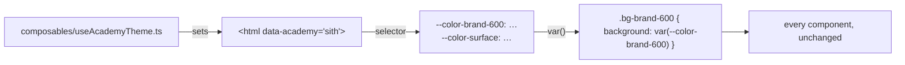

# Chapter 18 — Four looks, one attribute

> **Time:** about 1.5–2 h
> **Concepts:** [Styling and theming](../concepts/12-styling-tailwind.md)

## Where you stand

One palette, semantic tokens, a tidy layout. Jedi and Sith look identical.

## What's new

Four themes. Switching happens through **one** attribute on the `<html>` element — no
component needs to know which academy it's currently rendering for.



## The observation everything rests on

Tailwind outputs its utilities as a **reference**, not a baked-in value:

```css
.bg-brand-600 { background-color: var(--color-brand-600) }
```

So it's enough to redefine the custom property under a different selector to recolor every use
on the page.

## The path

1. **Four blocks in `main.css`:** `[data-academy='jedi'] { --color-brand-600: …; … }` and so on.
   All four define **the same** properties.

2. **Tell them apart on several levels.** Color alone isn't enough to distinguish Empire from
   Sith — both are dark. Bring in radius (`--radius-card`), typeface (`--font-display`), and
   letter spacing (`--tracking-display`) as well. A design is more than a color.

3. **Don't forget `color-scheme`.** On the dark academies, `color-scheme: dark` belongs in the
   block, or scrollbars and native form elements stay light.

4. **`composables/useAcademyTheme.ts`.** There's a subtlety here worth seeing once:

   ```ts
   // OUTSIDE the function: exists exactly ONCE for the whole app,
   // every caller shares the same value.
   const previewAcademyId = ref<AcademyId>('jedi')

   export function useAcademyPreview() {
     return { previewAcademyId }
   }
   ```

   A `ref` **inside** a composable function (like in `useGradeStats`) creates a fresh one on
   every call. Both are correct — you just need to know which one you're writing. Same
   distinction as the module `ref` in [chapter 07](07-login-mock.md).

5. **Set the attribute:**

   ```ts
   watchEffect(() => {
     document.documentElement.dataset.academy = academy.value?.id ?? previewAcademyId.value
   })
   ```

   `watchEffect` instead of `watch`, because its dependencies are detected on the first run,
   and that first run happens immediately. Called once in `App.vue` — so it applies to the
   whole app.

6. **The preview on the sign-in screen.** The academy selector from
   [chapter 15](15-four-academies.md) is the same `previewAcademyId` — that's why a plain
   `v-model` is enough there, and the recoloring happens on its own.

   Plus a detail you only notice once you try it: after signing in, the real academy has to be
   remembered as the preview. Otherwise signing out is a visual jump — someone signing out of
   Sith would otherwise land back in the bright Jedi design.

7. **The flash on load.** Between the first paint and Vue's first tick, the page briefly sits
   in the default palette. A tiny inline script in `index.html` that reads `data-academy` from
   `localStorage` before the bundle loads fixes this —
   [Styling and theming](../concepts/12-styling-tailwind.md#the-flash-on-load) shows it.

8. **The crests as inline SVG** per academy, with `fill="currentColor"`. That way they inherit
   the text color and follow the theme automatically — you don't need an icon library for four
   symbols.

## What's still simplified

| Simplification | Why that's fine for now | Cleaned up in |
| --- | --- | --- |
| Names and mottos still live in the master data | they're language-dependent | [Chapter 21](21-i18n.md) |
| No test that all four palettes are complete | tests are the next chapter | [Chapter 19](19-tests-vitest.md) |
| Themes don't respond to `prefers-color-scheme` | the academy deliberately wins | — |

## Review

- [ ] On the sign-in screen, the **whole** look changes when you switch academies
- [ ] After signing in, the signed-in person's academy applies
- [ ] Signing out doesn't cause a color jump
- [ ] Empire and Sith are distinguishable with no labels at all
- [ ] On the dark themes, scrollbars and date fields are dark
- [ ] A reload shows no flash of the light palette
- [ ] No component checks the academy to choose colors

## Commit

The state runs — save it before you move on.

```bash
git add -A && git commit -m "feat: four academy themes via data-academy"
```

## Further reading

- [Concepts: Styling and theming](../concepts/12-styling-tailwind.md) — the four themes in detail
- `reference/src/assets/main.css`, `reference/src/composables/useAcademyTheme.ts`
- `reference/src/components/emblems/` — the four crests
