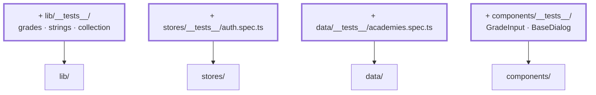

# Chapter 19 — Tests

> **Time:** about 2–3 h
> **Concepts:** [Tests](../concepts/13-tests-vitest.md)

## Where you stand

The app is done and looks good. Nothing is locked in — every change to `seed.ts` or a store
gets checked by hand, by clicking around.

## What's new

Vitest, and tests in the order that pays off most: pure functions first, then stores, then
components last.



## The path

1. **Set up:** `vitest`, `@vue/test-utils`, `jsdom`, plus a `vitest.config.ts` and a
   `tsconfig.vitest.json`. `npm run test:unit`.

2. **Start with `lib/`.** Pure functions, no setup, green immediately. The cases that matter
   are the edges:

   - `average([])` → `null`, not `NaN`
   - `average([1, null, 3])` → `2` — `null` doesn't count
   - `parseGrade('')` → `null`, `parseGrade('9')` → `undefined`, `parseGrade('2,0')` → `2`
   - `toUsername('Sabé')` → `sabe`, `toUsername('Groß')` → `gross`
   - `fullName({ firstName: 'Yoda', lastName: 'Yoda' })` → `Yoda`

3. **Then the stores.** Pinia needs a fresh instance per test:

   ```ts
   beforeEach(() => setActivePinia(createPinia()))
   ```

   And `localStorage` has to be empty between tests, or one test drags the previous one's state
   along. This is exactly why it mattered that `createGradeBook()` is a **function** and not an
   exported constant ([chapter 04](04-seed-and-types.md)).

   Worth testing: a successful sign-in, a wrong password (`error` set, not signed in), an
   unknown username (**the same** message), signing out.

4. **A test that locks in the domain promise.** The most valuable test in the whole project
   isn't the one on `average` — it's the one on academy separation: `studentsOf('jedi')`
   contains nobody from another academy, and `createGradeBook()` never enters Sith trainees for
   a Jedi subject. That's the rule most likely to break by accident during a refactor.

5. **Components last**, and only the ones with real behavior in them:

   - `GradeInput` — checks the central promise: a `9` produces **no** `update:modelValue`, an
     empty input produces one with `null`.
   - `BaseDialog` — opens and closes, Escape works.

   Test what the user sees and does, not the internal structure. `findByText` and
   `trigger('click')` instead of reaching into `vm.internalCounter`.

6. **Wire it into CI** — at the latest in [chapter 20](20-build-deployment.md).

## What's still simplified

| Simplification | Why that's fine for now | Cleaned up in |
| --- | --- | --- |
| No end-to-end tests | Playwright would be its own tutorial | — |
| No coverage threshold | a number is no substitute for judgment | — |
| Views are untested | they're almost all presentation | — |

## Review

- [ ] `npm run test:unit` is clean and runs in a few seconds
- [ ] Change `average` so empty lists return `0` → a test goes red
- [ ] Move a trainee in `students.ts` to a different academy → the separation test goes red
- [ ] Tests pass in any order, and individually (`-t`) too
- [ ] No test touches `localStorage` without clearing it first

## Commit

The state runs — save it before you move on.

```bash
git add -A && git commit -m "test: Vitest for lib, stores, and components"
```

## Further reading

- [Concepts: Tests](../concepts/13-tests-vitest.md) — Vitest, store tests, component tests
- `reference/src/lib/__tests__/`, `reference/src/stores/__tests__/auth.spec.ts`
- `reference/src/components/__tests__/GradeInput.spec.ts`
