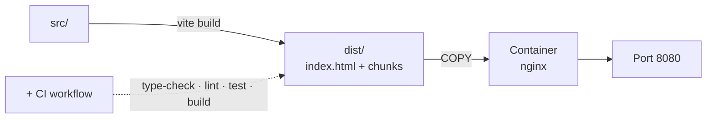

# Chapter 20 — Build and deploy

> **Time:** about 1–1.5 h
> **Concepts:** [Build and deployment](../concepts/14-build-deployment.md)

## Where you stand

The app runs in the dev server and is tested. You've never shipped anything yet — and the dev
server is not a web server.

## What's new

A production build, a container with nginx, and a CI that checks both.



## The path

1. **Run `npm run build` and look at the output.** `run-p type-check build-only` means: the
   build fails if the types are wrong. Look inside `dist/assets/` — you'll see the individual
   chunks for the views, produced by the `() => import(...)` from
   [chapter 06](06-router-two-views.md).

2. **`npm run preview`** — that's the state real users get. Click all the way through it once.
   This is usually where you notice what only worked in dev mode: missing assets, absolute
   paths, a `console.log` that shouldn't be there.

3. **The Containerfile in two stages.** Node to build first, then a lean image that only copies
   in `dist/`. Skip that split and you drag `node_modules` into production.

4. **The nginx rule without which an SPA is broken:**

   ```nginx
   location / {
     try_files $uri $uri/ /index.html;
   }
   ```

   Without it, visiting `/lecturer/subjects/f01` directly gives a 404 — that file genuinely
   doesn't exist. The router needs to get the path, not the filesystem lookup.

5. **Set caching correctly:** the files in `assets/` carry a hash in their name and can be
   cached for a long time; `index.html` must **not** be, or returning visitors get stuck on
   the old app forever.

6. **CI:** `type-check`, `lint`, `test:unit`, `build` — in that order, so the fastest check
   fails first.

7. **Actually start it once:** build the image, run the container, open it in a browser. Don't
   forget to visit a deep URL directly.

## What's still simplified

| Simplification | Why that's fine for now | Cleaned up in |
| --- | --- | --- |
| No backend, everything in the browser | that's the project's scope | — |
| No environment variables | there's nothing to configure | — |
| No deployment target | starting the container is proof enough | — |

## Review

- [ ] `npm run build` runs through and aborts on a type error
- [ ] `dist/assets/` holds several JS files, not one big one
- [ ] `npm run preview` behaves like the dev server
- [ ] In the container: visiting `/lecturer/subjects/f01` directly serves the app, not a 404
- [ ] Reloading on a deep URL works
- [ ] `index.html` is **not** cached for long, per the response headers
- [ ] CI goes red when you break a test

## Commit

The state runs — save it before you move on.

```bash
git add -A && git commit -m "build: production build and container with nginx"
```

## Further reading

- [Concepts: Build and deployment](../concepts/14-build-deployment.md) — build, Containerfile, nginx, CI
- `reference/Containerfile`, `reference/nginx.conf`
