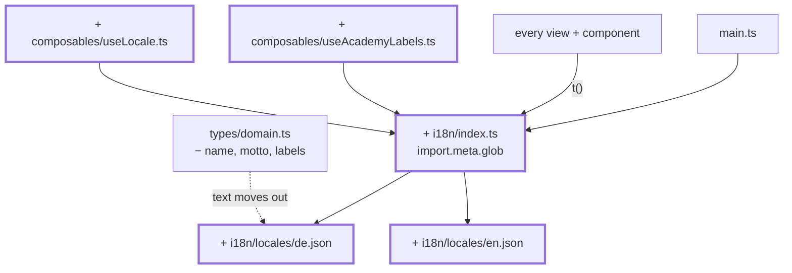

# Chapter 21 — Two languages

> **Time:** about 2–3 h
> **Concepts:** [Internationalisation](../concepts/15-i18n.md)

## Where you stand

The app is done, tested, and shipped. And every string sits wherever it was needed at the
time: in templates, in components, in `academies.ts`, in `subjects.ts`.

## What's new

vue-i18n, two locale files — and along the way, the realization that internationalization is
mostly a refactoring task: you first have to find every scrap of text lying around.



## The path

1. **The question first, then the library.** For two languages you could build this yourself.
   What people underestimate there is plurals and interpolation — this app needs both.
   [Internationalisation](../concepts/15-i18n.md#first-the-question-library-or-build-it-yourself)
   weighs it up; the answer is `vue-i18n`.

2. **Find locale files instead of listing them:**

   ```ts
   const messages = import.meta.glob('./locales/*.json', { eager: true, import: 'default' })
   ```

   A third language is then **one file**, not an entry in a list you can forget to update. The
   language's display name belongs in the file itself, not in a table next to it.

3. **Pull text out of the master data.** `Academy` loses `name`, `motto`, and the labels —
   what's left is `{ id }`. The text lives under `academies.<id>.*` in the locale files. Same
   for `subject.name` (under `subjects.<id>`), while `shortName` stays: an abbreviation is a
   code like a module number, and you don't translate those at a real university either.

   After this step, a fifth academy is: one entry in `academies.ts`, one block per locale file,
   one palette in `main.css`. No component.

4. **`useAcademyLabels`** supplies the academy-specific labels ("Padawan", "recruit") including
   singular/plural. Plurals belong in the locale file, not in an `if` branch — not every
   language has exactly two forms.

5. **Pure functions stay language-free.** `gradeLabel(grade, labels)` gets the table **handed
   to it** and knows no academy and no translator. Otherwise `lib/` tests would suddenly depend
   on the active language.

6. **The test that makes good on the promise.** A test that checks **every** locale file has
   the same keys. Without it, the second language goes patchy after three changes, and nobody
   notices, because vue-i18n silently falls back to the key.

7. **Two details people overlook:** `<html lang>` has to switch along with everything else
   (screen readers pick pronunciation from it), and quotation marks are language-dependent —
   that's what `<q>` is for, which the browser sets correctly on its own.

8. **`useLocale`** with persistence via `useLocalStorage` from
   [chapter 12](12-localstorage-composable.md), plus a `LanguageSelect` in the navigation.

## What's still simplified

| Simplification | Why that's fine for now | Cleaned up in |
| --- | --- | --- |
| Only two languages | a third is now just a file | — |
| No per-locale date and number formats | the app barely displays any dates | — |
| No RTL support | would be its own chapter | — |

## Review

- [ ] Switching changes **every** string, including error messages and `aria-label`
- [ ] The language survives a reload
- [ ] `<html lang>` switches along with it
- [ ] Delete a key from `en.json` → the completeness test goes red
- [ ] Add a third locale file → it shows up in the selector **with no code change**
- [ ] `npm run test:unit` is clean, and no `lib/` test depends on the active language
- [ ] There's no German sentence left in `src/views/` or `src/components/`

## And then?

That was the last chapter — your app now matches the reference. If you want to keep going:
build in a fifth academy (three places, no component), hang a real backend behind the stores,
or leave `lib/` and `data/` untouched and rewrite the views in a different framework. That the
latter is even possible is the real payoff of [chapter 04](04-seed-and-types.md).

## Commit

The state runs — save it before you move on.

```bash
git add -A && git commit -m "feat: internationalization with vue-i18n"
```

## Further reading

- [Concepts: Internationalisation](../concepts/15-i18n.md) — locale files, plurals, the extensibility test
- `reference/src/i18n/`, `reference/src/composables/useAcademyLabels.ts`
- `reference/src/i18n/__tests__/locales.spec.ts` — the test that locks in extensibility
