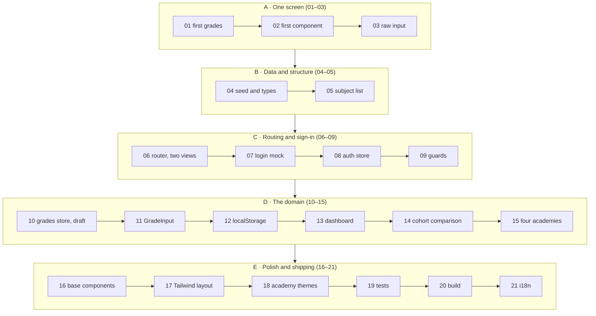
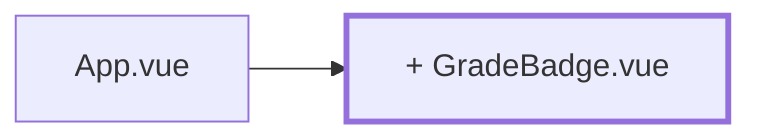

# The build track — the project in 21 chapters

The pages in [`concepts/`](../concepts/) are cut by **topic**: one page, one concept. That's
good for learning and good for looking things up — but it doesn't tell you in what order you
actually build the app. Open [The instructor view](../concepts/10-instructor-view.md) and
you're facing draft state, watchers, `isDirty`, and an access check all at once.

The chapters here do the opposite: they cut **work**, not topics. Every chapter is a state you
can see in the browser, and every one deliberately leaves something simplified that a later
chapter cleans up. Assessments start hardcoded in `App.vue`. Then they come from a seed. Then
from a store. Then they survive a reload. And right at the end there are four academies instead
of one.

## How to read both tracks together

```
open a chapter  →  read "What's new"  →  read the linked concept page  →  build  →  review
```

The chapter tells you **what, and in what order**. The concept page explains **why and how**.
You need both; neither replaces the other.

Chapters only show code where the intermediate state doesn't exist in `reference/` — that is,
for the simplified versions you couldn't look up anywhere else. Once a chapter reaches the
state of the reference, only the task and the file path remain. The rule from the
[tutorial README](../README.md) still applies: try it yourself first.

> **Two words, two meanings.** *Chapter* in this tutorial always means a page from here — the
> numbers 01 through 21. The explainer pages in [`concepts/`](../concepts/) have their own
> numbers and are therefore referred to by title, never by number.

> **On terminology.** [The instructor view](../concepts/10-instructor-view.md) and
> [The trainee view](../concepts/11-trainee-view.md) use "instructor" and "trainee" for the
> humans, matching the rest of this tutorial — the code stays `lecturer`/`student`, matching
> the reference app.

> **Every chapter ends with a commit.** One chapter, one commit: your rebuild gets a history in
> which you can find every intermediate state — and you can always go back to something that
> runs, instead of rescuing a half-rebuilt app. A message is suggested each time;
> [chapter 01](01-first-grades.md) creates the repo.

## The chapter map



## Chapter → Concepts

| Chapter | What runs at the end | Time | Concepts |
| --- | --- | --- | --- |
| [01 — First grades](01-first-grades.md) | a list of assessments with an average, all in `App.vue` | 1–1.5 h | [Vue reactivity](../concepts/04-vue-reactivity.md) |
| [02 — First component](02-first-component.md) | `GradeBadge` and `StatTile` as their own files | 0.5–1 h | [Components](../concepts/05-components.md) |
| [03 — Raw input](03-raw-input.md) | adding and removing assessments | 0.5–1 h | [Vue reactivity](../concepts/04-vue-reactivity.md), [Components](../concepts/05-components.md) |
| [04 — Seed and types](04-seed-and-types.md) | real subjects and trainees from `src/data/` | 1.5–2.5 h | [TypeScript](../concepts/03-typescript.md), [Domain model](../concepts/06-domain-model.md) |
| [05 — Subject list](05-subject-list.md) | a table with progress and average | 1–1.5 h | [Domain model](../concepts/06-domain-model.md) |
| [06 — Router, two views](06-router-two-views.md) | list and assessment form under their own URLs | 1–1.5 h | [Router](../concepts/07-router.md) |
| [07 — Login mock](07-login-mock.md) | a sign-in screen that checks nothing yet | 0.5–1 h | [Router](../concepts/07-router.md) |
| [08 — Auth store](08-auth-store.md) | a real sign-in against the master data, with Pinia | 1–1.5 h | [Pinia](../concepts/08-pinia.md) |
| [09 — Guards](09-router-guards.md) | protected routes, roles, sign-out | 1–1.5 h | [Router](../concepts/07-router.md), [Pinia](../concepts/08-pinia.md) |
| [10 — Grades store and draft](10-grades-store-and-draft.md) | recording, saving, discarding assessments | 1.5–2 h | [Pinia](../concepts/08-pinia.md), [The instructor view](../concepts/10-instructor-view.md) |
| [11 — GradeInput](11-grade-input.md) | robust input, random fill, a leave-page confirmation | 1.5–2 h | [The instructor view](../concepts/10-instructor-view.md) |
| [12 — localStorage](12-localstorage-composable.md) | everything survives a reload | 1–1.5 h | [Composables](../concepts/09-composables.md) |
| [13 — Trainee dashboard](13-trainee-dashboard.md) | your own assessments across every subject | 1–1.5 h | [The trainee view](../concepts/11-trainee-view.md) |
| [14 — Cohort comparison](14-cohort-comparison-chart.md) | an anonymous comparison with a bar chart | 1.5–2 h | [Composables](../concepts/09-composables.md), [The trainee view](../concepts/11-trainee-view.md) |
| [15 — Four academies](15-four-academies.md) | the academy as a dimension in the data model | 2–3 h | [Domain model](../concepts/06-domain-model.md) |
| [16 — Base components](16-base-components.md) | `components/base/`, slots, a generic table | 2–3 h | [Components](../concepts/05-components.md) |
| [17 — Tailwind layout](17-tailwind-layout.md) | design tokens, navigation, banner | 1.5–2.5 h | [Styling and theming](../concepts/12-styling-tailwind.md) |
| [18 — Academy themes](18-academy-themes.md) | four looks from a single attribute | 1.5–2 h | [Styling and theming](../concepts/12-styling-tailwind.md) |
| [19 — Tests](19-tests-vitest.md) | Vitest across `lib/`, stores and components | 2–3 h | [Tests](../concepts/13-tests-vitest.md) |
| [20 — Build and deployment](20-build-deployment.md) | a production build in a container | 1–1.5 h | [Build and deployment](../concepts/14-build-deployment.md) |
| [21 — i18n](21-i18n.md) | the app speaks two languages | 2–3 h | [Internationalisation](../concepts/15-i18n.md) |

**Roughly 27–40 hours in total** — the same work the concept pages from *Vue reactivity* to
*Internationalisation* estimate at 24–35 hours. The difference is the surcharge for touching
some files twice: once simplified, once for real. That's not wasted effort — it's the point of
the exercise.

Chapters 01–21 need a running project. You create that on the
[Setup](../concepts/00-setup.md) concept page — there's no chapter of its own for it here.

## Concepts → Chapter

| Concept page | Chapter |
| --- | --- |
| [Setup](../concepts/00-setup.md) | prerequisite for everything |
| [JavaScript fundamentals](../concepts/01-js-fundamentals.md) through [TypeScript](../concepts/03-typescript.md) | none; `playground/` instead of the app |
| [Vue reactivity](../concepts/04-vue-reactivity.md) | [01](01-first-grades.md), [03](03-raw-input.md) |
| [Components](../concepts/05-components.md) | [02](02-first-component.md), [03](03-raw-input.md), [16](16-base-components.md) |
| [Domain model](../concepts/06-domain-model.md) | [04](04-seed-and-types.md), [05](05-subject-list.md), [15](15-four-academies.md) |
| [Router](../concepts/07-router.md) | [06](06-router-two-views.md), [07](07-login-mock.md), [09](09-router-guards.md) |
| [Pinia](../concepts/08-pinia.md) | [08](08-auth-store.md), [09](09-router-guards.md), [10](10-grades-store-and-draft.md) |
| [Composables](../concepts/09-composables.md) | [12](12-localstorage-composable.md), [14](14-cohort-comparison-chart.md) |
| [The instructor view](../concepts/10-instructor-view.md) | [10](10-grades-store-and-draft.md), [11](11-grade-input.md) |
| [The trainee view](../concepts/11-trainee-view.md) | [13](13-trainee-dashboard.md), [14](14-cohort-comparison-chart.md) |
| [Styling and theming](../concepts/12-styling-tailwind.md) | [17](17-tailwind-layout.md), [18](18-academy-themes.md) |
| [Tests](../concepts/13-tests-vitest.md) | [19](19-tests-vitest.md) |
| [Build and deployment](../concepts/14-build-deployment.md) | [20](20-build-deployment.md) |
| [Internationalisation](../concepts/15-i18n.md) | [21](21-i18n.md) |

## Two deliberate deviations from chapter order

Both are intentional.

**The four academies don't arrive until chapter 15.** The
[domain model](../concepts/06-domain-model.md) page introduces them right away because they
belong to the data model on paper. For building, that's the wrong moment: you'd be fighting
`Grade`, `Subject`, `Student` **and** the question of who may see whom, all at once. So chapters
04–14 build with *one* academy, and chapter 15 pulls the dimension in afterwards. That's
uncomfortable — which is the point: you feel, first-hand, how many places a forgotten dimension
resurfaces, and why the concept page would rather have had it in the type system from the
start.

**Base components and styling move to the back (16–18).** Up to chapter 15 the app deliberately
looks plain. A few Tailwind classes along the way are fine, but design tokens only pay off once
you know which components actually exist.

## The shape of a chapter

Every file has the same nine sections:

| Section | For |
| --- | --- |
| Header | time, and the concept pages this chapter belongs to |
| Where you stand | the state after the previous chapter |
| What's new | one sentence |
| Diagram | the architecture as it looks after this chapter |
| The path | the individual steps |
| What's still simplified | **the most important section** — with a pointer to the chapter that cleans it up |
| Review | what has to work in the browser |
| Commit | the suggested commit for this state |
| Further reading | concept pages; `reference/` paths only once the chapter reaches the final state |

In the diagram, anything new is **bold-bordered** and marked with `+`:



Start with [chapter 01](01-first-grades.md).
